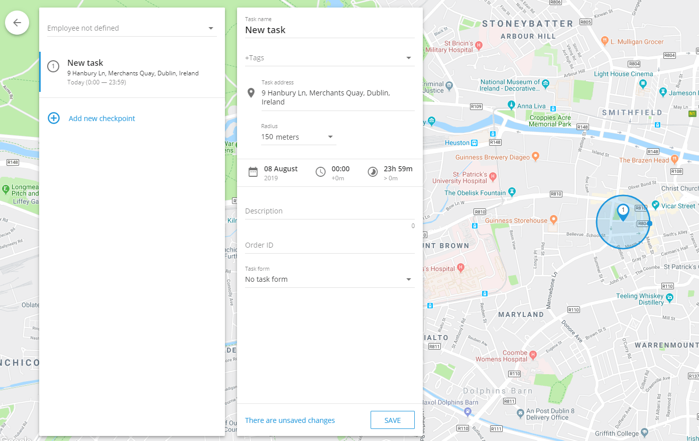

# Tarefas

A **Tarefa** na Navixy refere-se a uma tarefa ou trabalho específico que precisa ser concluído por um funcionário ou trabalhador de campo. Inclui instruções detalhadas sobre o que precisa ser feito, onde deve ser feito e em que prazo. As tarefas podem variar de atribuições simples e pontuais, como entregar um pacote em um único local, a operações mais complexas, como visitar vários pontos de controle ao longo de uma rota para realizar inspeções, instalações ou outros serviços.

As tarefas são essenciais para gerenciar e coordenar as operações de campo, garantindo que os funcionários tenham clareza sobre suas responsabilidades e permitindo que os gerentes monitorem o progresso, otimizem as rotas e garantam que todos os trabalhos sejam concluídos com eficiência.

## Como criar uma tarefa

1. Navegue até a guia Tarefas no aplicativo Serviço de campo
2. Clique no botão **"+"** para iniciar o processo de criação de uma nova tarefa.
3. **Defina o nome da tarefa:**
  - Digite um nome descritivo da tarefa que ajude a identificar o objetivo da tarefa. Pode ser o nome do cliente ou uma breve descrição da tarefa, como "Instalar equipamento" ou "Inspecionar comunicações".
4. **Especifique o endereço da tarefa:**
  - Digite o endereço da tarefa manualmente, selecione um ponto no mapa ou use coordenadas geográficas. Isso definirá o local principal para uma única tarefa ou o primeiro ponto de controle para uma tarefa de rota.
5. **Defina o tempo da tarefa:**
  - Defina a data e o intervalo de tempo durante os quais o funcionário deve concluir a tarefa. Isso garante que a tarefa seja concluída dentro do período de tempo designado.
6. **Adicionar pontos de controle para tarefas de rota:**
  - Para criar uma tarefa de rota, clique em "Add New Checkpoint" (Adicionar novo ponto de controle) depois de definir o local inicial. Cada ponto de controle representa uma parada adicional ao longo da rota, e eles serão automaticamente conectados em sequência. O funcionário deve concluir esses pontos de controle na ordem especificada.
7. **Atribuir a tarefa a um funcionário:**
  - Selecione o funcionário que será responsável pela tarefa. Se necessário, você pode atribuir a tarefa posteriormente usando a lista de tarefas ou utilizar ferramentas adicionais fornecidas na interface para facilitar a atribuição.
8. **Detalhes adicionais da tarefa:**
  - **Descrição da tarefa:** Forneça quaisquer detalhes adicionais que possam ser úteis para o funcionário, como informações de contato ou instruções especiais.
  - **Molde:** Selecione o formulário que o funcionário precisa preencher ao executar a tarefa. Os formulários podem ser preenchidos diretamente no aplicativo X-GPS Tracker.
  - **Tags:** Adicione tags relevantes à tarefa para facilitar a busca e a categorização posteriormente.
  - **ID do pedido:** Atribua um ID de pedido que o cliente possa usar para rastrear o status da tarefa por meio do recurso "Courier on the Map".
9. Clique em **"Salvar"** para finalizar e enviar a tarefa para o dispositivo móvel do funcionário.

### Tarefas individuais e de rota

- **Tarefas individuais:** São tarefas simples em que o funcionário visita um único local para realizar as tarefas atribuídas. A tarefa é concluída quando o funcionário chega ao endereço especificado e executa as ações necessárias.
- **Tarefas de rota:** Elas envolvem vários pontos de controle que o funcionário deve visitar em uma ordem específica. Esse tipo de tarefa é ideal para situações em que o funcionário precisa visitar vários locais ao longo de uma rota planejada, como entregas ou inspeções.

A interface foi projetada para ser intuitiva, permitindo que os gerentes e despachantes criem e gerenciem rapidamente tarefas individuais e de rota com facilidade, garantindo que todas as operações de campo sejam tratadas com eficiência e eficácia.

### Recurso de otimização de rota

Navixy's **Otimização de rotas** O recurso ajuda os entregadores a entregar pacotes com eficiência, determinando a melhor sequência para visitar vários endereços em uma cidade. Ele considera a localização de cada endereço, janelas de tempo de entrega específicas e o ponto de partida da tarefa para criar a rota mais ideal.

#### Principais benefícios:

- **Economia de combustível:** Minimiza a distância de viagem, reduzindo o consumo de combustível.
- **Entregas mais rápidas:** Otimiza a sequência para uma conclusão mais rápida da tarefa.
- **Produtividade aprimorada:** Automatiza o planejamento de rotas, permitindo que os entregadores se concentrem nas entregas.

A plataforma pode otimizar até 25 pontos em uma única tarefa de rota, garantindo que todas as entregas sejam feitas no prazo e na ordem mais eficiente.

## Importação de tarefas

Ao gerenciar uma grande força de trabalho ou várias tarefas, a importação de tarefas de um arquivo do Excel é mais eficiente do que criá-las e atribuí-las manualmente, uma a uma. Isso é particularmente útil quando as tarefas são geradas por sistemas externos, como CRMs.

### Importar de um arquivo do Excel

Embora os desenvolvedores possam usar uma API para importação de tarefas, há um método mais simples disponível: importar tarefas de um arquivo do Excel. Os dados devem ser apresentados nos formatos de planilha XLS, XLSX ou CSV.

#### Como importar tarefas de um arquivo do Excel

1. **Iniciar o processo de importação:**
  - Passe o mouse sobre o botão "+" na seção de tarefas.
  - Clique no botão **XLS** opção.
2. **Janela de importação de tarefas:**
  - Na janela "Tasks import" (Importação de tarefas), você pode fazer o download de um arquivo **Exemplo de arquivo** modelo.
  - Defina os parâmetros da tarefa conforme necessário.
3. **Campos obrigatórios:**
  - Os campos marcados como "Obrigatório" devem ser preenchidos para que a importação seja bem-sucedida. O sistema rejeitará a importação se algum campo obrigatório estiver faltando.
4. **Endereço vs. Coordenadas:**
  - Você pode especificar um endereço em vez de coordenadas; o sistema determinará automaticamente o local.

#### Importar configurações

Além das configurações de tarefas individuais, você pode definir as seguintes configurações globais:

- **Raio padrão:** Define o desvio permitido do local especificado. Se o funcionário (ou veículo) chegar dentro desse raio, a tarefa será considerada concluída, mesmo que ele não chegue ao local exato.
- **Atribuição automática de tarefas:**
  - **Endereço ignorado:** As tarefas são atribuídas de forma homogênea a todos os funcionários.
  - **Use o endereço do funcionário:** As tarefas são atribuídas com base na proximidade do endereço residencial do funcionário.
  - **Use o endereço do departamento:** As tarefas são atribuídas de acordo com a distância do departamento do funcionário.*Observação:* Os endereços dos departamentos e dos funcionários devem ser especificados em seus respectivos cartões de perfil.

Ao usar essas configurações, você pode simplificar o processo de atribuição de tarefas, garantindo que elas sejam distribuídas e concluídas com eficiência.

### Importar de um arquivo TXT

#### Como importar tarefas de um arquivo TXT

1. **Iniciar o processo de importação:**
  - Passe o mouse sobre o **"+"** na seção de tarefas.
  - Clique no botão **TXT** opção.
2. **Janela de importação de tarefas:**
  - Você verá a janela "Tasks import" (Importação de tarefas), que contém um campo grande.
  - Cole a lista de tarefas da sua planilha diretamente nesse campo usando a área de transferência (copiar e colar).

Esse processo permite que você importe com eficiência várias tarefas de uma só vez, simplificando o fluxo de trabalho de gerenciamento de tarefas.