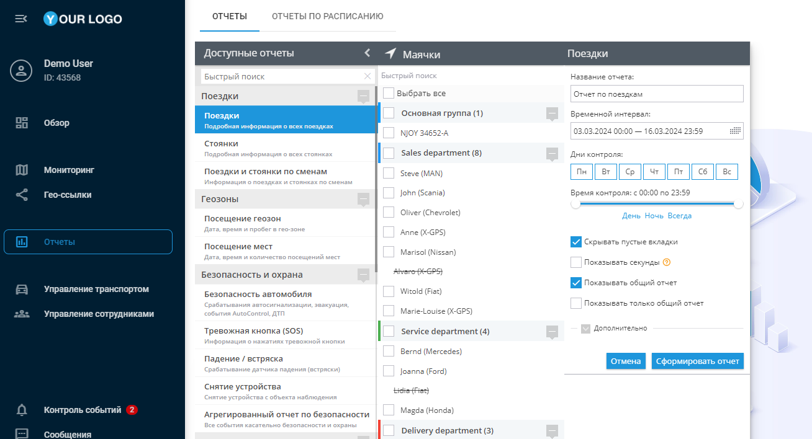

# Отчеты

Navixy предлагает мощную функцию отчетности, которая позволяет создавать подробные отчеты по различным аспектам работы вашего автопарка. В этом руководстве вы узнаете, как создавать, планировать и управлять отчетами с помощью платформы Navixy, обеспечивая легкий доступ и анализ необходимых данных.

## Доступ к разделу отчетов

1. **Перейдите в приложение "Отчеты":**
  - В главном меню в левой части интерфейса Navixy нажмите на пункт "Отчеты". Вы перейдете в раздел, где можно просматривать, создавать и управлять отчетами.
2. **Просмотр созданных отчетов:**
  - В разделе "Сформированные отчеты" отображается список всех ранее созданных отчетов. Вы можете быстро получить доступ к любому из этих отчетов и просмотреть его, щелкнув по его названию.
3. **Создание нового отчета:**
  - Чтобы создать новый отчет, нажмите на кнопку "Создать отчет" в верхней части списка сгенерированных отчетов. Откроется интерфейс создания отчета.

## Создание одного отчета

Отчет - это созданный документ, который предоставляет подробную информацию о конкретных аспектах работы вашего автопарка, таких как активность транспортных средств, расход топлива или поведение водителей, на основе выбранных критериев и временных рамок.

Для того, чтобы создать отчет необходимо пройти следующие шаги:

1. **Выберите тип отчета:**
  - На панели "Доступные отчеты" вы найдете различные типы отчетов, сгруппированные по категориям, таким как "Поездки", "Геозоны", "Безопасность и охрана" и "Эксплуатация транспорта" и так далее. Выберите отчет, который вы хотите создать, щелкнув по нему.
2. **Выберите объекты:**
  - После выбора типа отчета необходимо выбрать объекты (автомобили, водители и т. д.), для которых будет сформирован отчет. С помощью панели "Маячки" установите соответствующие флажки рядом с нужными объектами.
3. **Настройте параметры отчета:**
  - На панели настроек отчета введите название отчета и выберите диапазон дат. Вы также можете выбрать конкретные дни и время контроля, а также решить, включать ли в отчет сводки или расширенные настройки.
4. **Постройте отчет:**
  - После того как все параметры настроены, нажмите кнопку "Сформировать отчет". Отчет будет создан и добавлен в верхнюю часть списка "Сформированные отчеты" для немедленного доступа.

## Отчеты по расписанию

Отчеты по расписанию - это автоматические отчеты, которые создаются через заданные интервалы времени, например ежедневно, еженедельно или ежемесячно, что позволяет регулярно получать информацию о работе вашего автопарка без ручного вмешательства. Вот как можно запланировать отчет:

1. **Доступ к запланированным отчетам:**
  - В приложении "Отчеты" перейдите на вкладку "Отчеты по расписанию", расположенную рядом с вкладкой "Отчеты". Этот раздел позволяет автоматизировать создание отчетов по заданному расписанию.
2. **Добавьте новое расписание:**
  - Чтобы создать новый отчет по расписанию, нажмите "Создать расписание для отчета".
3. **Настройте параметры расписания:**
  - Выберите тип отчета, объекты и настройте параметры расписания, такие как контрольные дни, время доставки и интервал (например, каждую неделю, каждый месяц). Вы также можете выбрать отправку отчетов непосредственно на указанные адреса электронной почты.
4. **Сохраните расписание:**
  - После настройки всех параметров нажмите "Сохранить расписание". Теперь запланированный отчет будет автоматически создаваться в соответствии с заданными параметрами, и его можно будет открыть или изменить в разделе "Отчеты по расписанию".

## Управление отчетами

1. **Скачать отчеты:**
  - Чтобы загрузить отчет, просто щелкните на нем в списке "Сформированные отчеты" и выберите опцию загрузки. Вы можете сохранить отчет в различных форматах, таких как XLS или PDF.
2. **Печать отчетов:**
  - Если вам нужна печатная копия отчета, вы можете распечатать его прямо из браузера, не скачивая, нажав кнопку "Печать".
3. **Удаление отчетов:**
  - Чтобы удалить отчет, который больше не нужен, выберите его в списке и нажмите кнопку удаления. Подтвердите удаление при появлении запроса.