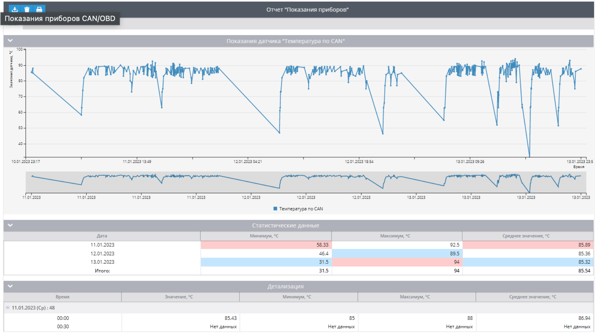

# Отчет Показания приборов (CAN / OBDII)

Отчет **Показания приборов** предлагает подробную информацию о данных, полученных от приборов вашего автомобиля через датчики CAN/OBD или виртуальные датчики за выбранный период. Отчет содержит такие данные, как пробег, обороты двигателя, скорость, расход топлива, температура охлаждающей жидкости и другие важные показатели, помогая руководителям автопарков и операторам транспортных средств контролировать и оптимизировать работу автомобиля.

Такой отчет можно также построить с использованием API. Вам понадобится плагин 22.

Для того, чтобы получить информацию в отчете необходимо:

- Устройство, для которого поддержано чтение CAN/OBD или виртуальных датчиков на платформе. Вы можете уточнить – поддержано ли чтение уровня топлива с определенного типа датчиков в [списке поддержанных входов у любой модели](https://www.navixy.ru/devices/).
- Автомобиль, который может передавать определенные CAN или OBD данные на установленную модель устройства. Такую информацию можно уточнить у производителя автомобиля.
- Данные с устройства и датчиков.
- Настроенные измерительные CAN/OBD или виртуальные датчики на платформе.

## Параметры отчета

В отчете используются следующие параметры:

- Интервал детализации – отобразить полученные показания в таблице детализации данных с шагом в 30 минут, 1, 3 или 6 часов. В графике будут отображены все полученные с датчика точки.
- Ось “x” на графике – выбор, относительно чего отображать информацию в графике – время или пробег.
- Сглаживать график – применить сглаживание на графике, если наблюдается большая разница в получаемых данных. Платформа отфильтрует пиковые значения и попытается усреднить данные.

Для каждого маячка необходимо выбрать датчик, по которому строить отчет.

Виртуальный датчик должен иметь вид определения - оригинальное значение. Если выбрать датчик с другим типом определения, отчет возвратит ошибку "Это не измерительный датчик".

## График показания датчика

Отображает полученные платформой показания датчика в графическом виде.

При наведении на любую точку, вы получите информацию о времени, когда она получена и значении датчика – если ось X время. При выборе оси Х – пробег, вы получите значение и пробег, когда оно получено. Пробег считается от начала периода отчета.

## Таблица со статистическими данными

Содержит статистические данные о показаниях по дням.

Информация распределена по следующим колонкам:

- Дата
- Минимум, единицы измерения
- Максимум, единицы измерения
- Среднее значение, единицы измерения

Для разных типов датчиков единицы измерения могут быть разными.

## Таблица с детализацией

В этой таблице будут представлены показания относящиеся к представленному промежутку времени от текущего момента до следующего шага. Если это отчет с шагом в 30 минут, то информация в строке 00:00 будет относиться ко времени 00:00-00:30.

Сенсор может передавать данные гораздо чаще, поэтому в таблице отображается статистическая информация, касающаяся каждого представленного промежутка.

Если в таблице, за какой-либо из промежутков вы видите «Нет данных», значит в промежуток никаких показаний от датчика не поступало. Причин может быть несколько:

- Устройство не отправляло данных CAN/OBD или виртуального датчика в этот период. Например, данные с этого датчика не отправлялись согласно настройке маячка.
- Устройство вообще не отправляло данных в этот период. Например, оно было выключено или снято с объекта наблюдения.

Информация представлена в колонках со следующими значениями:

- Время – это временной промежуток от указанного времени, до следующего шага.
- Значение – это ближайшее зафиксированное платформой значение датчика к указанному в первом столбце времени.
- Минимум – минимальное значение, полученное в промежуток до следующего шага.
- Максимум – максимальное значение, полученное в промежуток до следующего шага.
- Среднее значение – средние показания из всех полученных в промежуток данных.

## Чем может быть полезен такой отчет

Отчет способен отображать зафиксированные платформой показания датчиков или приборов, поэтому будет полезен всем, для отслеживания получаемых данных в различные промежутки времени. В зависимости от того, какую именно информацию вы получаете с датчика можно

- Проанализировать данные, которые поступают с приборов транспортного средства– температура двигателя, охлаждающей жидкости, бортового напряжения и многих других. Это поможет отследить проблемы автомобиля и устранить до того, как потребуется полный и затратный ремонт.
- Отследить нагрузку на двигатель за период и увидеть, как водители используют автомобиль. Например, с помощью датчика оборотов двигателя.