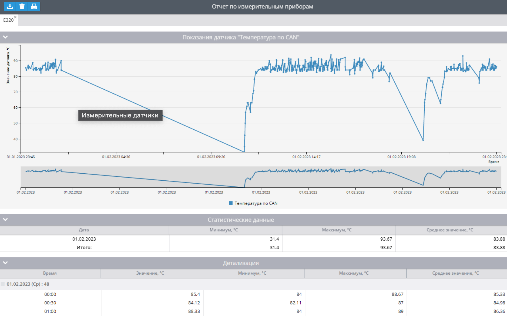
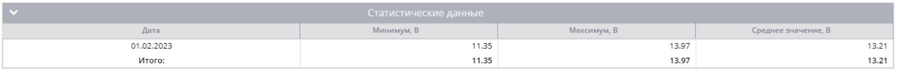

# Отчет Измерительные датчики

Отчет отображает данные, полученные с любых настроенных измерительных датчиков или виртуальных датчиков с методом подсчета Оригинальное значение за период. Позволяет отобразить графическую и статистическую информацию с датчиков устройств.

Для того, чтобы получить информацию в отчете необходимо:

- Устройство, для которого поддержано чтение необходимого датчика на платформе. Вы можете уточнить – поддержано ли чтение уровня топлива с определенного типа датчиков в [списке поддержанных входов у любой модели](https://www.navixy.ru/devices/).
- Данные с устройства и датчиков. Устройство должно быть настроено на отправку этих данных и отправлять их.  
Виртуальные датчики должны иметь способ определения Оригинальное значение и отправлять числовые значения на платформу.
- Настроенные измерительные датчики на платформе.

Построить такой отчет с помощью API можно, используя плагин 9.

## Параметры отчета

В отчете используются следующие параметры:

- Интервал детализации – отобразить полученные показания в таблице детализации данных с шагом в 5, 30 минут, 1, 3 или 6 часов. В графике будут отображены все полученные с датчика точки.
- Ось “x” на графике – выбор, относительно чего отображать информацию в графике – время или пробег.
- Сглаживать график – применить сглаживание на графике, если наблюдается большая разница в получаемых данных. Платформа отфильтрует пиковые значения и попытается усреднить данные.
- Показывать адрес – отобразить адрес, полученный платформой вместе с данными от датчика. Отображается адрес, полученный с первым показанием за отрезок детализации.
- Использовать умный фильтр – не отобразит данные, полученные во время коротких поездок. Короткими считаются поездки короче 300 метров за время которых устройство отправило менее 4 точек.

Для каждого маячка необходимо выбрать датчик, по которому строить отчет. В списке устройств для выбора только те, у которых есть настроенные измерительные или виртуальные датчики.

Если выбрать виртуальный датчик с другим способом определения данных, то отчет выдаст ошибку "Датчик не является измерительным".

## График показания датчика

Отображает полученные платформой показания измерительного или виртуального датчика в графическом виде.

При наведении на любую точку, вы получите информацию о времени, когда она получена и значении датчика – если ось X время. При выборе оси Х – пробег, вы получите значение и пробег, когда оно получено. Пробег считается от начала периода отчета.

## Таблица со статистическими данными

Содержит статистические данные о показаниях по дням.

**Колонки**

Информация распределена по следующим колонкам:

- Дата
- Минимум, единицы измерения
- Максимум, единицы измерения
- Среднее значение, единицы измерения

Для разных типов датчиков единицы измерения могут быть разными.

**Строки**

Информацию в первой строке можно прочитать так:

1 февраля 2023 года минимальное значение бортового напряжения 11.35 В. Максимум был 13.97 В. Среднее значение за этот день по всем показаниям составило 13.21 В.

## Таблица с детализацией

В этой таблице будут представлены показания относящиеся к представленному промежутку времени от текущего момента до следующего шага. Если это отчет с шагом в 30 минут, то информация в строке 00:00 будет относиться ко времени 00:00-00:30.

Сенсор может передавать данные гораздо чаще, поэтому в таблице отображается статистическая информация, касающаяся каждого представленного промежутка.

Если в таблице, за какой-либо из промежутков вы видите «Нет данных», значит в промежуток никаких показаний от датчика не поступало. Причин может быть несколько:

- Устройство не отправляло данных с измерительного или виртуального датчика в этот период. Например, данные с этого датчика не отправлялись согласно настройке маячка.
- Устройство вообще не отправляло данных в этот период. Например, оно было выключено, датчик был отсоединен или отключен или устройство было снято с объекта наблюдения.

Информация представлена в колонках со следующими значениями:

- Время – это временной промежуток от указанного времени, до следующего шага.
- Значение – это ближайшее зафиксированное платформой значение датчика к указанному в первом столбце времени.
- Минимум – минимальное значение, полученное в промежуток до следующего шага.
- Максимум – максимальное значение, полученное в промежуток до следующего шага.
- Среднее значение – средние показания из всех полученных в промежуток данных.
- Адрес – отображает адрес, полученный с первым показанием за отрезок детализации.

## Чем может быть полезен такой отчет

Отчет способен отображать зафиксированные платформой показания измерительных датчиков, поэтому будет полезен всем, для отслеживания получаемых данных в различные промежутки времени. В зависимости от того, какой датчик и на каком объекте используется вы можете отслеживать различные показания:

- Отследить показания измерительных датчиков, установленных на автомобилях – температура двигателя, охлаждающей жидкости, бортового напряжения и многих других. Это поможет отследить проблемы автомобиля и устранить до того, как потребуется полный и затратный ремонт.
- Отследить показания оборудования для тяжелой техники, чтобы оценить – как оно используется и какие данные передает.
- Проанализировать данные из кузова или прицепа автомобиля. Например, данные о температуре внутри рефрижератора - это позволит избежать потерь продукции при перевозках.
- Проанализировать данные с различных датчиков, установленных в помещениях для отслеживания различных показателей и принятия необходимых мер до того, как это понесет огромные убытки.