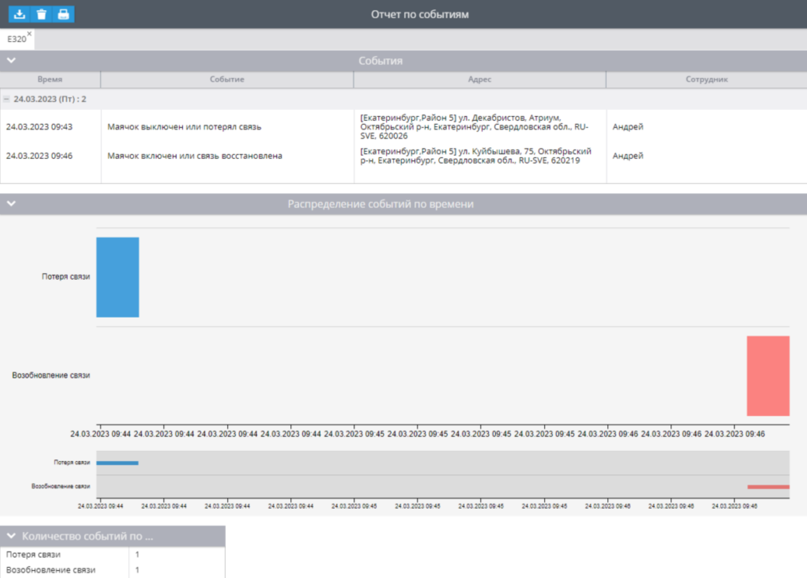
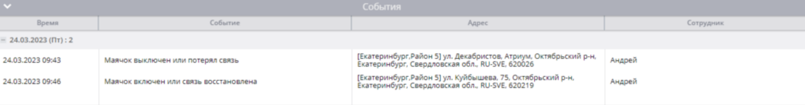

# Отчет Агрегированный по всем типам событий

Общий отчет обо всех типах событий, поддерживаемых платформой, который можно сгруппировать по типам событий (общие, события на основе местоположения, аппаратные события, сервисные уведомления). Отчет покажет когда и где произошло событие на устройстве, покажет распределение событий по времени на графике и выведет общую информацию обо всех событиях за период.

Для регистрации событий, на устройстве должны быть созданы [правила](../../../page-fafd011b-2281-4036-8ce0-5fa2e4aa4641/page-7cd89192-2b27-4179-9ee3-3d5cee315e37.md).

Для всех событий есть колонка с назначенным водителем. Если водитель был назначен на момент получения события - он будет указан в отчете.

## Параметры отчета

В дополнение к [общим параметрам](../../page-4eb4db1b-12a4-4ffd-b56e-a98fd003dfcc/page-b0c624ae-d81b-4bcb-b6d1-991cca3f18cf.md) в отчете используются дополнительные:

- Группировать по типу события – при включении данной опции, события будут сгруппированы в таблицы по типу. Если опция выключена, то все события будут показаны по порядку их регистрации устройством.
- Тип события – все возможные типы событий, которые разделены на 4 группы. Есть возможность использовать быстрый поиск по названию. Поиск выделит искомый текст в названиях событий.

### Тип события для отчета

Остановимся подробнее на всех возможных типах событий. Они бывают трех типов:

- Аппаратные – обрабатываются на стороне устройства его внутренними алгоритмами и настройками. На платформу отправляется событие.
- Программные – регистрируются на основе данных на стороне платформы.
- Работающие всегда – срабатывают всегда и не относятся ни к каким правилам.

Далее рассмотрим какие правила соответствуют различным событиям. Нажмите на любую из групп, чтобы открыть список.

## Таблица События

В данной таблице представлена информация обо всех событиях, времени их срабатывания, адресе, а также сотруднике назначенном на устройстве. Также в отчете информация распределена по дням с указанием дня недели и общим количеством событий.

Информация распределена по следующим колонкам:

- Время – когда произошло событие.
- Событие – название события.
- Адрес – где произошло событие.
- Сотрудник – назначенный сотрудник в момент получения события устройством.

Информацию в строках можно прочитать так. В общем за 24 марта (пятница) произошло 2 события. В 9:43 была зарегистрирована потеря соединения устройства с сервером. Последнее известное местоположение на момент отключения на ул. Декабристов. Андрей был назначен на маячок в тот момент.

## График Распределение событий по времени

График с визуальным представлением всех сработавших правил за период.

На нижнем графике есть возможность изменить масштаб верхнего графика. Необходимо навести курсор на край серой области и потянуть его в сторону. Также есть возможность переместить серую область вправо или влево. Так вы зададите границы времени для верхнего графика и, соответственно, его масштаб. По умолчанию график показывает весь период отчета без масштабирования.

## Таблица Количество событий по устройству

Здесь отображается общее количество событий каждого типа за указанный период на устройстве. Все типы учитываемых событий вы выбираете в настройках отчетах. Если каких-то из выбранных событий за период на маячке не было, то напротив названия типа событий будет прочерк.

## Чем могут быть полезны отчеты

Данный отчет будет полезен для учета каких-либо событий на устройстве за период. Особенно полезно, если вы отслеживаете несколько групп событий или хотите сделать учет произошедшего по определенным событиям для анализа возникших ситуаций.