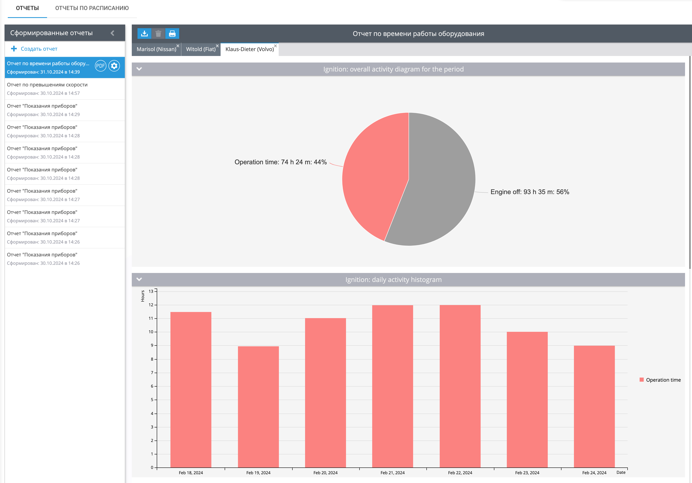

# Отчет Время работы оборудования

Отчет по времени работы оборудования представит информацию о времени работы любого агрегата, подключенного к дискретным или виртуальным входам с двумя состояниями. Также есть возможность узнать время работы оборудования в движении и без движения, получить информацию об активности по дням и информацию – когда и где включалось оборудование. Для построения отчета с помощью API платформы используйте плагин 12.

## Как работает отчет

Отчет рассчитывает время работы оборудования, исходя из точек, полученных платформой и определенных, как поездка. Учитывается время работы с выбранного дискретного входа и состояние остановился/движется для распределения времени работы в движении и на холостом ходу. Для работы отчета необходимо настроить следующее:

1. Дискретный датчик на устройстве. Он должен быть правильно подключен и регистрировать состояние входа корректно.
2. Виртуальный датчик - это может быть датчик с любым методом расчета информации, однако у него должно быть два состояния. Одно из состояний обязательно при значении датчика 0.
3. Также на правильное определение времени работы в движении и на холостом ходу влияет настройка [определения стоянок](https://www.navixy.ru/docs/user/web-interface-docs/devices-doc/parking-detection/). Если устройство определит состояние входа включенным, а платформа определит стоянку, то время работы оборудования будет записываться в холостой ход. Например, скорость для определения стоянки ниже 3 км/ч. Устройство двигается с такой скоростью более 5 минут. Все это время будет учтено, как время работы на холостом ходу, а не в движении.

Платформа рассчитывает время работы оборудования следующим образом, при выборе минимальной продолжительности включения 60 секунд:

| Точка | Время | Статус входа | Моточасы |
| --- | --- | --- | --- |
| 1   | 10:00:00 | выкл | 0 минут |
| 2   | 10:01:00 | вкл | 0 минут. Так как по информации платформы с 10:00 до 10:01 вход был выключен |
| 3   | 10:01:32 | вкл | 0 минут, так как установлена минимальная продолжительность для учета включения – 60 секунд. |
| 4   | 10:05:32 | выкл | 4 минуты и 32 секунды, так как все время до 10:05:32 – дискретный вход был включен. |

## Параметры отчета

В отчете есть следующие параметры:

- Минимальная продолжительность включения – укажите, сколько секунд минимум дискретный датчик должен быть включен, чтобы время работы фиксировалось отчетом. Если это отчет по виртуальному датчику, то расчет времени работы будет вестись при значении датчика не равном 0.
- Показывать только общий отчет – отобразить только общую информацию для нескольких выбранных маячков. Минимум должно быть выбрано 2 устройства.
- Отображать наработку в зависимости от движения – отчет будет вести учет состояния парковки и распределять время работы оборудования в движении и на холостом ходу.
- Использовать умный фильтр – не будет учитывать короткие поездки. Короткими считаются поездки короче трехсот метров за время которых устройство отправило менее 4 точек.
- Устройство с выбором дискретного входа или виртуального датчика. В списке устройств для отчета будут только те, на которых настроен минимум один дискретный или виртуальный датчик.

Этот отчет покажет точно такую же информацию для входа зажигание, как отчет по моточасам, если установить минимальную продолжительность включения 60 секунд и включить отображение наработки в зависимости от движения.

## Диаграмма активности за период

Представляет информацию об общем времени работы оборудования за период. Сколько времени дискретный датчик был выключен и сколько включен. При отображении наработки в зависимости от движения, график также отобразит время работы в движении и на холостом ходу.

Если отчет построен по виртуальному датчику, платформа будет отображать его виртуальное состояние для значений следующим образом:

- Состояние виртуального датчика, соответствующее значению 0, будет отображаться серым цветом.
- Состояние виртуального датчика, соответствующее любому другому значению, будет отображаться красным цветом.

## Гистограмма активности по суткам

Отображает время работы оборудования по дням. Если статус движения отслеживается, то отображает время работы оборудования в движении и на холостом ходу по суткам. При наведении на гистограмму каждого дня можно увидеть более детальную информацию.

## Таблица Датчик: время работы (по суткам)

Таблица со статистической информацией о времени работы оборудования каждый день. В этой таблице можно узнать количество интервалов работы, время работы оборудования по дням в среднем, а также пробег с включенным оборудованием и среднюю скорость автомобиля.

Если включить отслеживание статуса движения, то в отчете также появится информация об использовании оборудования в движении и на холостом ходу по дням.

## Таблица Датчик: время работы (детализация)

Здесь представлена информация о каждом интервале работы - когда и где определилось включение и выключение датчика на устройстве. Детализация распределена по дням с указанием даты, дня недели и общего количества интервалов.

## Чем и кому может быть полезен отчет

Этот отчет может быть полезен всем, кто стремится оптимизировать использование оборудования, повысить эффективность и принять обоснованные решения по обслуживанию и замене оборудования.

- Отчет может быть использован для детального анализа использования оборудования сотрудниками. Например, если они включают какой-либо агрегат, но при этом машина, не двигается.
- Оценить эффективность использования оборудования за период. Сколько часов оно в общем простаивает без работы.
- Оценить – как скоро может потребоваться замена оборудования на основании его использования.
- Рассчитать амортизационные расходы на основании времени использования оборудования.
- Произвести перерасчет ГСМ не только на основе пробега, но также исходя из времени без движения, если время на холостом ходу очень большое. Например, для тяжелой техники.
- Расширение числа возможных контролируемых устройств путем считывания данных с виртуальных датчиков. Эта функция полезна для датчиков, имеющих два состояния, одно из которых имеет значение 0.