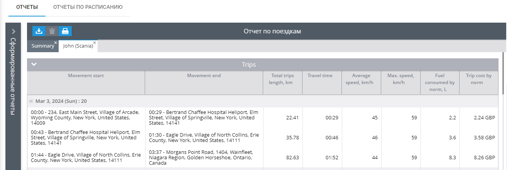

# Отчет Поездки

Отчет **Поездки** обеспечивает всесторонний анализ истории поездок вашего автомобиля, предлагая информацию о пройденном расстоянии, времени в пути, продолжительности остановок, скорости и расходе топлива.

Этот отчет бесценен для руководителей автопарков, которым необходимо следить за использованием транспортных средств, рассчитывать эксплуатационные расходы и оценивать эффективность вождения. Ниже приводится подробное руководство по работе отчета о поездках, параметрах и эффективной интерпретации данных.

## Обзор

Отчет "**Поездки**" содержит подробную информацию о каждой поездке, совершенной вашим автомобилем, включая время начала и окончания поездки, расстояние, скорость и расход топлива. В отчете также представлена сводка всех поездок за выбранный период, что позволяет легко проследить за работой автомобиля.

## Чем может быть полезен отчет

Отчет о поездках предоставляет ценные сведения, которые можно использовать несколькими способами:

- **Оперативный анализ:** Проанализировав схемы использования автомобиля, вы сможете оценить частоту, расстояние и продолжительность поездок. Эти данные необходимы для расчета амортизации и прогнозирования будущего использования автомобиля.
- **Управление затратами:** Отчет помогает выявить неожиданные или несанкционированные поездки, которые могут привести к увеличению расходов. Он также содержит подробную информацию о расходе топлива, позволяя оценить расходы в зависимости от различных маршрутов и нагрузок.
- **Производительность водителя:** В отчете указывается время, которое водители проводят на конкретных маршрутах, их средняя и максимальная скорость, а также время, которое автомобили простаивают после поездок.
- **Оценка эффективности:** Вы можете оценить расход топлива для различных типов поездок, например, для поездок с высокой нагрузкой по сравнению с поездками с низкой нагрузкой или без нагрузки, чтобы оптимизировать расход топлива.

## Параметры отчета

Отчет о поездках имеет несколько настраиваемых параметров, позволяющих адаптировать отчет к вашим потребностям:

- Показывать общий отчет - позволяет включить или отключить страницу с общей информацией по всем устройствам.
- Показывать только общий отчет – в отчете будет только лист с итоговыми данными по всем устройствам. Нужно выбрать минимум 2 устройства, чтобы получить такой лист. Подробной информации о каждой поездке в отчете не будет.
- Разделять стоянками – поездки будут разделены стоянками. Если данная функция не выбрана, то в отчете старт поездки будет по первой точке, полученной за день и окончание с последней точкой, полученной за день.
- Показывать длительность стоянки –  для каждой поездки будет отображаться время стоянки после нее.
- Показывать координаты – для места начала и окончания поездки будут отображаться координаты в дополнение к адресам.
- Использовать умный фильтр – прячет короткие поездки. Короткими считаются поездки короче 300 метров за время которых устройство отправило менее 4 точек.
- Группировать по водителям – сгруппирует поездки по водителям. Если за период отчета никто из водителей не был назначен на маячок, все поездки будут для не идентифицированного водителя.

### Колонки отчета

- Начало движения – содержит информацию о времени и месте начала поездки. Содержит только время и адрес, если параметр показывать координаты выключен. Если начало движения внутри геозоны, ее название будет отображаться перед адресом в квадратных скобках.
- Окончание движения – содержит информацию о времени и месте окончания поездки. Название геозоны будет отображаться, если маячок окончил движение внутри нее.
- Сумма длин поездок – общая длина поездки, посчитанная по GPS.
- Время в пути – общая продолжительность поездки.
- Средняя скорость – скорость, с которой можно преодолеть длину поездки за время в пути.
- Максимальная скорость – максимальная скорость маячка за поездку, которую зафиксировало устройство.
- Расход топлива по норме – отобразит сколько топлива за поездку могло быть израсходовано по норме. Для получения этой информации маячок должен быть назначен транспортному средству, у которого заполнена информация о расходе топлива на 100 км.
- Стоимость топлива по норме – отобразит стоимость топлива согласно информации, которую вы можете заполнить в карточке транспортного средства.
- Расход топлива по сенсору – отобразит реальный расход топлива по топливному датчику. Топливный датчик обязательно должен быть создан на маячке и данные с него должны поступать на платформу.  
Важно, что отчет по поездкам отображает данные по расходу топлива только во время поездок, поэтому показания с отчетом по топливу, который отвечает за изменения уровня топлива за весь день могут расходиться.
- Время стоянки – отобразит время стоянки между текущей и следующей поездками.

**Пример:**

Представленную строку можно прочитать следующим образом:

Маячок начал движение в 00:00:01 по адресу Erie Street, 12200 в Онтарио, Канада. Координаты начала движения – широта 42.8662533, долгота -79.383255. За эту поездку проехал 27.6 км и остановился в 00:37:56 по адресу Montgomery Road, 64 Онтарио, Канада по координатам широта 43.0247133, долгота -79.2759833. Общее время в пути 37 минут 55 секунд. Средняя скорость во время поездки 44 км/ч. Максимальная скорость 59 км/ч. Согласно карточке транспортного средства, за 27.6 км оно израсходовало 2,2 литра топлива стоимостью 114,92 рублей. После этой поездки транспортное средство стояло 14 минут и 9 секунд.

*Пример строки в отчете по поездкам*

## Итог

Итоговую информацию можно прочитать так:

Всего за период была 21 поездка. Сумма длин всех поездок по GPS 856.7 км. Общее время в пути 19 часов 16 минут 24 секунды. Средняя скорость за все поездки 44 км/ч, а максимальная 59 км/ч. Согласно карточке ТС должно было израсходоваться 68.5 литров общей стоимостью 3562 рубля. Общее время стоянок между поездками 4 часа 42 минуты и 36 секунд. Значение одометра на конец выбранного периода 427626.5 км.

*Пример итоговой информации в отчете по поездкам*

## Чем может быть полезен отчет

Информация из отчета по поездкам позволит вам понимать

- как используются транспортные средства, и по каким направлениям они двигаются в течение периода. Позволит оценить частоту и длину поездок, чтобы рассчитать амортизационные расходы на использование в настоящем и будущем.
- какие расстояния они преодолевают.
- сколько времени требуется водителям, чтобы проехать по определенным маршрутам в разные дни, если маршруты повторяются.
- какая средняя и максимальная скорость движения была при движении транспортного средства.
- как могло бы или как на самом деле расходуется топливо в автомобиле при движении по различным маршрутам. Например, при движении со склада, когда автомобиль загружен или при движении в парк, когда автомобиль разгружен. Также позволит рассчитать стоимость ГСМ в маршрутах.
- Как долго транспортные средства стоят после поездок, во время разгрузок или погрузок, при общении менеджеров по продажам с клиентами на местах или сколько времени мерчендайзер проводит на каждой точке.

Для получения более подробной информации о стоянках вы можете обратиться к нашему следующему отчету, о стоянках.