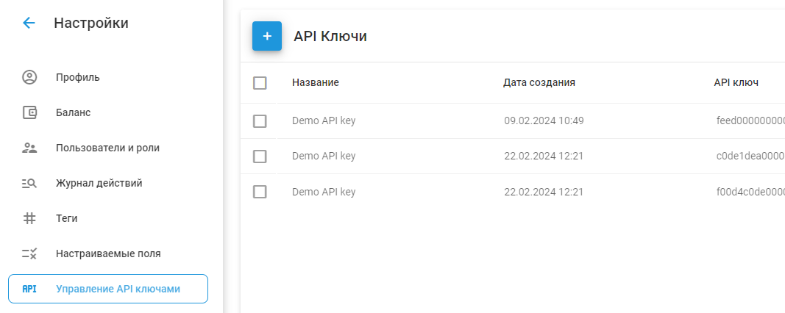

# Управление API Ключами

API-ключи - это уникальные и конфиденциальные коды, которые позволяют получить доступ к вашему аккаунту Navixy через программный интерфейс. С их помощью сторонние приложения могут подключаться к вашему аккаунту, получать доступ к данным и выполнять действия от вашего имени.

## Как просматривать и создавать ключи API

Перейдите в раздел **Аккаунт** → **Ключи API** из меню.

1. **Просмотр существующих ключей API:** В разделе "Ключи API" вы увидите список существующих ключей со следующими данными:
  - **Ярлык:** Имя ключа API.
  - **Дата создания:** Когда был создан ключ API.
  - **Ключ API:** Сам уникальный ключ.
2. **Создание нового ключа API:**
  - Нажмите на кнопку **"+"** чтобы добавить новый ключ API.
  - Введите метку для нового ключа.
  - Нажмите **Сохранить**.
  - Новый ключ сразу же появится в списке.

## Как удалить ключи API

1. **Удаление одного ключа API:**
  - Наведите курсор на клавишу, которую нужно удалить.
  - Нажмите на значок мусорной корзины, который появится справа.
2. **Удаление нескольких ключей API:**
  - Установите флажки рядом с клавишами, которые вы хотите удалить.
  - Нажмите на значок мусорной корзины в правом верхнем углу, чтобы удалить выбранные ключи.

## Советы по безопасности

- **Не публикуйте ключи API:** Храните ключи API в тайне, чтобы предотвратить несанкционированный доступ. С помощью этих ключей можно выполнять практически любые действия в вашей учетной записи.
- **Отдельные ключи для каждого приложения:** Рекомендуется создавать отдельный ключ API для каждого стороннего приложения или сервиса, чтобы повысить безопасность и эффективнее управлять доступом.