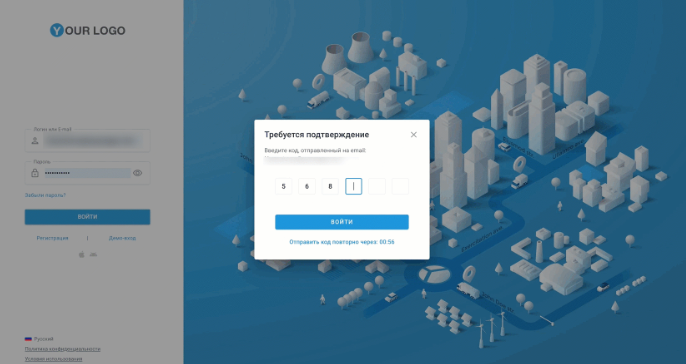

# Двухфакторная аутентификация

Navixy предлагает двухфакторную аутентификацию (2FA) для усиления безопасности в веб- и мобильных приложениях. В связи с увеличением объема конфиденциальных телематических данных 2FA обеспечивает дополнительный уровень безопасности, требуя ввода пароля и одноразового кода (OTP), отправляемого по электронной почте. Поставщик услуг GPS/телематики определяет, включена ли функция 2FA, и настраивает соответствующие параметры.

**Как это работает?**

OTP будет отправлен на вашу электронную почту и должен быть введен для завершения процесса входа в систему. Этот дополнительный шаг гарантирует, что даже если ваш пароль будет взломан, неавторизованные пользователи не смогут получить доступ к вашей учетной записи без доступа к вашей электронной почте.

1. **Войдите в систему, используя свой пароль**: введите свое имя пользователя и пароль, чтобы начать процесс входа в систему.
2. **Получите одноразовый код.** После проверки пароля на электронную почту, зарегистрированную в учетной записи Navixy, будет выслан одноразовый код доступа.
3. **Введите код.** Вы введете этот код для завершения входа в систему.
4. **Доступ к вашей учетной записи.** Если код верен, доступ предоставляется; в противном случае вход запрещен.

Каждый код действует в течение 5 минут, что ограничивает возможность злоупотребления. Кроме того, при необходимости вы можете запросить новый код, но только один раз в минуту, чтобы предотвратить злоупотребления.