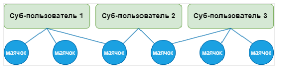

# Ограничение доступа к информации

Navixy позволяет организациям эффективно управлять доступом к созданной пользователями информации, включая GPS-устройства и связанные с ними артефакты, такие как геозоны, места и правила уведомлений. Эта возможность жизненно важна для обеспечения безопасности данных и операционной эффективности, особенно в организациях с несколькими подразделениями или бизнес-единицами. Такой подход обеспечивает:

- Чувствительная информация защищена от несанкционированного доступа
- Пользователи могут сосредоточиться на данных и инструментах, соответствующих их ролям
- Обеспечение операционной эффективности различных подразделений и бизнес-единиц

В этом документе описывается, как обеспечивается безопасность GPS-устройств и информации, созданной пользователями, и как она передается другим сотрудникам организации.

## Устройства GPS

Когда пользователь добавляет GPS-устройство, оно фактически создается под учетной записью владельца, поэтому даже после удаления пользователя GPS-устройство остается в учетной записи организации. Владелец может указать, какие пользователи могут просматривать данные GPS-устройства, такие как поездки или данные датчиков, гарантируя, что только уполномоченные лица могут просматривать и управлять устройством.

## Сопутствующие артефакты

- **Правила уведомления**: Правила оповещения позволяют пользователям настраивать оповещения на основе различных критериев, например превышения скорости или выхода за пределы геозоны. Когда пользователь создает правило, оно фактически создается в учетной записи владельца. Другие пользователи, имеющие доступ к соответствующему устройству, также смогут видеть и использовать эти правила.

- **Места и геозоны**: Пользователи могут создавать места и геозоны для определения конкретных областей, представляющих интерес. Хотя этими артефактами управляет создавший их пользователь, они фактически связаны с учетной записью владельца. Владелец может предоставить доступ к этим геозонам другим пользователям в организации. Только пользователи с соответствующими разрешениями могут просматривать и изменять эти геозоны.