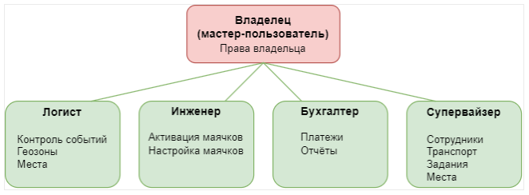
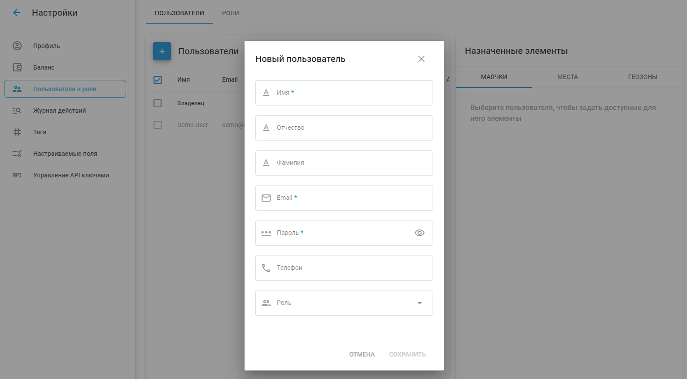

# Добавление пользователей в учетную запись

К пользователям учетной записи организации относятся Владелец и Пользователи. Владелец - это основной владелец учетной записи с полным контролем и административными правами, а Пользователи - это дополнительные учетные записи с определенными ролями и разрешениями, назначенными Владельцем.

## Владелец и пользователи

Владелец в Navixy - это основной владелец аккаунта с полным доступом и контролем над платформой. Эта учетная запись имеет самый высокий уровень прав и может выполнять все административные задачи. Владелец обладает эксклюзивными правами, которые не могут быть переданы другим аккаунтам, что обеспечивает ему полный контроль над аккаунтом.

Владелец может ограничить доступные пользователям операции:

- [Определение ролей пользователей](../page-445af484-7e7a-434f-808d-8bb00aa42d25/page-cff75fed-0c27-4f8d-aa74-75803972b90e.md) - определяет, какие действия могут выполнять пользователи;
- [Ограничение доступа пользователей к информации](../page-cc07cc24-f4ab-4ad5-9e05-7b1084300824/page-210daba9-cd22-4997-97f4-7b5e1ae988b9.md) - контроль за тем, к каким GPS-устройствам и данным пользователи могут получить доступ.

Пользователи - это дополнительные учетные записи, которым владелец предоставляет доступ. Как подчиненные учетные записи, пользователи не могут обладать определенными правами владельца, включая:

- Создание, редактирование или удаление других пользователей
- Редактирование GPS-устройств, геозон или мест, которые им недоступны
- Ограничение доступа владельца к своему аккаунту

### **Просмотр и редактирование списка пользователей**

Чтобы добавить нового пользователя или изменить список пользователей, перейдите в Настройки аккаунта → Пользователи и роли в главном меню.

1. **Добавление нового пользователя**:

- Нажмите кнопку "+", чтобы добавить нового пользователя.
- Заполните необходимые поля: Имя, Отчество, Фамилия, Email, Пароль, Телефон и [Роль](../page-7e99d347-72ca-4087-95de-249a3e42ff6b/page-18b5ac59-1338-439d-8e37-15e8404c1fbc.md).
- Нажмите "Сохранить", чтобы создать нового пользователя.

3. **Редактирование информации о пользователе**:

- Выберите пользователя из списка, чтобы просмотреть его данные.
- Измените необходимые поля и обновите информацию о пользователе.
- Нажмите "Сохранить", чтобы применить изменения.

4. **Назначение объектов пользователям**:

- Выбрав пользователя, вы можете [назначать конкретные объекты, POI и геозоны](../page-9fec6462-d6c2-4032-89a5-4177e9a0a587/page-625c1a7f-a239-4d5d-a232-237c1d4c528a.md) к ним.
- Выберите элементы на соответствующих вкладках (Трекеры, POI, Геозоны) и назначьте их пользователю.