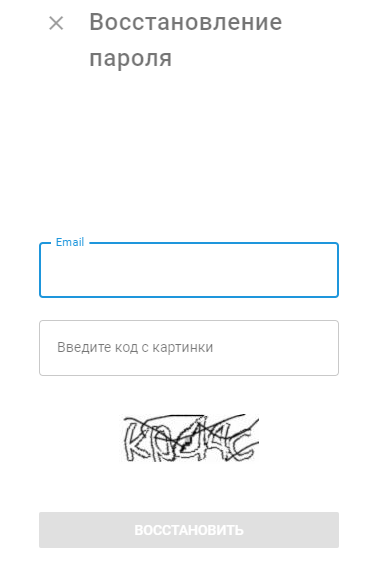

# Восстановить пароль

Если вы забыли свой пароль и вам нужно его восстановить, выполните следующие действия:

1. **Перейдите на страницу входа в систему:** Откройте страницу входа в систему. Пожалуйста, свяжитесь с вашим [поставщиком услуг](../../page-8a2f8196-a6cd-4a31-b179-17cfb7171e88/page-6ddb2987-f073-40cb-b1e2-30dc2381df39/page-7218bbf2-4fb7-447c-97b4-87a19f8cdee4.md) для получения URL-адреса, если вы его не знаете.
2. **Нажмите на кнопку "Забыли пароль?".** Найдите и нажмите ссылку "Забыли пароль?" под полем для ввода пароля.
3. **Введите данные для входа в систему:** Укажите свой зарегистрированный адрес электронной почты или имя пользователя.
4. **Следуйте инструкциям:** Проверьте свою электронную почту на наличие ссылки для сброса пароля и следуйте инструкциям, указанным в письме, чтобы сбросить пароль.

## Вопросы и ответы и устранение неполадок

Если у вас нет доступа к адресу электронной почты, попробуйте связаться с вашим [поставщиком услуг](../../page-dbd3a366-9fa0-4f14-b2e0-9393f8999c9d/page-6596a5b3-3749-4700-9590-3ee0e71b20a4/page-baf002ea-0fff-4704-ab7b-58c24b4f6383.md) чтобы восстановить доступ к своей учетной записи.