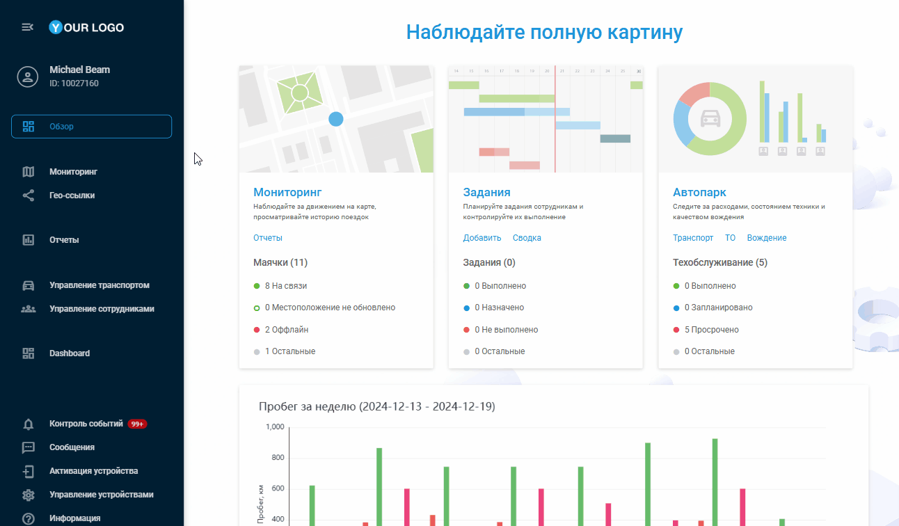

# Приложения

## **Обзор**

Эта функция позволяет расширять и настраивать функциональность платформы за счет беспрепятственной интеграции инструментов сторонних разработчиков и пользовательских надстроек. Приложения - это своего рода строительные блоки, которые позволяют создать индивидуальное рабочее пространство, где все необходимые инструменты находятся на расстоянии одного клика. Если вам нужно проанализировать сложные данные, упростить коммуникацию или интегрировать специализированные отраслевые инструменты, эта функциональность призвана вам помочь, не требуя дополнительных технических знаний.

Вы моете выбирать сами, как внешние инструменты будут интегрированы в ваше рабочее пространство. Некоторые приложения лучше всего работают, когда они встроены непосредственно в интерфейс, становясь частью вашего ежедневного рабочего процесса. Другие лучше перенаправлять в новые вкладки, позволяя работать в полноэкранном режиме. Система адаптируется к вашим предпочтениям, сохраняя безопасность и простоту использования благодаря дополнительным параметрам URL, идентификации пользователя и безопасному управлению сессиями.

Вот основные преимущества использования **Приложений**:

- **Индивидуальная настройка**  
Расширьте возможности платформы для удовлетворения конкретных потребностей бизнеса с помощью пользовательских функций и рабочих процессов.
- **Бесшовная интеграция**  
Легко подключайте сторонние приложения, чтобы оптимизировать рабочий процесс. Сократите количество переключений контекста и сэкономьте время, получив доступ к нужным инструментам в рамках одной платформы.
- **Усиленный контроль**  
Расширьте возможности управления ежедневными операциями с помощью гибкой конфигурации платформы, потенциально открывая новые способы её использования.
- **Способствуйте инновациям**  
Разрабатывайте и получайте доступ к новым приложениям и решениям непосредственно из Navixy, стимулируя инновации в вашей организации.
- **Развитие сообщества**  
Расширяйте профессиональную телематическую сеть и делитесь ценными сведениями о своих разработках.

## **Доступ к Приложениям**

В зависимости от уровня доступа, определенного ролью пользователя, доступность функции может отличаться:

- **Владельцы** учетных записей имеют полный доступ к управлению приложениями. Они могут создавать новые приложения, просматривать все приложения, существующие в учетной записи, и управлять ими.
- **Пользователи** аккаунта могут видеть только те приложения, которые включены для них в боковой панели платформы.

Раздел **Приложений** доступно **владельцам** учетных записей в разделе **"Настройки учетной записи"**. Чтобы получить к нему доступ:

1. Нажмите на значок профиля в левом верхнем углу экрана, чтобы открыть настройки вашей учетной записи
2. На боковой панели настроек выберите **Приложения**

Вы увидите полный список всех существующих дополнений, а также возможность создания новых.

## **Содержание раздела**

Узнайте больше о том, как создавать и настраивать пользовательские Приложения:

- [Создание новых Приложений](./page-9ce52c1d-751e-46e3-bc77-337fb9a61120/page-1e9f6c23-fe89-46e7-ac8f-a39f61375d9c.md)
- [Управление существующими Приложениями](./page-34caa213-5257-4ad8-a74b-503393fd8918/page-98f512d7-bc57-467f-b8d0-370deadddd73.md)