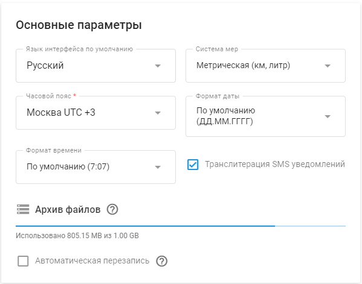

# Основные параметры пользователей

Раздел "Основные параметры" находится в **Настройки учетной записи → Профиль.** Вы можете настроить различные параметры в соответствии с вашими индивидуальными потребностями и предпочтениями. Сюда входят опции языка, система мер, часового пояса, формата даты и управления хранением файлов.

## Основные параметры пользователя

1. **Язык интерфейса по умолчанию:** Установите язык по умолчанию для вашей учетной записи. Например, на скриншоте выше выбран английский язык.
2. **Система мер:** Выберите предпочтительную систему измерения. Обычно выбирают метрическую (километры, литры) или имперскую (мили, галлоны).
3. **Часовой пояс:** Установите местный часовой пояс для вашей учетной записи. Эта настройка очень важна для точного отслеживания времени и создания отчетов. Например, на скриншоте показан Париж UTC +1 (DST +1).
4. **Формат даты:** Выберите формат отображения дат. Доступные форматы помогут обеспечить отображение дат в наиболее привычном для вас виде, например ДД/ММ/ГГГГ.
5. **Формат времени:** Выберите формат отображения времени. По умолчанию обычно используется 12-часовой формат (11:59 AM).
6. **Транслитерация SMS-уведомлений:** Включить или отключить транслитерацию SMS. Эта настройка может быть полезна, если вам нужно отправлять SMS-сообщения с определенным набором символов.

## Хранение файлов

- **Использование.** Отслеживайте использование файлового хранилища.
- **Автоматическое удаление:** Включите опцию автоматического удаления файлов при достижении лимита хранения. Это поможет эффективно управлять хранилищем без ручного вмешательства.