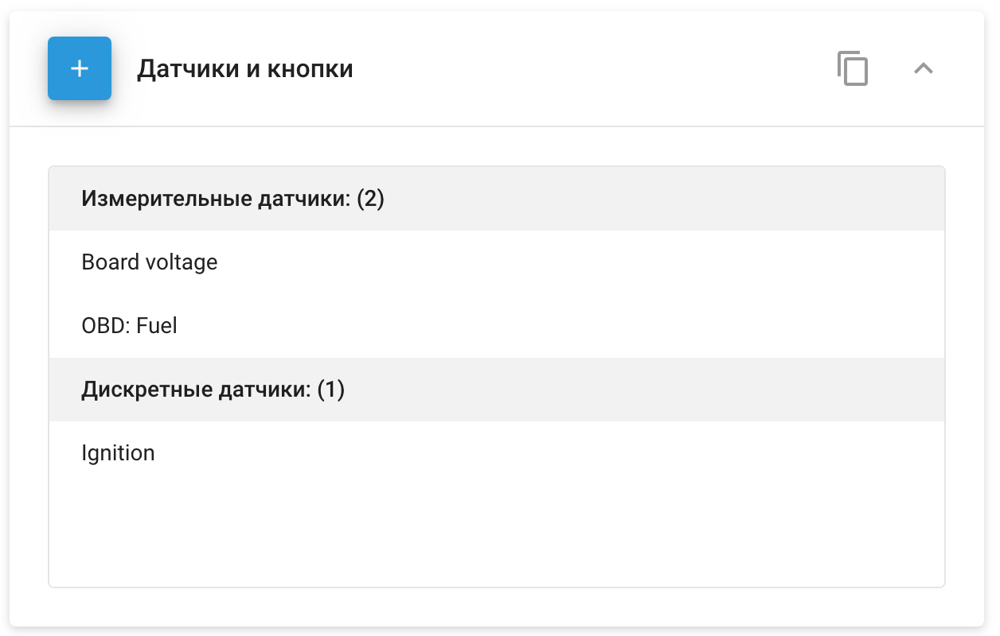

# Датчики и кнопки

**Датчики и кнопки** Виджет в Navixy позволяет управлять и настраивать различные датчики, подключенные к GPS-устройствам. Эта функция необходима для мониторинга различных параметров автомобиля, таких как уровень топлива, температура и диагностика двигателя, непосредственно через платформу.

## Обзор

Виджет **Датчики и кнопки** находится в разделе **Управление устройствами**.

Сложенный виджет предоставляет обзор количества датчиков, уже подключенных к выбранному устройству. Развернув панель, можно добавлять новые датчики или редактировать существующие.

Количество и тип подключаемых датчиков зависят от модели GPS-устройства. Например, некоторые устройства позволяют настраивать параметры данных, передаваемых по шине CAN или диагностическому разъему OBDII.

## Добавление и редактирование датчиков

Для управления датчиками вы можете использовать следующие кнопки:

- **Добавить датчик**: Позволяет добавить новый датчик.
- **Редактировать датчик**: Позволяет изменять параметры существующего датчика.
- **Удалить датчик**: Удаляет выбранный датчик из системы.

### Типы датчиков

Navixy поддерживает различные типы датчиков, включая:

- [**Дискретные датчики**](./page-da981ade-b025-4ccd-b40f-a50cfaa1e9c6/page-735d0cb3-e88e-4f21-b67f-bac4712f58a2.md): Используется для двоичных входов, таких как состояние зажигания, открытие/закрытие двери и т.д.
- [**Измерительные датчики**](./page-f638c171-2c2d-43c7-8fec-f81622b5b207/page-7756c17e-dcbd-4169-a234-614b7d388256.md): Эти датчики измеряют и сообщают непрерывные значения, такие как температура, уровень топлива или число оборотов двигателя.
- [**Агрегационные датчики**](./page-7078b3fb-9d13-48d5-b73f-7ebde549bac4/page-19565c18-6f06-422f-86ba-2eb38dc9ad85.md): Объединение данных из нескольких источников в единое отчетное значение.
- [**Виртуальные датчики**](./page-108f9c9e-4ea6-4b6d-a562-11b463785ce8/page-644e84a1-818a-4663-aefb-c6d3756aeb3f.md): Получается из расчетных данных или комбинированных значений датчиков.

### Копирование настроек датчика

Для упрощения настройки можно копировать параметры датчиков с одного устройства на другое, если устройства имеют одну и ту же модель. Это особенно полезно при управлении крупными автопарками с одинаковыми типами транспортных средств.

**Шаги для копирования настроек датчика:**

1. Нажмите кнопку копирования (📋).
2. Выберите устройства, к которым нужно применить скопированные настройки.
3. Нажмите **Применить**.

**Примечание:** Копирование настроек датчиков приведет к перезаписи текущих настроек выбранных устройств. Убедитесь, что вы выбрали только те устройства, которые собираетесь обновить.