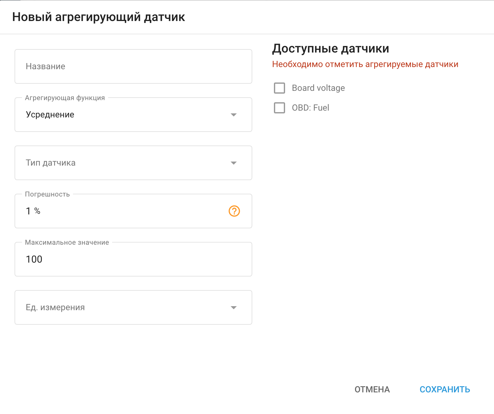

# Агрегирующие датчики

**Агрегирующий датчик** в Navixy - это мощный инструмент, позволяющий объединять данные с нескольких датчиков и обрабатывать их с помощью функции агрегирования. Эта функция особенно полезна в сценариях, где несколько датчиков используются для мониторинга схожих параметров, например уровня топлива в автомобиле.

## Опции функции агрегации

#### Доступны две функции агрегирования **Усреднение и Суммирование**.

- **Усреднение**: Эта функция рассчитывает среднее значение для выбранных датчиков. Она полезна, когда необходимо сгладить показания нескольких датчиков, обеспечив более стабильное и репрезентативное значение.

- **Суммирование**: Эта функция суммирует значения выбранных датчиков. Она идеально подходит, когда необходимо контролировать общее значение параметра, например, суммарный уровень топлива в двух баках.

## Практические примеры: несколько датчиков топлива в автомобиле

1. **Один бак с двумя датчиками уровня топлива**:
  - **Сценарий**: У вас есть большой топливный бак с двумя датчиками, расположенными в разных точках внутри бака.
  - **Цель**: Для получения более точных данных об общем уровне топлива путем усреднения показаний обоих датчиков.
  - **Конфигурация**:
    - **Функция агрегации**: Выбор **Усреднение**.
    - **Датчики для агрегации**: Выберите два датчика уровня топлива.
    - **Результат**: Система отображает средний уровень топлива, обеспечивая сбалансированные показания, которые компенсируют любые расхождения между двумя датчиками.
2. **Два сообщающихся резервуара с отдельными датчиками**:
  - **Сценарий**: У вас есть два топливных бака, которые сообщаются друг с другом, и каждый бак имеет свой собственный датчик уровня топлива.
  - **Цель**: Для контроля общего количества топлива в обоих баках.
  - **Конфигурация**:
    - **Функция агрегации**: Выбор **Суммирование**.
    - **Датчики для агрегации**: Выберите датчики из обоих резервуаров.
    - **Результат**: Система суммирует уровни топлива в обоих баках, показывая общее количество доступного топлива.

## Настройка датчика агрегации

1. **Название**: Введите имя для датчика агрегации, которое четко определяет его назначение.
2. **Агрегирующая функция**: Выберите либо **Усреднение** (для усреднения) или **Суммирование** (для суммирования) в зависимости от ваших потребностей.
3. **Тип датчика**: Выберите тип датчика (например, уровня топлива).
4. **Погрешность**: Укажите допустимую погрешность. Например, если точность установлена на 5%, а максимальное значение составляет 100 литров, изменения на 5 литров или меньше будут игнорироваться.
5. **Максимальное значение**: Установите верхний предел для агрегированного значения. Это предотвращает превышение суммарным показанием определенного порога.
6. **Ед. измерения**: Укажите единицу измерения (например, литры).
7. **Доступные датчики**: Выберите отдельные датчики, данные которых необходимо объединить.
8. **Сохранить**: После настройки датчика нажмите кнопку **Сохранить** чтобы применить настройки.

Такая конфигурация позволяет эффективно контролировать и управлять данными из нескольких источников, повышая точность и полезность решений по управлению автопарком и телематике.