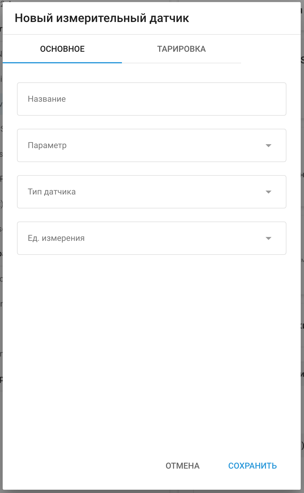
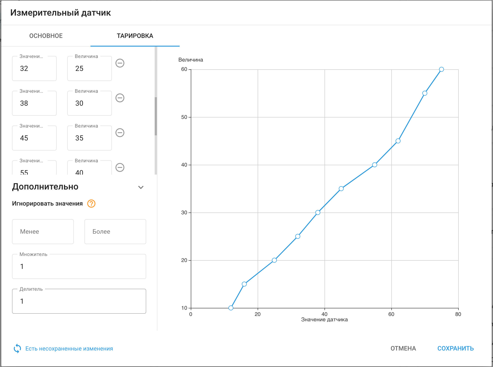
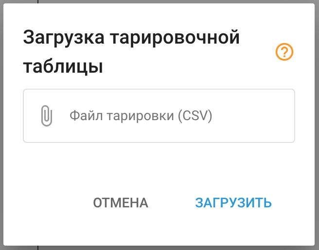

# Измерительные датчики

Чтобы добавить датчик измерения нажмите  

   и выберите «Датчик измерения» во всплывающем меню.

Укажите необходимые параметры датчика:

**Название датчика** – укажите название датчика в системе. Это может быть любое название по вашему выбору.

**Параметр** - выберите вход, к которому подключен датчик (количество и типы доступных входов определяются моделью устройства).

**Тип датчика** – выберите тип датчика

**Ед. измерения** – выберите единицы измерения. Вы можете выбрать доступные единицы из выпадающего списка или указать собственные.

**Дополнительные параметры** –появляются только при выборе определенного типа датчика.

Например, для датчика топлива параметры точности и пороговые значения можно настроить для использования при обнаружении слива.

После того, как все необходимые параметры заданы, нужно внести тарировочные данные в таблицу.

Предварительно нужно получить список соответствия «сырых» значений измерительного датчика (например, вольт) фактически измеряемым значениям (например, литрам).

Чтобы добавить строки в таблицу, нажмите “+”.

В созданной строке заполните поле «Значение» полученным «сырым» значением, а поле «Величина» - соответствующей этому значению измеряемой величиной.

Чтобы удалить строку, нажмите “-”.

Для загрузки готового файла тарировочной таблицы нажмите кнопку 

. Поддерживается только формат CSV.

При внесении данных в таблицу будет выполняться построение графика. При корректно заполненной тарировочной таблице график будет монотонно возрастать.

Если показания возрастают не монотонно (то есть, сначала возрастают, а затем снижаются), значит, тарировочная таблица заполнена некорректно.

После внесения необходимой информации нажмите кнопку **«Сохранить»**.