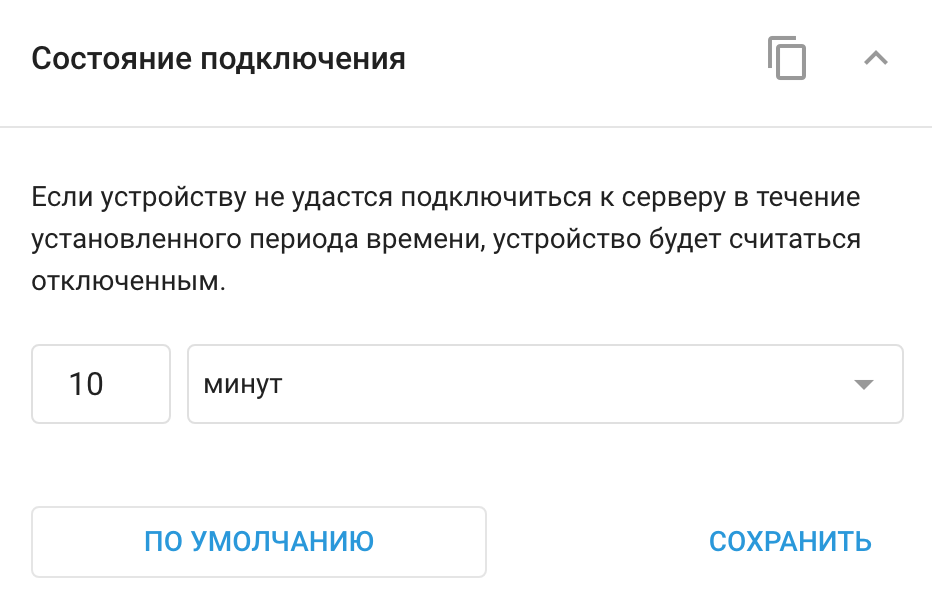

# Виджет Состояние подключения

Настройки состояния соединения позволяют определить временной интервал, по истечении которого GPS-устройство считается отключенным, если оно перестало передавать данные.

Возможно, вам потребуется изменить эти настройки для устройств, которые сообщают данные реже. Это предотвратит их пометку как автономных и обеспечит точное отображение их состояния, особенно для устройств в энергосберегающих режимах.

> [!INFO]
> Вы можете контролировать [Состояние подключения](../../page-2f00e975-26c0-45b9-8dd5-792a22b995da/page-0df48539-54ef-4fd8-978b-e4c65ad70fd7/page-d5221f61-e044-4fc4-8519-56a292554815/page-47821f9e-9f99-484e-92c1-f5c02a629538.md) ваших GPS-устройств, например, в [Список объектов](../../page-9f4799bd-9c60-4a8a-97ac-984147f68332/page-639e5e8e-ee19-47da-a78a-28023434ee37/page-f589e94f-bd47-4dd2-8b15-1e0d5780a4de.md) - в меню "Мониторинг" в веб-интерфейсе и мобильном приложении X-GPS Monitor. Состояние соединения отображается в виде цветного кругового индикатора в виджете каждого устройства, что позволяет быстро определить, подключено ли устройство в данный момент, не подключено или потеряло соединение.

Виджет состояния соединения в **Управление устройствами** имеет единственную настройку:

- **Временной интервал**: Установите время, по истечении которого устройство считается отключенным, если оно перестало передавать данные. Можно выбрать минуты, часы или дни.

Кнопка **По умолчанию** возвращает настройки к тайм-ауту по умолчанию, если в них были внесены изменения. Обычно это 10 минут, но может меняться в зависимости от модели устройства.