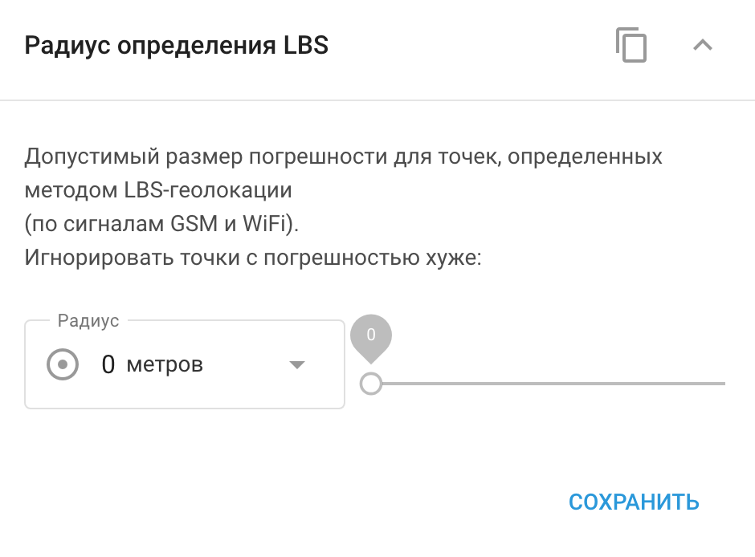

# Радиус определения LBS

Виджет **Радиус определения LBS (Location-Based Service)** определяет, на каком расстоянии система будет искать сигналы от базовых станций сотовой связи или точек Wi-Fi, чтобы определить местоположение устройства. Эта настройка очень важна для обеспечения точного отслеживания местоположения в зависимости от среды, в которой работает устройство.

- **Сельские районы**: В сельской местности с небольшим количеством базовых станций рекомендуется увеличить радиус действия LBS. Это позволит системе использовать более удаленные базовые станции, повышая шансы на обнаружение устройства.
- **Городские районы**: В городах с высокой плотностью базовых станций радиус LBS должен быть меньше. Близость нескольких базовых станций обеспечивает достаточное количество сигналов для точного отслеживания местоположения, поэтому меньший радиус поможет сохранить высокую точность.

Настройте радиус обнаружения LBS в зависимости от условий работы устройства, чтобы сбалансировать точность и покрытие сигнала.

В Navixy местоположения LBS отображаются на карте в виде кругов. Центр указывает на предполагаемое местоположение, а радиус - на возможную погрешность. Меньший круг указывает на более высокую точность, что обычно наблюдается в городских районах, в то время как больший круг указывает на большую погрешность, что характерно для сельских районов.