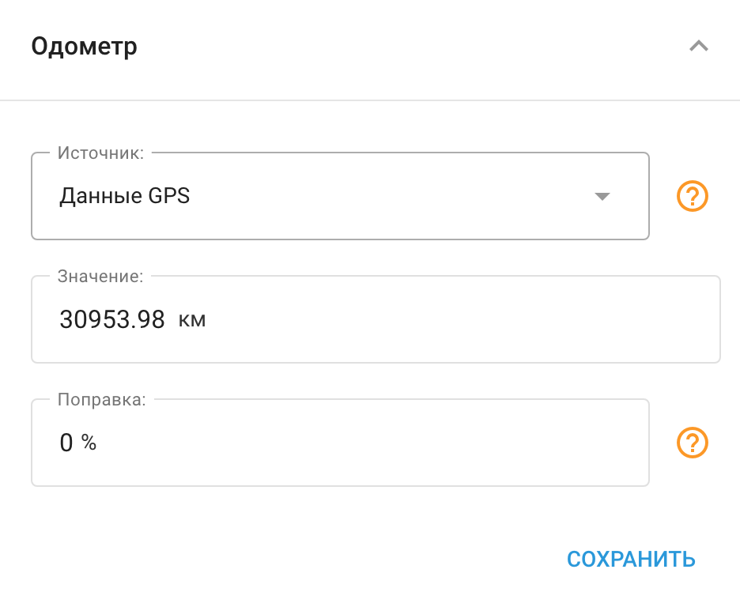

# Одометр

Виджет **Одометр** позволяет отслеживать пробег автомобиля в режиме реального времени. Показания пробега могут быть получены из данных, полученных через устройство слежения GPS или шину CAN. Кроме того, функция одометра интегрируется с [Управление автопарком](../../../page-b5d0f52d-676c-4efc-b911-8c231de87be3/page-2c08c03f-e110-4c39-8fd4-f5c8b942e829.md) Функция, позволяющая планировать сервисные работы для автомобиля и получать своевременные напоминания.

## Активация одометра

Чтобы активировать одометр:

1. Перейдите в раздел «Управление устройствами»;
2. Найдите панель «Одометр» и нажмите её, чтобы развернуть;
3. Нажмите кнопку «Добавить одометр»;
4. Измените источник данных, если это требуется;
5. Установите текущее значение одометра в машине;
6. Нажмите кнопку «Сохранить»

## Корректировка показаний одометра

- **Поправочный коэффициент.** Вы можете задать поправочный коэффициент для автоматической корректировки показаний одометра в сторону увеличения или уменьшения. Введите процентное значение в поле "Коррекция". Положительное значение увеличит показания одометра, а отрицательное - уменьшит.
- **Обновление значения.** Вы также можете обновить значение одометра, когда это необходимо. Предыдущие значения одометра можно просмотреть, создав "Отчет обо всех событиях" в приложении "Отчеты".
- **Быстрый доступ в режиме просмотра объектов.** Для быстрого доступа к значению одометра его можно найти и настроить в специальном виджете [Детали маячка](../../../page-c30fd701-49fe-48c6-99ef-7f22760f204a/page-158ac1de-7de2-4ee5-888a-fd1f3f9116a5/page-2adff096-ade3-4f0a-ad4d-20fb819d95ec/page-add5ee35-2d3f-46a1-bc9c-0dad49aa9178.md).

## Добавление дополнительных источников одометров

Типы источников одометра, которые вы можете использовать, зависят от конкретной модели устройства. Понимание и использование нескольких источников может повысить точность отслеживания пробега вашего автомобиля.

Чтобы добавить дополнительные источники показаний одометра:

1. **Создайте новый датчик измерения:** В зависимости от возможностей вашего устройства вы можете создать такие датчики, как CAN Mileage или аппаратный пробег. Эти датчики собирают данные непосредственно с систем вашего автомобиля, обеспечивая точные показания пробега.
2. **Интеграция с виджетом Odometer:** После создания датчика он появится в качестве опции в виджете "Одометр" на платформе Navixy. Это позволит вам выбрать наиболее подходящий источник данных о пробеге.

Использование нескольких источников одометров позволяет повысить надежность отслеживания пробега, что особенно полезно для планирования технического обслуживания и составления точных отчетов. Понимание различных типов источников и способов их интеграции в вашу систему является ключом к оптимизации вашей телематической системы.