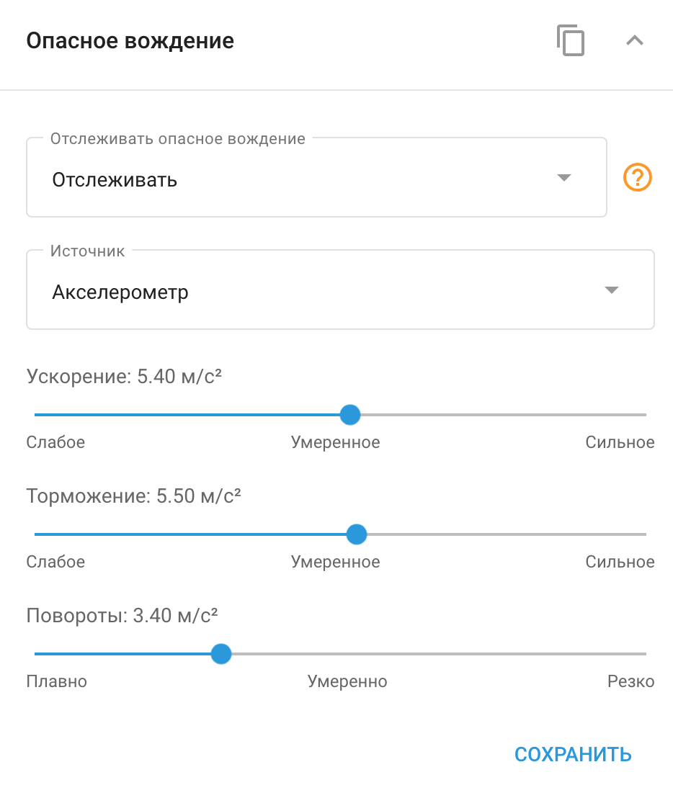

# Опасное вождение

Многие современные автомобильные GPS-устройства оснащены встроенным **Детектором опасного вождения**. Этот детектор непрерывно отслеживает значения ускорения при разгоне, торможении и повороте. Если эти значения превышают заданные пороговые значения, система генерирует соответствующее событие "Резкое вождение". Эти события можно отслеживать и анализировать с помощью [Уведомления](../../../page-2381d446-2262-41c3-81ab-0b7bdcc2e5a7/page-ef105848-1839-4da0-91f0-7f87c470553e/page-c1cd8ecf-05ad-47a1-b342-fc34874f6a26/page-b576ef6c-a537-4a8e-b54d-eb83bce0fbfe.md) и [Отчета о качестве вождения](../../../page-e512758b-67b2-474b-b93d-913b9d7f97ce/page-cb5b82c7-1c61-4242-96d9-49a606709ed2/page-b13e4e10-b9a7-43f0-9e2e-01ede75c3d65.md) что позволяет детально оценить поведение водителя.

## Настройка пороговых значений детектора опасного вождения

Поскольку транспортные средства различаются по своим техническим характеристикам - например, седан может разгоняться быстрее автобуса, - критические значения ускорения также отличаются. Navixy позволяет настраивать параметры жесткого вождения GPS-устройств в соответствии с конкретным типом транспортного средства, за которым ведется наблюдение.

Чтобы получить доступ к портлету **Опасное вождение** в Navixy перейдите к разделу **Управление устройствами.** В разделе выберите нужное устройство, а затем разверните виджет **Опасное вождение**, чтобы настроить параметры.

В портлете можно настроить пороговые значения для ускорения, торможения и поворота. Превышение этих пороговых значений будет вызывать различные типы событий, которые впоследствии можно проанализировать с помощью отчетов о событиях или отчетов об экологическом вождении. Такая настройка гарантирует, что система точно отражает условия вождения и требования безопасности вашего автопарка.