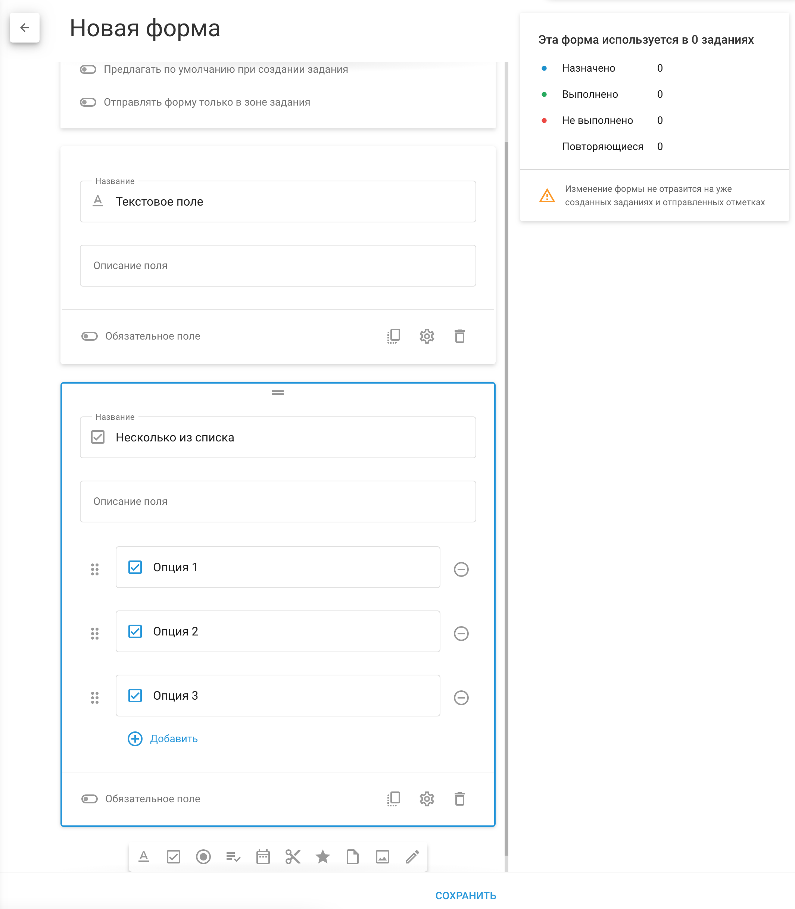

# Формы

**Формы** это электронные документы, которые могут быть прикреплены к заданиям, что позволяет сотрудникам представлять результаты выполнения заданий непосредственно через X-GPS Tracker мобильное приложение. Эти формы могут включать в себя различные типы полей, например текстовые поля для заказов клиентов, отчеты об осмотре, а также медиа-разделы для загрузки фотографий и видео.

## Начало работы

### Создайте форму

Начните использовать формы для продуктивной работы:

1. Создайте форму (кнопка в левом верхнем углу)
2. Прикрепите созданную форму к заданию

Данные, полученные через формы, можно просмотреть тремя способами:

1. В списке отправленных форм можно просмотреть их содержание
2. Через уведомления. На платформе можно настроить уведомления об отправке форм сотрудниками. Подобные смс и email уведомления будут содержать ссылку на заполненную форму.
3. В отчете по вложениям. Отчет покажет статистику по заполненным данным в табличном формате.

Для форм также доступны дополнительные параметры:

1. **Предлагать по умолчанию при создании задания —** форма с данной опцией будет автоматически прикреплена к новым заданиям. Рекомендуется для часто используемых форм.
2. **Отправлять форму только в зоне задания** — формы с данной опцией можно будет отправить только после прибытия в зону выполнения задания.

При работе с компонентами формы можно:

1. **Сделать поле обязательным для заполнения** — форму нельзя будет отправить если данные поля не заполнены
2. **Менять очередность полей** в форме перетаскивая их мышкой
3. **Копировать, редактировать и удалять** поля

### Прикрепление формы к задаче

Чтобы прикрепить форму к задаче, выполните следующие действия:

1. Откройте окно создания задачи: перейдите на вкладку **"Задания"** и нажмите кнопку "+", чтобы создать новую задачу.
2. В поле "Форма" выберите из выпадающего списка форму, которую вы создали ранее.
3. Укажите другие детали задания, например, выберите сотрудника, ответственного за его выполнение.
4. Завершите создание задания, нажав "Сохранить".

Выбранный сотрудник получит задание с приложенной формой в мобильном приложении X-GPS Tracker, обеспечив наличие всей необходимой документации во время выполнения задания.

### Заполнение формы в X-GPS Tracker

Сотрудники могут заполнить форму во время или после выполнения задания.  
Для заполнения формы сотруднику необходимо:

1. Запустить приложение X-GPS трекер
2. Перейдите в меню Задания
3. Откройте нужное задание
4. Нажмите на форму в описании задания

Форму можно будет отправить после заполнения всех обязательных полей. После сохранения форма будет отправлена на сервер.

### Настройка оповещений для отправки формы

Оповещения позволят вам не пропустить момент, когда сервер получил новую форму. Для создания оповещений:

1. Откройте меню «[Контроль событий](../../page-9a1088a8-3f94-42c4-bd43-594ecc4bcfa7/page-212220d8-a955-4a81-854a-cd8330e09a79.md)»
2. Нажмите «Добавить правило»
3. Выберите трекеры, к которым надо применить правило
4. Выберите тип события «Выполнение заданий» и нажмите Далее
5. В настройках правила выберите «Отправка формы»
6. На вкладке «Уведомления» выберите тип уведомлений, который вы хотите получать

### Просмотр заполненных форм

На платформе можно просмотреть отправленные формы и сравнить их друг с другом. Для просмотра форм необходимо:

1. Зайти в меню **«Управление сотрудниками»**
2. Выбрать пункт **«Формы»**
3. Навести курсор на нужную форму и нажать кнопку «Заполнения» в правой части строки
4. Выбрать форму в нижней части экрана

Вы сможете сравнить заполненные формы и скачать одну/несколько из них

### Отчет о данных формы задания

Отчет позволит вам просмотреть и сравнить производительность ваших сотрудников. Для создания отчета:

1. Зайдите в меню [**Отчеты**](../../page-8f439f39-d9f5-4cd4-a2b6-84fca5a3a205/page-9277016f-0f5e-4379-8172-ae2beff61fad.md)
2. Нажмите «**Создать отчет**»
3. Выберите отчет «Формы заданий»
4. Выберите объекты, по которым необходимо построить отчет
5. Выберите диапазон дат
6. Нажмите «Сформировать отчет»

В статистике по формам будет видно сколько раз и какие виды полей были заполнены по каждой форме.