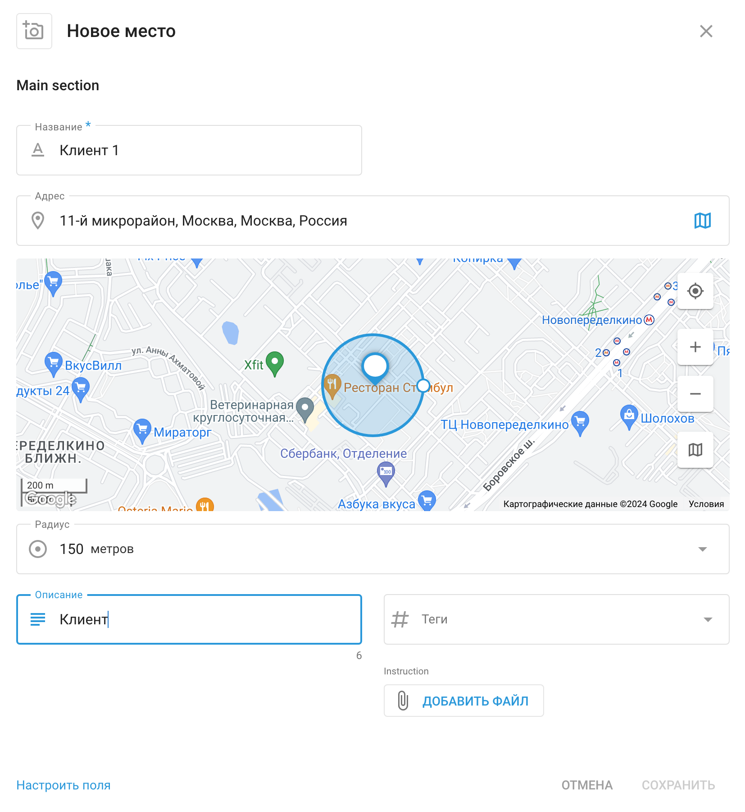

# Места - Управление сотрудниками

Раздел **Места** можно использовать для организации и управления ключевыми местами, которые необходимо посетить вашему полевому персоналу, например адресами клиентов, объектами компании или другими важными точками интереса. Это помогает упростить распределение задач, оптимизировать маршруты и обеспечить эффективность полевых работ.

Войдя в раздел "Места", вы увидите список всех доступных мест, а также их подробную информацию, включая добавленные вами пользовательские поля.

## Создание и управление местами

При создании нового места в меню "**Управление сотрудниками**" вы можете ввести всю необходимую информацию, чтобы облегчить его идентификацию и управление. Начните с присвоения имени месту, указания его адреса или выбора его местоположения на карте. Вы также можете добавить такие детали, как описание, теги и любые инструкции, относящиеся к месту.

### Пользовательские поля

Пользовательские поля позволяют добавлять дополнительные сведения, которые не входят в стандартные параметры. Эти поля соответствуют потребностям вашего бизнеса, обеспечивая наличие всей важной информации под рукой. Например:

- **Тип оборудования**: Запишите, какое оборудование находится на объекте, например "4G-антенна" или "Электрогенератор".
- **График технического обслуживания**: Отметьте, как часто сайт нуждается в обслуживании, например "Ежемесячно" или "Ежеквартально".
- **Код доступа**: Храните любые коды безопасности или инструкции, необходимые для доступа к сайту.
- **Контакт с менеджером**: Укажите контактные данные лица, ответственного за местоположение.

Использование пользовательских полей обеспечивает упорядоченность и доступность всей необходимой информации, что повышает эффективность работы на местах.