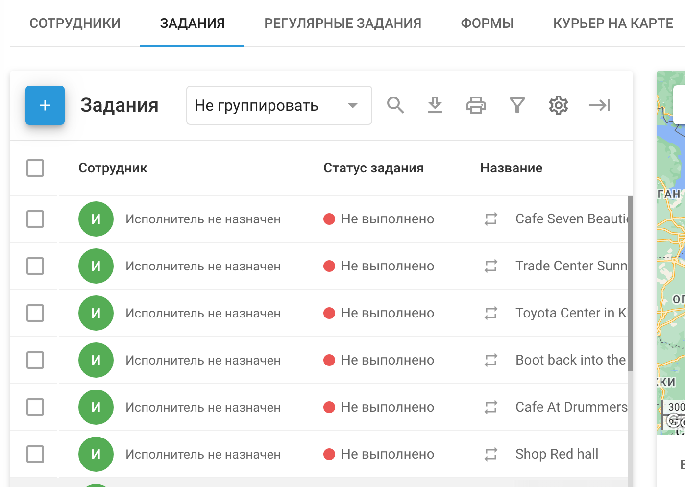
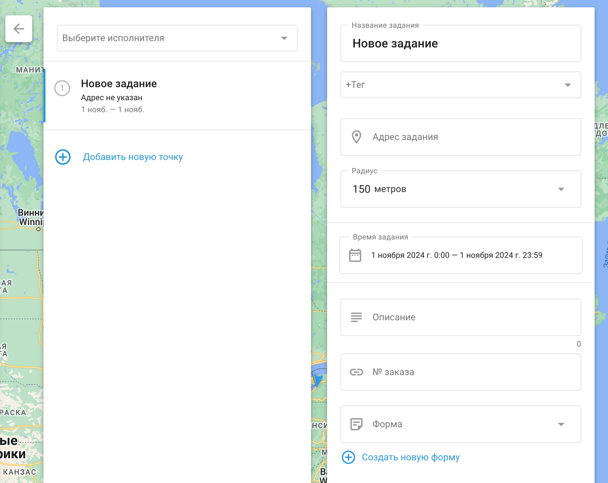

# Задания

Вкладка **Задания** в Navixy содержит конкретное задание(я) или работу, которую должен выполнить сотрудник или работник на месте. Оно включает в себя подробные инструкции о том, что нужно сделать, где это нужно сделать и в какие сроки. Задания могут варьироваться от простых разовых поручений, таких как доставка посылки в одно место, до более сложных операций, таких как посещение нескольких контрольных точек по маршруту для проведения инспекций, установки или других услуг.

Задания необходимы для управления и координации полевых работ, обеспечения четкого понимания сотрудниками своих обязанностей, а также для того, чтобы руководители могли контролировать ход работ, оптимизировать маршруты и обеспечивать эффективное выполнение всех заданий.

## Как создать задачу

1. Перейдите на вкладку “**Задания**”
2. Нажмите на кнопку **"+"** Чтобы начать процесс создания новой задачи, нажмите кнопку .
3. **Определите название задания:**
  - Введите описательное название задачи, которое поможет определить ее цель. Это может быть имя заказчика или краткое описание задачи, например "Установить оборудование" или "Проверить коммуникации".
4. **Укажите адрес задания:**
  - Введите адрес задания вручную, выберите точку на карте или используйте географические координаты. Это позволит определить основное местоположение для одиночного задания или первую контрольную точку для задания на маршруте.
5. **Установите время выполнения задания:**
  - Определите дату и временной диапазон, в течение которого сотрудник должен выполнить задание. Это гарантирует, что задание будет выполнено в установленные сроки.
6. **Добавьте контрольные точки для задач маршрута:**
  - Чтобы создать задание маршрута, нажмите "Добавить новую контрольную точку" после установки начального местоположения. Каждая контрольная точка представляет собой дополнительную остановку на маршруте, и они будут автоматически подключаться по порядку. Сотрудник должен пройти эти контрольные точки в указанном порядке.
7. **Назначьте задание сотруднику:**
  - Выберите сотрудника, который будет отвечать за выполнение задания. При необходимости вы можете назначить задачу позже, используя список задач, или воспользоваться дополнительными инструментами, представленными в интерфейсе, чтобы упростить назначение.
8. **Дополнительные сведения о задании:**
  - **Описание задачи:** Укажите любые дополнительные сведения, которые могут быть полезны сотруднику, например, контактную информацию или особые указания.
  - **Форма:** Выберите форму, которую сотрудник должен заполнить при выполнении задания. Формы можно заполнять непосредственно в приложении X-GPS Tracker.
  - **Теги:** Добавьте соответствующие теги к задаче, чтобы облегчить поиск и категоризацию в дальнейшем.
  - **Код заказа:** Присвойте идентификатор заказа, который клиент может использовать для отслеживания статуса задания с помощью функции "Курьер на карте".
9. Нажмите **"Сохранить"** чтобы завершить работу и отправить задание на мобильное устройство сотрудника.

### Одиночные и маршрутные задания

- **Одиночные задания:** Это простые задания, в рамках которых сотрудник посещает одно место для выполнения порученных ему обязанностей. Задание считается выполненным, когда сотрудник прибыл по указанному адресу и выполнил необходимые действия.
- **Маршрутные задания:** Они включают в себя несколько контрольных пунктов, которые сотрудник должен посетить в определенном порядке. Этот тип заданий идеально подходит для ситуаций, когда работнику необходимо посетить несколько мест по запланированному маршруту, например при доставке или проверке.

Интерфейс разработан интуитивно понятным, что позволяет менеджерам и диспетчерам быстро создавать и управлять как одиночными, так и маршрутными заданиями, обеспечивая эффективное и результативное выполнение всех полевых операций.

### Функция оптимизации маршрута

Функция **Оптимизировать маршрут** помогает курьерам эффективно доставлять посылки, определяя оптимальную последовательность посещения нескольких адресов в городе. При этом учитывается местоположение каждого адреса, конкретные сроки доставки и начальная точка задания, чтобы составить наиболее оптимальный маршрут.

#### Ключевые преимущества:

- **Экономия топлива:** Сокращает расстояние поездки, снижая расход топлива.
- **Быстрая доставка:** Оптимизирует последовательность действий для более быстрого выполнения задач.
- **Повышенная производительность:** Автоматизирует планирование маршрутов, позволяя курьерам сосредоточиться на доставке.

Платформа может оптимизировать до 25 точек в рамках одного маршрутного задания, обеспечивая своевременную и наиболее эффективную доставку.

## Импорт задач

При управлении большим штатом сотрудников или множеством задач импорт задач из файла Excel более эффективен, чем их ручное создание и назначение по одной. Это особенно удобно, когда задачи генерируются внешними системами, например CRM.

### Импорт из файла Excel

Разработчики могут использовать API для импорта задач, но есть и более простой способ - импортировать задачи из файла Excel. Данные должны быть представлены в форматах XLS, XLSX или CSV.

#### Как импортировать задачи из файла Excel

1. **Запустите процесс импорта:**
  - Наведите курсор на кнопку **"+"** в разделе заданий.
  - Нажмите на кнопку **XLS** вариант.
2. **Окно импорта задач:**
  - В окне "Импорт задач" вы можете загрузить **Пример файла** шаблон.
  - При необходимости установите параметры задачи.
3. **Необходимые поля:**
  - Определенные поля должны быть заполнены для успешного импорта. Система отклонит импорт, если какие-либо обязательные поля отсутствуют.
4. **Адрес против координат:**
  - Вместо координат можно указать адрес; система автоматически определит местоположение.

#### Настройки импорта

Помимо индивидуальных настроек задач, вы можете настроить следующие глобальные параметры:

- **Радиус по умолчанию:** Определяет допустимое отклонение от указанного местоположения. Если сотрудник (или транспортное средство) прибудет в пределах этого радиуса, задание будет считаться выполненным, даже если он не достигнет точного места.
- **Автоматическое назначение заданий:**
  - **Игнорировать адрес:** Задачи равномерно распределяются между всеми сотрудниками.
  - **Используйте адрес сотрудника:** Задания назначаются в зависимости от близости к домашнему адресу сотрудника.
  - **Используйте адрес отдела:** Задания распределяются в зависимости от удаленности от отдела сотрудника.*Примечание:* Адреса отделов и сотрудников должны быть указаны на их соответствующих профильных карточках.

Используя эти параметры, вы можете упростить процесс назначения задач, обеспечив их эффективное распределение и выполнение.

### Импорт из TXT-файла

#### Как импортировать задачи из TXT-файла

1. **Начните процесс импорта:**
  - Наведите курсор мыши на **"+"** Кнопка в разделе заданий.
  - Нажмите на кнопку **TXT** вариант.
2. **Окно импорта задач:**
  - Вы увидите окно "Импорт задач", в котором есть большое поле.
  - Вставьте список задач из электронной таблицы прямо в это поле с помощью буфера обмена (копировать-вставить).

Этот процесс позволяет эффективно импортировать сразу несколько задач, оптимизируя рабочий процесс управления задачами.