# Гео-ссылки

- [Описание](#page-11898164-9f41-494e-9152-19a27564935e)
- [Создание Гео-ссылки](#page-3b535161-7d28-4ef8-9309-a75429f4d335)
- [Обновление и обмен гео-ссылками](#page-bec9f031-4fc3-4670-a9ed-d8b016533fd5)
- [Встраивание гео-ссылок](#page-f80e969f-dd11-455d-a855-25a0d7341dc0)

## Описание

Гео-ссылки могут применяться в самых разных отраслях бизнеса и промышленности. Например, в логистике они могут обеспечить отслеживание поставок в режиме реального времени, что улучшает информирование клиентов. Гео-ссылки также позволяют отслеживать условия транспортировки, например температуру в рефрижераторах, что очень важно для скоропортящихся товаров. Интеграция геопривязок в бизнес-системы облегчает автоматизированный доступ к данным, повышая операционную эффективность. Гео-ссылки могут иметь определенный срок действия, что идеально подходит для временного доступа к информации об отслеживании, например, в период доставки, после чего ссылка автоматически отключается для обеспечения конфиденциальности и безопасности. Эта функция особенно полезна для безопасной транспортировки ценных или конфиденциальных предметов, обеспечивая видимость на ограниченный или постоянный срок.

Инструмент используется для отображения объектов трекера на карте, доступ к которым обеспечивается сгенерированной ссылкой. Он предлагает такие функции, как настройка ссылки, включающая установку времени действия, назначение геозон, отслеживание и дополнительные опции. По сути, геоссылка - это URL-адрес, автоматически генерируемый платформой при создании экземпляра геоссылки. С помощью этой ссылки конечные пользователи могут получить временный или постоянный доступ к интерфейсу карты, опциям автомобиля и т. д.

> [!INFO]
> Например, вот пример сгенерированной гео-ссылки URL:
> `https://tracking.example/ls/#ecdd8c083d52a396ecdd8c083d52a396`

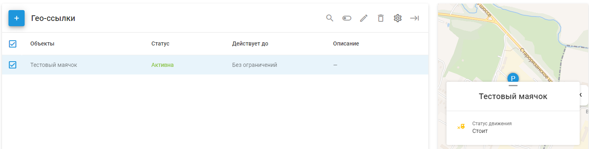

*Интерфейс Гео-ссылки для конечного пользователя обеспечивается автоматически сгенерированным URL.*

Гео-ссылка может быть связана с несколькими трекерами, и эти трекеры будут указаны на карте с помощью сгенерированной ссылки. Существует несколько опций и атрибутов, которые можно указать для конкретного трекера или для всей геоссылки, например карта, переопределенная метка объекта, атрибуты трекера (скорость, адрес и т. д.) и другие. Давайте создадим пример Гео-ссылки, чтобы рассмотреть его подробнее.

## Создание Гео-ссылки

Чтобы создать геоссылку, просто нажмите на кнопку "+", и появится диалог создания. Диалог предлагает несколько опций, которые нужно настроить или заполнить:

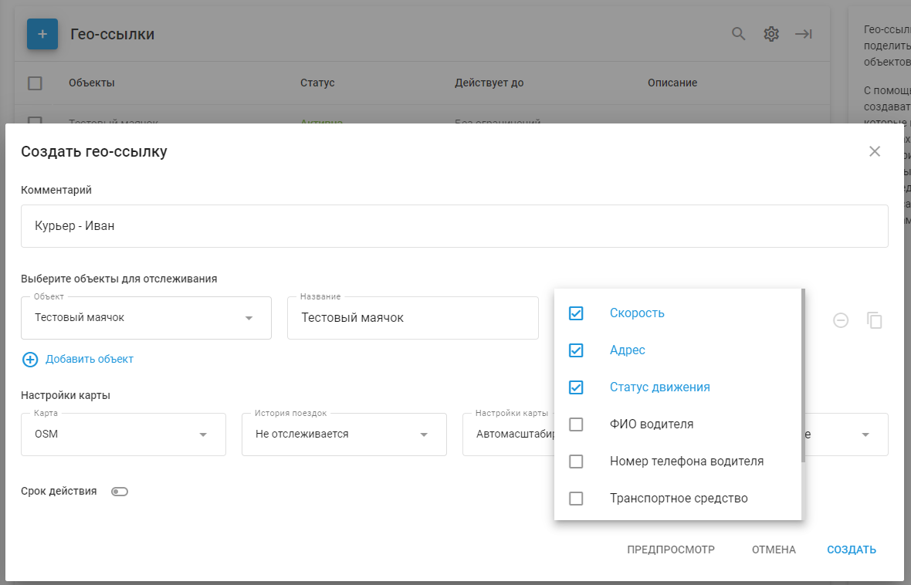

1. **Описание (необязательно)**

Информационное поле, которое служит для указания дополнительной пользовательской информации о ссылке. Максимальная длина - 100 символов.

2. **Выбор объектов и данных**

Список объектов, доступных по ссылке. Каждый объект имеет следующий список опций, которые необходимо указать при добавлении объекта:

*Объект* - Маячок, который необходимо отслеживать.

*Название* \- Определенная метка, которая будет отображаться в интерфейсе геопривязки, заменяя текущую метку, установленную в шкафу.

*Атрибуты* - Атрибуты трекера, которые будут отображаться в интерфейсе геопривязки. Атрибуты включают в себя:

- Скорость
- Адрес
- Состояние движения
- Имя водителя
- Номер телефона
- Название автомобиля
- Номерной знак
- Состояние соединения

Используйте кнопку копирования, чтобы применить тот же список атрибутов ко всем остальным объектам в геоссылке. Эта функция может сэкономить значительное количество времени при настройке атрибутов для нескольких объектов.

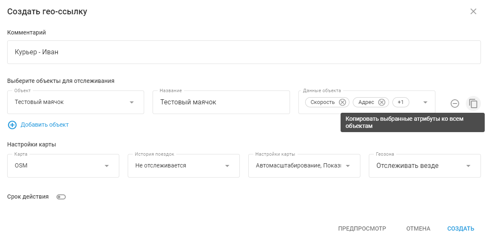

3. **Настройки карты**

*Поставщик карт* - Выберите карту, которую вы хотите, чтобы конечные пользователи геопривязки видели по созданной геопривязке. Список карт задается поставщиком услуг платформы.

*История поездки* - След отслеживания.

Вот как может выглядеть след, оставленный на 5 минут:

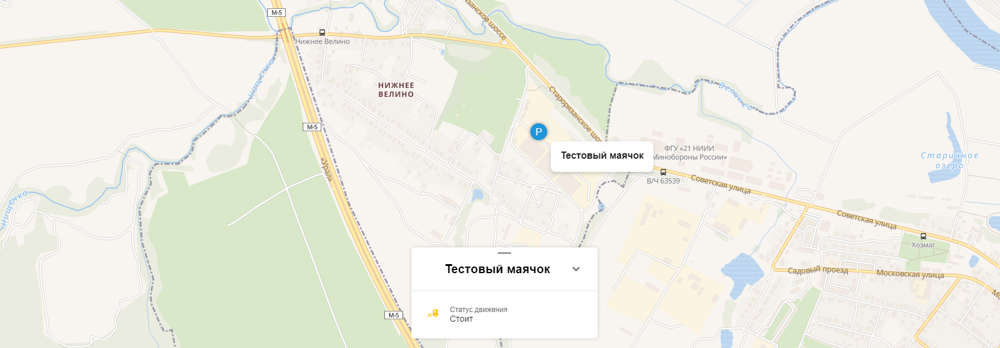

*Настройки карты* \- Автоматическое изменение масштаба и положения карты при многократном движении трекера.

*Геозона* - Можно выбрать, показывать или скрывать местоположение трекеров в зависимости от положения геозон. Например, если выбрать опцию "Отслеживать за пределами геозон", трекеры будут отображаться на карте только тогда, когда они находятся за пределами выбранных геозон. Эта функция может быть полезна в таких сценариях, как доставка грузов, когда конечный пользователь не должен видеть, что трекер загружен товаром перед отправлением. Соответственно, функция "Отслеживать внутри геозон" будет показывать трекеры только тогда, когда они находятся внутри выбранных геозон.

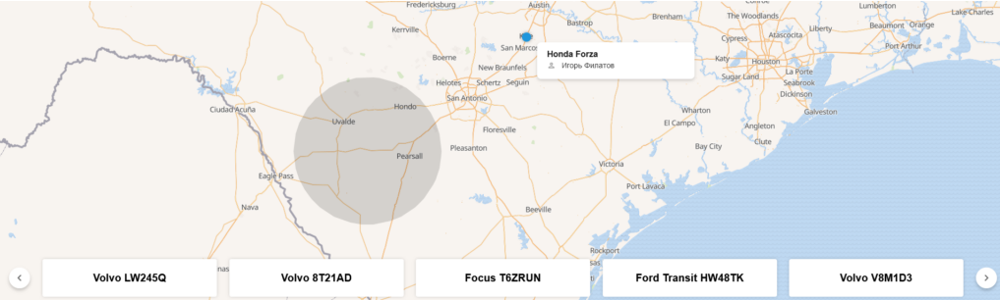

4. **Ограниченный срок действия** - Укажите время жизни соединения. Это время можно быстро выбрать из предопределенных периодов или установить пользовательский период времени. Если срок действия установлен с будущего момента, ссылка будет оставаться неактивной до наступления этого момента. Оставьте этот параметр невыбранным для постоянной настройки геосвязи.
5. **Предварительный просмотр** - Проверьте, как выглядит сконфигурированная геосвязь в веб-интерфейсе геосвязи с точки зрения конечного пользователя. Функция предварительного просмотра позволяет быстро переключаться между пользовательским интерфейсом и интерфейсом geo-link для более точного представления конфигурации geo-link.

После нажатия кнопки "Создать" появляется всплывающий диалог со сгенерированной ссылкой. Ссылку можно скопировать и предоставить конечным пользователям или поделиться ею с помощью кнопок социальных сетей:

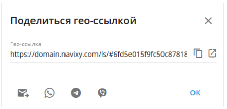

## Обновление и обмен гео-ссылками

При любом обновлении геоссылки сохраняется сгенерированный URL. Если URL необходимо изменить, геоссылку нужно создать заново.

Чтобы отредактировать геоссылку, выделите ее и воспользуйтесь кнопкой с карандашом в верхней части таблицы или наведите курсор мыши на ссылку, и вместе с кнопкой с карандашом появятся дополнительные кнопки:

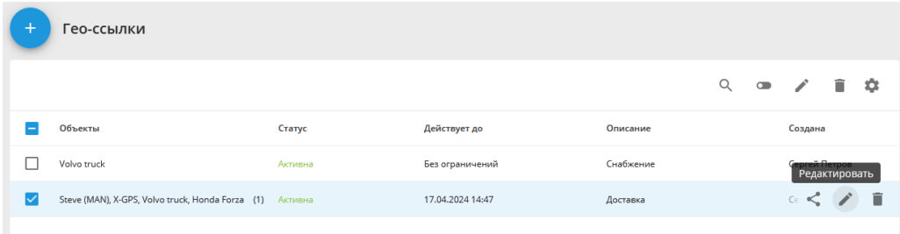

Чтобы поделиться существующей геоссылкой, наведите курсор мыши на ссылку (или установите флажок) и нажмите кнопку "Поделиться":

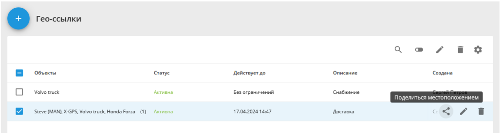

Чтобы отключить гео-ссылку, выберите ее с помощью галочки и нажмите кнопку Отключить в верхней части списка:

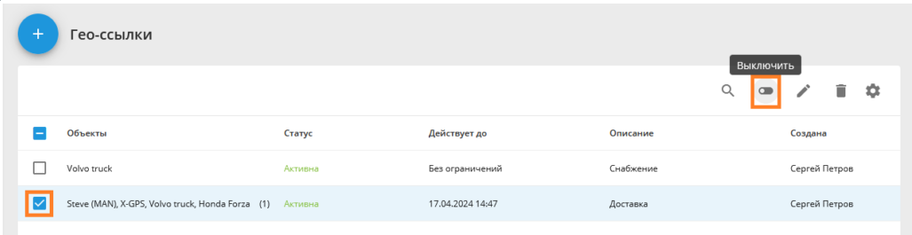

Повторное включение геопривязки осуществляется из меню боковой панели:

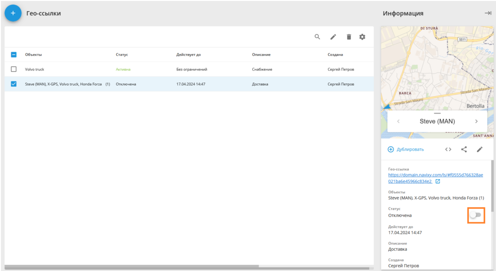

## Встраивание гео-ссылок

Встраиваемые гео-ссылки - очень полезный инструмент для интеграции интерфейсов и веб-разработки. Гео-ссылки позволяют генерировать и настраивать код для встраивания iframe, который можно повторно использовать для нужд создателей и интеграторов.

Чтобы получить доступ к коду вставки, выберите гео-ссылку и перейдите в меню правой боковой панели. В меню найдите кнопку "<>" и нажмите на нее:

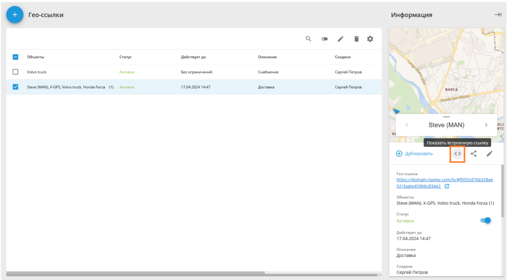

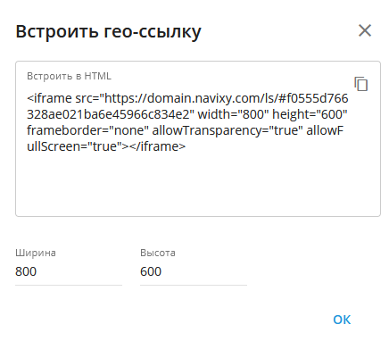

Ширину и высоту элемента iframe можно настроить непосредственно в окне "Встроить гео-ссылку".