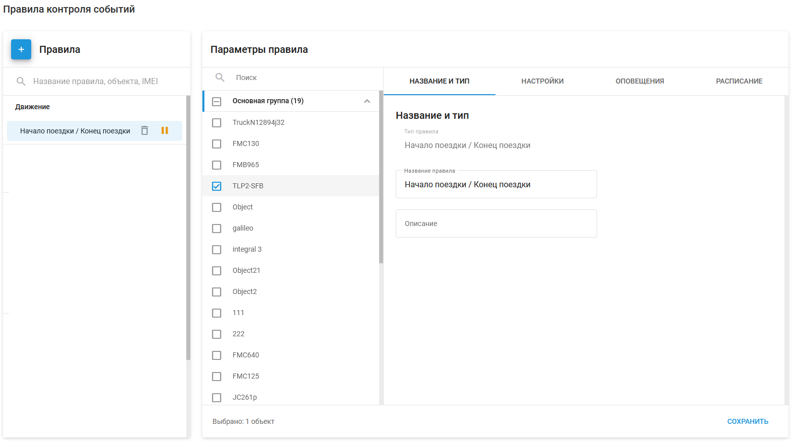
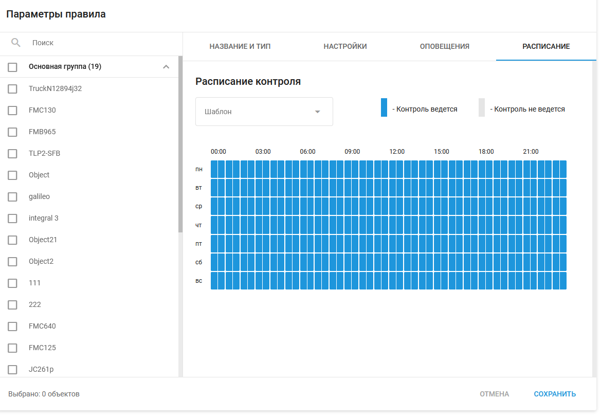
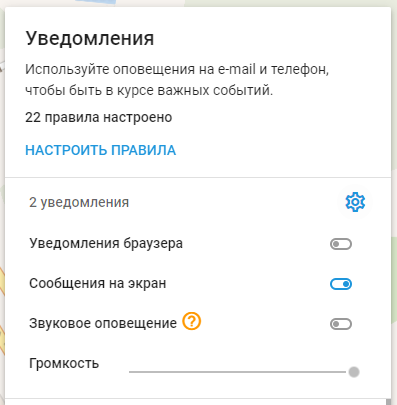

# Контроль событий

С помощью **контроля событий** в Navixy вы можете обнаруживать различные события и получать уведомления о них. Эти функции помогают пользователям более эффективно контролировать и управлять своим автопарком, имуществом и сотрудниками на местах. События могут варьироваться от простого нарушения геозоны до сложных сценариев, таких как предупреждение об угоне или предотвращение хищения топлива. См. [примеры](#) для более подробной информации.

## Типы обнаруженных событий

Navixy предлагает обширный набор типов событий, разбитых на различные категории, которые помогут вам эффективно контролировать и управлять своим автопарком, активами и сотрудниками на местах. Ниже представлены категории мероприятий:

- [**Устройство**](https://squaregps.atlassian.net/wiki/x/WIBTpQ) \- Контролируйте состояние питания устройства, включая батарею и внешние подключения
- [**Подключение устройства**](./page-d0573058-aced-4232-8437-8c3e3971559f/page-f0b415a2-606e-4528-b881-8f51e34bd2d4.md) \- Отслеживайте подключение устройств к сети
- [**Позиционирование устройства**](./page-89e90678-0f26-4b6b-86a3-6af402995994/page-7db3081f-f08c-4588-a430-51dd1398d267.md) \- Мониторинг сигнала GPS
- [**Безопасность**](./page-644469a6-797b-4d92-86c5-4d04f8f20597/page-f878c1b5-f410-41b9-818a-926e6b6cdafd.md) \- События, связанные с безопасностью и несанкционированным проникновением в автомобиль
- [**Безопасность**](/wiki/pages/createpage.action?spaceKey=UDOCRU&title=%28%D1%83%D0%B4%D0%B0%D0%BB%D0%B8%D1%82%D1%8C%29&linkCreation=true&fromPageId=2922810746) \- Мероприятия, связанные с безопасностью водителей
- [**Мониторинг движения**](./page-cb790cb8-6f75-4821-970c-b8efbc51c2e5/page-626fb648-b41e-4bab-af18-d63434b24ebd.md) \- Отслеживайте движение, скорость и маршрут транспортного средства
- [**Планирование и диспетчеризация**](./page-b887dda5-897e-4070-8684-7f274a5d3d47/page-94b6a210-9af8-4f82-8104-08c9ac4ae92a.md) \- Управление графиком движения транспортных средств и персонала
- [**Эффективность автомобиля**](./page-a8e007d4-1f5b-4120-a48f-26022fbf7828/page-2d37c097-5713-4d30-a128-67ef8b4a8dbf.md) \- Контролируйте расход топлива и эффективность
- [**Входы и выходы**](./page-34a17467-d705-41a2-b5dd-546721b1971b/page-6568edc8-89be-4266-8885-e55c9e1e37b6.md) \- Отслеживайте состояние подключенных датчиков и оборудования

### Где вычисляются события

В системах IoT события могут быть обнаружены как на стороне устройства, так и на стороне сервера:

- **События, обнаруженные на стороне устройства**: Срабатывание датчиков или входов устройства GPS-слежения, установленного на транспортном средстве или объекте. Эти события происходят в результате физических действий или условий, например нажатия тревожной кнопки, обнаружения дорожно-транспортного происшествия или регистрации резкого поведения водителя. Конкретные обнаруженные события зависят от возможностей используемого устройства.
- **События, обнаруженные на стороне сервера**: Генерируются путем анализа данных, полученных от устройства, в соответствии с предопределенными правилами и условиями, заданными пользователем. Эти события определяются с помощью серверной логики, например обнаружение нарушений геозоны, отклонений от маршрута, предупреждений о плановом техническом обслуживании или необычных изменений уровня топлива. Сервер обрабатывает данные и запускает оповещения на основе заданных критериев.

## Управление правилами

Правила в Navixy - это предопределенные условия, выполнение которых запускает события. Чтобы настроить, отредактировать или удалить правила, которые вы хотите отслеживать и получать уведомления о них, выберите **Контроль событий** из главного меню.

Читать далее

Чтобы получить доступ к настройкам правил уведомлений в Navixy, перейдите в левое меню и выберите **Контроль событий**. Откроется панель уведомлений. Нажмите на **Настроить правила.** Появится интерфейс правил оповещения.

В интерфейсе правил оповещения вы можете:

- **Просмотр существующих правил**: В интерфейсе отобразится список всех существующих правил оповещения.
- **Выберите или создайте новые правила**: Вы можете выбрать существующие правила для редактирования или создать новые правила, нажав кнопку "+".
- **Настройки правил**: Для каждого правила можно настроить следующие параметры:
  - **Название и тип**: Задайте имя и описание правила.
  - **Настройки**: Определите конкретные условия и параметры для правила.
  - **Оповещения**: Настройте, как и кому будут отправляться оповещения.
  - **Расписание**: Установите расписание, когда правило будет активно.

### Привязка правил к объектам

Правило может быть привязано к одному или нескольким объектам, например к отдельным автомобилям или группам автомобилей. Такая гибкость позволяет применять одно и то же правило к различным активам, обеспечивая последовательный мониторинг и уведомления.

Шаги по привязке правила к объектам

1. **Откройте настройки правил**: Перейдите в раздел **Контроль событий → Настроить правила.** Выберите правило, которое нужно настроить.
2. **Выберите объекты**: В настройках правил на панели слева вы увидите список доступных объектов. Этими объектами могут быть отдельные автомобили или группы автомобилей, организованные по отделам.
3. **Выберите объекты**: Установите флажки рядом с объектами или группами, к которым вы хотите привязать правило. Например, можно выбрать отдельные автомобили, такие как "Оливер (Chevrolet)" и "Марисоль (Nissan)", или целые группы, такие как "Отдел продаж".

### Тип и название

В **Название и тип** В подразделе диалога вы можете указать следующие сведения для правила уведомления:

- **Тип правила**: Выберите один из множества типов событий, которые можно отслеживать с помощью Navixy.
- **Название**: Укажите имя правила, чтобы его можно было легко идентифицировать. Пример: "Автомобиль выбыл из депо ABC".
- **Описание**: Добавьте краткое описание правила, чтобы объяснить его цель или какие-либо дополнительные детали. Пример: "Это правило включает оповещение, когда транспортное средство покидает обозначенную зону депо ABC, помогая отслеживать несанкционированные перемещения".

Использование метки и описания поможет вам эффективно организовать и управлять множеством правил.

### Оповещения

Вы можете получать уведомления по различным каналам, чтобы оперативно информировать вас о важных событиях. К таким каналам относятся:

- **SMS-уведомления**: Мгновенные оповещения отправляются на мобильный телефон пользователя.
- **Оповещения по электронной почте**: Подробные уведомления, отправленные на адрес электронной почты пользователя.
- **Push-уведомления**: Мгновенные оповещения через мобильное приложение X-GPS.
- **Уведомления в приложении**: Оповещения, отображаемые в веб-интерфейсе Navixy.

Каждый канал уведомлений можно настроить с помощью таких параметров, как данные получателя и настройка содержимого.

### Расписание

В разделе **Расписание** можно определить, когда правила оповещения активны или неактивны. Это позволяет точно контролировать время срабатывания оповещений в зависимости от ваших конкретных операционных потребностей.

Настройка расписания

Вот как можно настроить расписание:

- **Шаблон**: Выберите предварительно заданный шаблон расписания (если он доступен), чтобы быстро применить общие шаблоны расписания, такие как выходные, будние дни и каждый день.
- **Активные периоды**: Синие блоки обозначают время, когда правило активно и будет вызывать уведомления. Вы можете установить эти блоки для определенных часов дня и дней недели.
- **Периоды неактивности**: Серые блоки обозначают время, когда правило неактивно и не вызывает уведомлений. Это помогает избежать ненужных оповещений в нерабочее время.

Чтобы настроить расписание, просто нажмите на нужные временные блоки для переключения между активным и неактивным состояниями. Благодаря такой гибкости вы будете получать уведомления только в нужное время, что повысит эффективность мониторинга.

## Просмотр истории уведомлений

История уведомлений может быть просмотрена на разных платформах, что позволяет пользователям просматривать прошлые события и предупреждения.

- **Веб-приложение**: Получите доступ к истории уведомлений через раздел "События" в веб-интерфейсе Navixy. Фильтруйте по дате, типу события и другим критериям.
- **Мобильное приложение**: Просмотр последних уведомлений и истории в мобильном приложении Navixy.
- **Отчеты**: Создавайте подробные отчеты о прошедших событиях и уведомлениях для анализа и ведения учета.

## Приостановка и возобновление работы правил

Пользователи могут временно приостанавливать действие правил и возобновлять их по мере необходимости. Эта функция полезна в периоды, когда действия правил не требуются, например во время технического обслуживания или сезонного бездействия.

Как приостановить действие существующего правила

1. **Перейдите в Контроль событий**: Перейдите в раздел **Контроль событий** в главном меню.
2. **Выберите правило**: Найдите правило, которое нужно приостановить, в списке правил оповещения.
3. **Приостановить действие правила**: Нажмите на значок паузы (⏸️) рядом с именем правила, чтобы приостановить его действие.

Чтобы возобновить действие правила, просто снова нажмите на значок паузы. Это снова активирует действия правила.

## Примеры

Вот несколько примеров того, как уведомления о событиях могут использоваться в различных сценариях:

### Оповещения о геозонах

Оповещения о геозонах - это мощная функция Navixy, которая помогает пользователям отслеживать передвижение своих транспортных средств и активов в пределах заданных географических границ, называемых геозонами. Эта функция необходима для обеспечения операционной эффективности, безопасности и соблюдения организационной политики.

Читать далее

**Что такое геозона?**

Геозона - это виртуальный периметр, установленный на карте вокруг определенной географической области. Эта область может быть любой формы и размера, например, в виде круга с радиусом вокруг точки или более сложного многоугольника, очерчивающего определенный регион.

**Как работают оповещения для геозон**

Когда транспортное средство или объект, оснащенный устройством GPS-слежения, пересекает границу геозоны, возникает событие. Система регистрирует это событие и отправляет уведомления пользователю в соответствии с заданными настройками.

**Настройка оповещений о геозонах**

1. **Определите зону геозоны**:
  - **Круговая геозона**: Задайте радиус вокруг центральной точки, например склада или офиса.
  - **Полигональная геозона**: Нарисуйте на карте сложную фигуру, чтобы охватить такие области, как строительные площадки, зоны доставки или районы города.
  - **Маршрутная геозона:** Создайте геозону, повторяющую определенный маршрут или путь, например шоссе, железную дорогу или трубопровод, чтобы отслеживать движение по этому маршруту и обнаруживать отклонения.
2. **Настройка условий оповещения**:
  - **Предупреждения о входе**: Уведомление, когда транспортное средство или объект входит в геозону.
  - **Предупреждения о выходе**: Уведомление о выходе транспортного средства или объекта за пределы геозоны.
3. **Настройка параметров уведомлений**:
  - Выберите каналы, по которым будут отправляться уведомления: SMS, электронная почта, push-уведомления или оповещения в приложении.
  - Настройте содержание сообщения, включив в него важные сведения.

**Практическое использование оповещений:**

- **Управление автопарком**: Обеспечение соблюдения автомобилями заданных маршрутов и выявление несанкционированных поездок или отклонений от заданных маршрутов.
- **Безопасность активов**: Отслеживайте местоположение ценных активов и получайте немедленные предупреждения, если они перемещаются за пределы безопасной зоны.
- **Управление персоналом**: Отслеживать сотрудников на местах и следить за тем, чтобы они находились в установленных рабочих зонах во время своей смены.
- **Операционная эффективность**: Оптимизируйте логистику, контролируя время въезда и выезда на ключевых объектах, таких как склады и пункты доставки.

**Пример сценария**

Компания по доставке устанавливает геозону вокруг своего главного склада. Когда грузовик въезжает в эту геозону, срабатывает оповещение о въезде, уведомляющее менеджера склада с помощью push-уведомления. Это позволяет менеджеру подготовиться к разгрузке грузовика. Если грузовик покидает геозону без запланированного отъезда, команде безопасности отправляется оповещение о возможном несанкционированном использовании или краже.

Используя оповещения о геозонах, организации могут усилить оперативный контроль, повысить безопасность и обеспечить соответствие внутренним и внешним нормам.

### Оповещения о противоугонных устройствах

Оповещения об угоне автомобиля - важная функция Navixy, предназначенная для повышения безопасности транспортных средств путем обнаружения несанкционированных перемещений или несанкционированного проникновения. Эта функция обеспечивает спокойствие владельцев транспортных средств и менеджеров автопарков, гарантируя немедленное принятие мер в случае подозрительных действий.

Читать далее

**Как работают противоугонный оповещения**

Автомобильные противоугонные оповещения срабатывают при выполнении определенных условий, указывающих на несанкционированное использование или несанкционированное вмешательство. Эти условия могут быть настроены в соответствии с требованиями пользователя и потребностями безопасности автомобиля на стороне устройства.

**Настройка противоугонных оповещений на устройстве**

1. **Определите критерии несанкционированного перемещения**:
  - **Обнаружение зажигания**: Отслеживайте состояние зажигания автомобиля, чтобы обнаружить несанкционированный запуск автомобиля.
  - **Обнаружение движения**: Используйте GPS-слежение, чтобы определить, когда автомобиль неожиданно покидает место стоянки.
  - **Ограничения по времени**: Установите предупреждения о движении автомобиля в нерабочее время или вне установленного времени работы.
2. **Обнаружение несанкционированного доступа**:
  - **Датчики дверей и окон**: Установите датчики для обнаружения насильственного или несанкционированного открытия дверей или окон.
  - **Отсоединение аккумулятора**: Установите оповещения для случаев, когда аккумулятор автомобиля отсоединен, что является распространенным методом, используемым ворами для отключения систем слежения.
  - **Помехи сигнала GPS**: Отслеживает помехи или вмешательство в сигнал GPS, указывая на возможное вмешательство.
3. **Настройка уведомлений о тревоге**:
  - **Мгновенные уведомления**: Настройте SMS, электронную почту, push-уведомления или оповещения в приложении для немедленной отправки при обнаружении несанкционированных действий.
  - **Получатели предупреждений**: Назначьте конкретных лиц или группы (например, сотрудников службы безопасности, менеджеров автопарка) для получения этих предупреждений.
  - **Настройка содержания оповещений**: Включите в уведомление важные сведения

**Практическое применение**

- **Охрана частных автомобилей**: Владельцы частных автомобилей могут использовать противоугонные сигнализации для защиты своих машин от кражи или несанкционированного использования, особенно в зонах повышенного риска.
- **Управление автопарком**: Руководители автопарков могут обеспечить безопасность своих автомобилей, предотвращая их несанкционированное использование сотрудниками или кражу со стоянок и складов.
- **Услуги аренды**: Компании по прокату автомобилей могут контролировать свои транспортные средства, чтобы обнаружить и отреагировать на несанкционированные перемещения или несанкционированные действия, обеспечивая безопасность своих активов.
- **Логистика и доставка**: Компании, занимающиеся логистикой и доставкой, могут защитить свои автомобили и ценные грузы, которые они перевозят, от кражи или несанкционированного доступа.

**Пример сценария**

Логистическая компания оснастила свои грузовики системой противоугонного оповещения Navixy. В нерабочее время, система обнаруживает, что зажигание одного из грузовиков было включено. Менеджеру автопарка мгновенно отправляется оповещение о несанкционированном включении зажигания через push-уведомление, SMS и электронную почту.

Одновременно GPS-слежение показывает, что грузовик удаляется от установленного места парковки. Менеджер автопарка немедленно связывается с местными властями и сообщает местоположение грузовика в режиме реального времени. Благодаря своевременному оповещению власти перехватывают автомобиль, предотвращая угон и обеспечивая безопасность активов компании.

Используя противоугонные оповещения, организации могут значительно повысить безопасность своих автомобилей, быстро реагировать на возможные кражи и минимизировать риск потери активов.

### Предупреждения о контроле температуры

Оповещения о контроле температуры - это вспомогательная функция Navixy, предназначенная для обеспечения оптимальных условий транспортировки чувствительных грузов. Эта функция очень важна для таких отраслей, как фармацевтика, производство продуктов питания и напитков, а также для других отраслей, где поддержание определенного температурного режима необходимо для сохранения качества и безопасности продукции.

Читать далее

**Как работают оповещения о температуре**

Оповещения о контроле температуры отслеживают температуру груза в режиме реального времени с помощью датчиков, установленных в транспортном средстве. Если температура превышает или опускается ниже заданных пределов, сигнал передаётся на платформу. Это позволяет немедленно принять меры для исправления ситуации и предотвращения повреждения груза.

**Настройка предупреждений**

1. **Установите датчики температуры**:
  - **Размещение датчиков**: Разместите датчики температуры в местах грузового отсека, чтобы обеспечить точный и всесторонний контроль.
  - **Калибровка датчиков**: Обеспечьте правильную калибровку датчиков для получения точных показаний температуры.
2. **Определите температурные пределы**:
  - **Верхний и нижний пороги**: Установите максимальные и минимальные пределы температуры в соответствии с требованиями конкретного груза.
  - **Температурные диапазоны**: Определите допустимые температурные диапазоны для различных типов грузов, к которым могут предъявляться разные требования.
3. **Настройка условий оповещения**:
  - **Мониторинг в режиме реального времени**: Непрерывно контролируйте температуру и подавайте сигналы тревоги, если она отклоняется от заданных пределов.
  - **Несколько пороговых значений**: Определите несколько пороговых значений для различных уровней предупреждений (например, предупреждение, критический) в зависимости от степени отклонения температуры.
4. **Настройка параметров уведомлений**:
  - **Каналы уведомлений**: Выберите каналы, по которым будут отправляться оповещения, например SMS, электронная почта, push-уведомления или оповещения в приложении.
  - **Получатели предупреждений**: Укажите лиц или команды, ответственные за реагирование на температурные предупреждения (например, контроль качества, менеджеры по логистике).
  - **Настройка содержания оповещений**: Включите в уведомления важные сведения

**Практическое использование**

- **Фармацевтическая промышленность**: Обеспечить транспортировку вакцин, лекарств и других чувствительных к температуре фармацевтических препаратов в требуемом диапазоне температур для сохранения их эффективности и безопасности.
- **Пищевая промышленность и производство напитков**: Предотвращение порчи и обеспечение безопасности продуктов питания путем поддержания правильной температуры для скоропортящихся товаров, таких как молочные продукты, мясо и продукты, во время транспортировки.
- **Химическая промышленность**: Обеспечьте защиту чувствительных к температуре химических веществ от разрушения или опасных реакций путем мониторинга и контроля условий транспортировки.
- **Логистика холодных цепей**: Оптимизируйте процесс холодовой цепи, обеспечивая поддержание требуемого температурного режима во всех звеньях цепи поставок, от производства до доставки.

**Пример сценария**

Фармацевтическая компания использует оповещения Navixy о температурном контроле для мониторинга транспортировки вакцин. Для сохранения эффективности вакцин их необходимо хранить при температуре от 2 до 8 °C. Компания устанавливает температурные датчики в своих рефрижераторах и устанавливает верхний и нижний пороги температуры соответственно.

Во время доставки один из грузовиков сталкивается с неисправностью холодильной установки, в результате чего температура поднимается выше предельного значения в 8 °C. Система немедленно подает сигнал, отправляя уведомления команде контроля качества по SMS, электронной почте и через push-уведомления.

В уведомлении указывается текущая температура (10°C), местоположение грузовика и время поступления сигнала. Группа контроля качества связывается с водителем и инструктирует его о необходимости принять меры по исправлению ситуации, например, заехать на ближайший объект с услугами по ремонту холодильного оборудования.

Кроме того, команда организует альтернативный транспорт для продолжения доставки, гарантируя, что вакцины останутся в безопасном температурном диапазоне. Быстрое реагирование предотвращает возможную порчу вакцин, избавляя компанию от значительных финансовых потерь и сохраняя целостность ее продукции.

Используя оповещения о температурном контроле, организации могут обеспечить безопасную и эффективную транспортировку важных грузов, минимизировать риск их порчи или повреждения, а также обеспечить соответствие отраслевым нормам.

### Предупреждения о предотвращении кражи топлива

Предупреждения о хищении топлива - важнейшая функция Navixy, предназначенная для защиты транспортных средств от несанкционированного слива топлива и обеспечения его эффективного использования. Эта функция помогает менеджерам автопарков и владельцам транспортных средств отслеживать уровень топлива в режиме реального времени и получать немедленные оповещения при обнаружении подозрительного снижения уровня топлива, что позволяет оперативно вмешаться и снизить потери.

Предупреждения о предотвращении кражи топлива

**Как работают оповещения о хищении топлива**

Предупреждения о краже топлива срабатывают при неожиданном снижении уровня топлива в баке автомобиля, что свидетельствует о возможной краже или несанкционированном использовании. Система использует данные с датчиков уровня топлива, установленных в автомобиле, для непрерывного мониторинга и анализа уровня топлива.

**Настройка**

1. **Установите датчики уровня топлива**:
  - **Размещение датчиков**: Установите датчики в топливном баке для получения точных показаний уровня топлива.
  - **Калибровка датчиков**: Убедитесь, что датчики правильно откалиброваны и отражают точный уровень топлива с учетом формы и размера бака.
2. **Определите условия оповещения**:
  - **Неожиданные падения**: Установите условия для обнаружения значительного снижения уровня топлива, которое происходит вне обычного режима использования, например, когда автомобиль стоит на стоянке или не используется.
  - **Пороговые пределы**: Установите определенные пороговые значения падения уровня топлива (например, более 10 литров за короткий период) для включения предупреждений.
  - **Оповещения, основанные на времени**: Настройте предупреждения так, чтобы они были более чувствительны в те моменты, когда автомобиль не должен использоваться, например в нерабочее время или в выходные дни.
3. **Настройка параметров уведомлений**:
  - **Каналы уведомлений**: Выберите каналы получения оповещений, например SMS, электронная почта, push-уведомления или оповещения в приложении.
  - **Получатели предупреждений**: Назначьте лиц или группы (например, менеджеров автопарка, сотрудников службы безопасности), ответственных за реагирование на сигналы о краже топлива.
  - **Настройка оповещений**: Включите в оповещения подробную информацию, например идентификатор автомобиля, текущее местоположение, время падения уровня топлива и количество потерянного топлива.

**Практическое применение**

- **Управление автопарком**: Защитите автопарк от краж топлива, сократите эксплуатационные расходы и обеспечьте точный учет расхода топлива.
- **Стационарное оборудование:** Защищают стационарное оборудование, такое как дизельные электрогенераторы, от несанкционированного слива топлива, обеспечивая бесперебойную работу и предотвращая дорогостоящие потери топлива.

**Пример сценария**

Логистическая компания использует систему оповещения Navixy о хищении топлива для мониторинга своих грузовиков. Они установили датчики уровня топлива во всех своих автомобилях и настроили систему на обнаружение неожиданных падений уровня топлива, особенно в нерабочее время.

После того как все поставки были завершены, а грузовики припаркованы на складе компании, система обнаруживает внезапное падение уровня топлива в одном из грузовиков на 15 литров. Это неожиданное падение вызывает немедленное оповещение, которое отправляет уведомления менеджеру автопарка через SMS, электронную почту и push-уведомления.

В оповещении указывается идентификатор грузовика, его местоположение на территории склада, время слива топлива. Сотрудники службы безопасности находят следы взлома топливного бака и задерживают подозреваемого, предотвращая дальнейшее хищение топлива.

Используя предупреждения о хищении топлива, логистическая компания может эффективно контролировать и защищать свои топливные активы, сокращая потери от хищений и обеспечивая эффективное управление топливом. Такой упреждающий подход не только экономит расходы, но и помогает сохранить целостность операций.

## Автоматически созданные правила

Когда вы [автоматически активировать](../page-5ee65c6d-64ed-4fe8-a755-1d325dfb2cd3/page-ab51c7f8-511f-4e92-aaf6-098e673493d3/gps.md) При установке нового устройства на платформу Navixy система автоматически создает правила, основанные на возможностях устройства, например правило "Экстренный сигнал sSignal" для персонального GPS-трекера с кнопкой экстренного вызова. Такая автоматизация позволяет сэкономить время, настроив необходимые функции мониторинга с самого начала, что гарантирует немедленную готовность устройства к использованию.

Эти предварительно настроенные правила полностью настраиваются - вы можете легко добавить уведомления, изменить настройки или приостановить действие любого правила, если оно не нужно. Такой оптимизированный подход повышает безопасность и удобство использования, позволяя сосредоточиться на главном, не отвлекаясь на ручную настройку.

## Настройка уведомлений в браузере

Вы можете настроить уведомления о событиях в браузере, нажав на значок шестеренки в списке событий. Чтобы получить доступ к настройкам уведомлений и настроить их, нажмите "Оповещения" в левом меню, чтобы открыть Уведомления, а затем нажмите на значок шестеренки.

- **Уведомления в браузере:** Включите эту опцию, чтобы получать уведомления о событиях непосредственно в центре уведомлений вашей операционной системы (например, в центре действий Windows). Ваш браузер попросит вас разрешить эти уведомления.
- **Отображение уведомлений:** Новые события будут отображаться в виде всплывающих уведомлений в правом верхнем углу страницы платформы мониторинга.
- **Звуковое уведомление:** Каждое новое событие будет вызывать звуковое оповещение в браузере.
- **Громкость:** Настройте громкость звуковых уведомлений в браузере в соответствии с вашими предпочтениями.