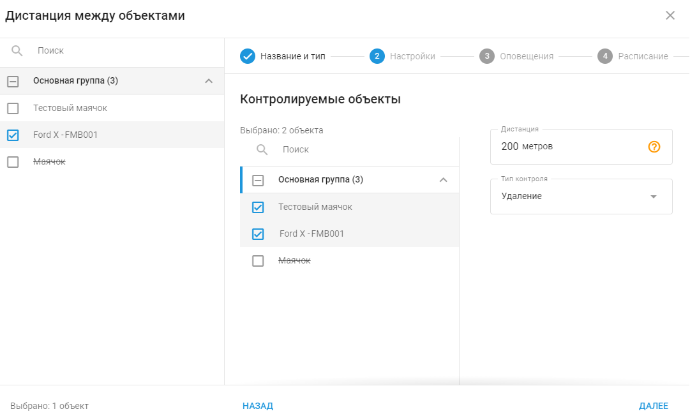

# Дистанция между объектами

## Обзор

Правило "Дистанция между объектами" разработано для того, чтобы помочь вам эффективно управлять и контролировать расстояние между различными активами, например между двумя автомобилями, автомобилем и его грузом или грузовиком и его прицепами.

Это правило позволяет установить определенные пороговые значения расстояния между отслеживаемыми объектами. Если расстояние превышает или опускается ниже установленных пределов, срабатывает событие, которое записывается и может генерировать уведомление.

### Как это работает

Это правило использует данные GPS для непрерывного отслеживания расстояния между заданным первичным объектом, например ведущим автомобилем, и до 100 вторичных объектов, таких как прицепы или следующие за ними автомобили. Задав определенные параметры расстояния, пользователи могут получать уведомления в реальном времени, когда эти объекты сближаются или удаляются друг от друга на расстояние, превышающее допустимое. Система автоматически рассчитывает расстояние на основе последних GPS-координат, обеспечивая точность и своевременность оповещений.

### Применения

- **Отслеживание прицепов и активов:** Поддерживайте контроль над расстоянием между транспортным средством и прикрепленными к нему или следующими за ним объектами, например прицепами. Это необходимо для предотвращения случайного разъединения, управления расстоянием между колоннами и обеспечения того, чтобы прицепы оставались в пределах безопасного рабочего диапазона.
- **Обеспечение безопасной дистанции следования:** Контролируйте и обеспечивайте соблюдение безопасного расстояния между автомобилями автопарка. Этот функционал имеет решающее значение для предотвращения столкновений и обеспечения соблюдения протоколов безопасности, особенно в условиях интенсивного движения или при эксплуатации большегрузных автомобилей.
- **Координация работы автопарка и управление движением:** Используйте это правило для управления расстоянием между автомобилями в колонне или для отслеживания взаимного расположения нескольких транспортных средств во время операций. Эти данные также можно агрегировать для анализа трафика, что поможет выявить закономерности образования заторов и оптимизировать планирование маршрутов.

## Настройки правила

### Параметры расстояния

- **Контролируемые объекты:** Настройте систему на предупреждение о приближении второстепенных объектов к основному автомобилю. Эта настройка очень важна для поддержания безопасной дистанции движения и предотвращения столкновений и других угроз безопасности.
- **Переезд:** Установите предупреждения о том, что второстепенные объекты увеличивают свое расстояние от основного транспортного средства. Это особенно полезно для обнаружения отхода автомобилей от колонны или отсоединения прицепов от ведущего автомобиля.
- **Дистанция:** Определите конкретный допустимый диапазон расстояний между первичными и вторичными объектами - от 5 до 200 000 метров. Система будет генерировать уведомления, когда расстояние попадает в заданный диапазон или выходит за его пределы, что позволяет проактивно управлять работой автопарка.

Общие настройки см. в разделе [Контроль событий](https://squaregps.atlassian.net/wiki/spaces/USERDOCS/pages/2761228324/Rules+and+Notifications#Manage-rules).

### Сведения о работе системы

- **Расчет расстояния на основе GPS:** Правило рассчитывает расстояния на основе последних доступных GPS-координат, обеспечивая точность мониторинга близости объектов.
- **Сброс таймера:** Оповещение "Дистанция между объектами" имеет 10-секундный таймер сброса, то есть оповещения не будут срабатывать чаще, чем раз в 10 секунд. Это помогает избежать избыточных уведомлений и гарантирует, что оповещения будут значимыми и действенными.
- **Несколько устройств:** Это правило не зависит от оборудования и может применяться к нескольким трекерам одновременно, что обеспечивает гибкость в управлении крупными парками с различными активами.