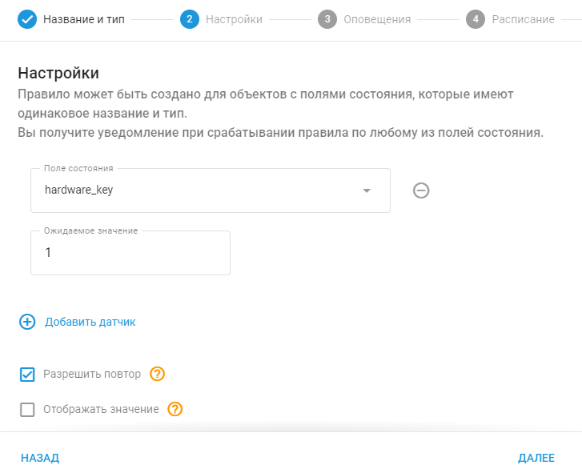
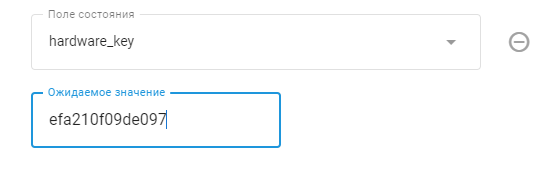

# Значение поля состояния

## Обзор

В телематике **поле состояния** отражает текущее состояние конкретного компонента или системы автомобиля, например, открыта или закрыта дверь, включен ручной тормоз или сработала подушка безопасности. Она предоставляет данные об этих элементах в режиме реального времени, позволяя осуществлять мониторинг и оповещать об изменениях в их состоянии.

Правило "Значение поля состояния" предназначено для использования этих данных путем мониторинга определенных полей состояния и запуска оповещений при выполнении заданных условий. Это правило необходимо для информирования пользователей о критических событиях, например, когда неожиданно открывается дверь, отпускается ручной тормоз или активируется передовая система помощи водителю (ADAS).

**Например:**

- Если в автомобиле сработает подушка безопасности, поле состояния подушки изменится, что побудит правило отправить предупреждение.
- При обнаружении диагностического кода неисправности (DTC) система может мгновенно уведомить пользователя, что позволит оперативно принять меры по техническому обслуживанию.

Используя это правило, организации могут повысить безопасность, улучшить защиту и оптимизировать процессы технического обслуживания благодаря уведомлениям в реальном времени и подробным отчетам о событиях.

## Настройки правила

### Поле состояния

Укажите поле, которое будет контролироваться (например, Багажник). Установите ожидаемое значение (например, Открыто), чтобы при выполнении условия запускалось уведомление. Параметр "Разрешить повтор" определяет, как часто одно и то же событие будет вызывать уведомления.

### Ожидаемое значение

Выберите значение, которому должно соответствовать поле состояния для запуска уведомления (например, Открыто/Закрыто). Для особых событий, таких как аппаратный ключ или код события, введите конкретное значение, предоставленное производителем устройства.

Пример

В следующем примере, если аппаратный ключ имеет пользовательское значение, например efa210f09de097, платформа будет отслеживать это значение в поле hardware\_key и уведомлять пользователя, когда оно будет обнаружено.

### Разрешить повтор

- **Не выбрано:** Событие срабатывает только тогда, когда состояние меняется на ожидаемое значение после получения другого значения.
- **Выбрано:** Событие срабатывает каждый раз при получении ожидаемого значения, но не чаще, чем позволяет параметр "Задержка повтора".

### Повторная задержка

Установите таймер сброса в секундах, чтобы контролировать, как часто событие может вызывать уведомления. Например, установка значения 1800 секунд ограничивает количество уведомлений одним разом в 30 минут.

Пример - Как работает опция "Разрешить повтор"

**Если параметр "Разрешить повтор" не выбран:**

Если опция "Разрешить повтор" не выбрана, событие сработает снова, только если будет получено другое значение до того, как ожидаемое значение снова придет в новом пакете данных. Вот как это работает:

- **09:00 AM:** Последний полученный ключ - A1DD3FC3452904D.
- **09:15 AM:** Платформа получает еще один пакет данных с тем же значением аппаратного ключа (A1DD3FC3452904D). Уведомление не срабатывает, поскольку это то же самое значение, что и раньше.
- **09:20 AM:** Получено новое значение аппаратного ключа, B99978233FDD1. Уведомление не генерируется, поскольку это значение не ожидалось. Однако система теперь готова к тому, чтобы запустить уведомление, если ожидаемый ключ (A1DD3FC3452904D) поступит снова.
- **09:30 AM:** Платформа снова получает значение аппаратного ключа A1DD3FC3452904D. На этот раз уведомление срабатывает, потому что в промежутке было получено другое значение.

Уведомления срабатывают только тогда, когда ожидаемое значение приходит после того, как было получено другое значение.

**Если выбран параметр "Разрешить повтор":**

Если выбрана опция "Разрешить повтор", событие будет срабатывать каждый раз при получении ожидаемого значения, в пределах ограничений таймера "Задержка повтора":

- **09:00 AM:** Последний полученный ключ - A1DD3FC3452904D.
- **09:15 AM:** Платформа получает другой пакет данных с тем же значением аппаратного ключа (A1DD3FC3452904D). Срабатывает уведомление.
- **09:25 AM:** Платформа снова получает то же значение аппаратного ключа (A1DD3FC3452904D). Срабатывает еще одно уведомление.
- **09:34 AM:** Получено новое значение аппаратного ключа, B99978233FDD1. Уведомление не запускается, поскольку это значение не ожидается.
- **09:45 AM.** Платформа снова получает значение аппаратного ключа A1DD3FC3452904D. Срабатывает уведомление.

Если выбрана опция "Разрешить повтор", уведомления будут срабатывать каждый раз, когда будет получено ожидаемое значение, но не чаще, чем позволяет таймер "Задержка повтора".

**Примечание:** Если выбрано значение "Разрешить повтор", событие будет срабатывать только так часто, как позволяет таймер "Задержка повтора". Для этого типа правил таймер сброса по умолчанию составляет 5 минут, но его можно настроить с помощью поля "Задержка повтора".

Общие настройки см. в разделе [Контроль событий](../../page-e938aacb-4bb2-41c2-b05f-9ddfbe366be7.md).

## Сведения о работе системы

- **Доступность виртуальных датчиков.** Пользователи также могут выбрать [виртуальные датчики](../../../page-4f987e23-cee6-4bd9-9585-b972b1109922/page-0681880c-0c00-4283-b7ef-ed4f48c60ab4/page-af2e7d2d-3fc7-4bc4-9297-00f73d735b0d/page-dde442ff-ea7b-4af0-9ea9-b20ff99c8fdb.md) в качестве источников данных в правиле поля состояния. Это позволяет создавать индивидуальные уведомления и отчеты на основе данных виртуальных датчиков, что обеспечивает более целенаправленный мониторинг и управление критическими событиями.
- **Сброс таймера:** Оповещение "Значение поля состояния" имеет таймер сброса по умолчанию 5 минут, что означает, что событие не будет срабатывать чаще, чем раз в 5 минут.
- **Поддержка одного устройства:** Каждое правило применяется только к одному устройству, так как различные поля состояния не могут быть перекрестно связаны в нескольких трекерах.
- **Независимая от GPS обработка:** Платформа обрабатывает и отображает события в полевых условиях даже при отсутствии данных GPS, что позволяет не упустить важные события из-за проблем с местоположением.