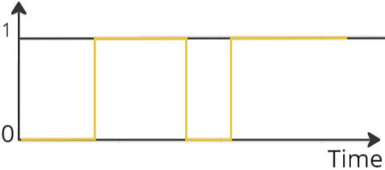
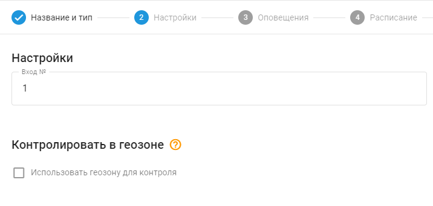
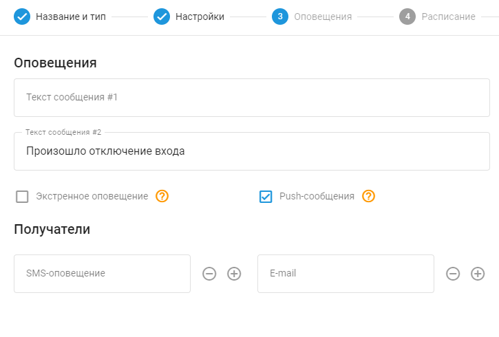

# Контроль срабатывания входов

Срабатывание входа (или изменение входа) означает изменение состояния входа на устройстве слежения за автомобилем. Этот вход может быть подключен к различным датчикам или переключателям в автомобиле, таким как датчики дверей, состояния зажигания или других компонентов автомобиля. Когда вход изменяет состояние, например, с включенного на выключенный или наоборот, GPS-устройство обнаруживает это изменение и может вызвать соответствующее событие или уведомление.

> [!INFO]
> Тип правила "Контроль срабатывания входов" применяется к дискретным входам, которые принимают две логические позиции (0 или 1). Для входов, указывающих непрерывные значения (например, аналоговые входы, показывающие диапазон напряжения), существует специальный тип правила, называемый "[Параметр в диапазоне](../page-6b8c1812-5d55-400a-bd40-0d75bf4dbe75/page-bbc301e1-b5ee-476f-a84d-b558c8b40874.md)".

## Обзор

Многие автомобильные GPS-трекеры оснащены входами, которые можно подключить к различным устройствам, например, датчику открытия автомобиля, состоянию зажигания или аварийной кнопке. Настроив систему соответствующим образом, пользователи могут получать уведомления о срабатывании входов через пользовательский интерфейс, push-уведомления, SMS или электронную почту.

Правило предназначено для отслеживания определенных дискретных входов и уведомления пользователей при изменении их состояния. Эти дискретные входы могут иметь только два значения: 0 или 1, отсюда и термин "дискретный". Правило ожидает перехода указанного входа из состояния true (1) в false (0) или наоборот и генерирует уведомления о каждом обнаруженном изменении.

Эта функция позволяет пользователям быть в курсе состояния подключенных инструментов или датчиков, предоставляя в режиме реального времени обновления о различных событиях, например, активации кнопки SOS. Возможность получения своевременных уведомлений расширяет возможности мониторинга и способствует быстрому реагированию на критические ситуации или события, обнаруженные дискретными входами.

## Настройки правил

#### Входной номер

В поле "Вход №" указывается аппаратный или виртуальный аппаратный номер используемого входа. Чтобы определить, какой вход соответствует той или иной функциональности, обратитесь к документации производителя GPS-трекера. Номер входа должен соответствовать номеру дискретного датчика, созданного в виджете "Управление устройствами" → "Датчики и кнопки".

## Сведения о работе системы

### Сведения о работе системы

- **Сброс таймера**: Оповещение "Контроль срабатывания входов" имеет 10-секундный таймер сброса, гарантирующий, что оповещение не будет срабатывать чаще, чем раз в 10 секунд. Если событие произойдет в течение этого периода сброса, оно будет пропущено платформой, в том числе в отчетах.
- **Множественные назначения трекеров**: Одному правилу можно назначить несколько трекеров. Указанный номер входа в настройках правила используется в качестве источника данных для каждого трекера. Например, если выбран 2-й вход и выбрано несколько трекеров, правило будет уведомлять пользователя всякий раз, когда любой из выбранных трекеров отправит изменение в своем входе № 2.
- **Срок действия события**: Если платформа идентифицирует входное событие (1 истинное/высокий уровень или 0 ложных/низкий уровень) из пакета данных трекера без достоверных координат, она посчитает это событие достоверным и отобразит его, независимо от того, произошло ли оно в пределах или за пределами ограниченных геозон. Логика “внутри/вне” в этом случае игнорируется, так как отобразить спорное событие еще раз лучше, чем пропустить его.
- **Выборочные оповещения**: Пользователи могут выбрать получение оповещений, связанных с вводом, только для определенных изменений ввода (например, с 1 на 0 или с 0 на 1), очистив текст уведомления для соответствующего поля, для которого они не хотят получать оповещения. Например, пользователи могут настроить оповещения на получение уведомлений только об изменениях с "ON" на "OFF", игнорируя события с "OFF" на "ON".

