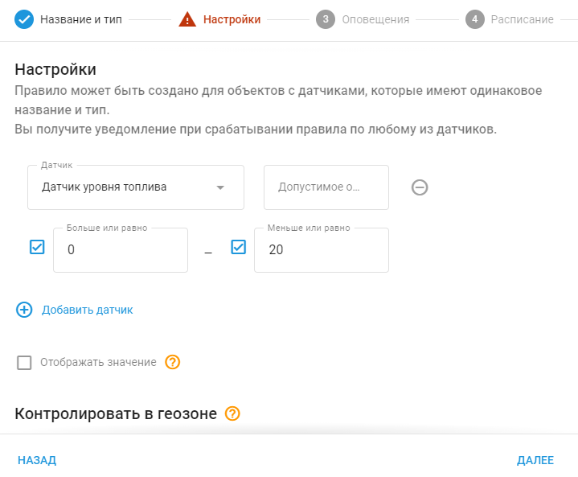

# Параметр в диапазоне

## Обзор

Правило "Параметр в диапазоне" - это мощный инструмент, который помогает отслеживать важные данные датчиков в режиме реального времени. Оно автоматически предупреждает вас, когда такие измерения, как температура или напряжение, попадают в заданные пороговые значения или выходят за их пределы. Благодаря этому правилу вы всегда будете в курсе важных показателей, что позволит вам принять оперативные меры в случае необходимости.

Например, логистическая компания может использовать правило "Параметр в диапазоне" для мониторинга чувствительных к температуре грузов. Установив температурные ограничения (например, от +2 °C до +10 °C или от 35 °F до 50 °F), система отправляет мгновенные предупреждения, если температура груза выходит за пределы безопасного диапазона. Это позволяет своевременно отреагировать на ситуацию, защитить груз и обеспечить соблюдение нормативных требований.

## Настройки правила

#### Датчик

Укажите датчик измерения (физический или [виртуальный](../../../page-5023c9cf-99ec-4999-9c0e-8db9050b8564/page-e27a54e3-6d72-453f-b8cd-b9b945cc85ff/page-1cb8cb7c-4a96-40c5-85a0-f7b8c30b7331/page-a858982a-5014-4698-89d6-bd6cb55b9699.md)), которые будут служить источником данных для оповещений. На одно правило может быть назначен только один датчик, поэтому для каждого трекера требуется отдельное правило.

#### Больше или равно

Установите нижнюю границу допустимого диапазона.

#### Меньше или равно

Установите верхнюю границу допустимого диапазона.

#### Пороговое значение

Этот параметр добавляет буфер вокруг заданных границ, чтобы учесть шумы или неточности датчика. Порог помогает различать состояния "В диапазоне" и "Вне диапазона", создавая зону допуска вокруг заданных значений. Если порог не указан, по умолчанию он равен 0,03. Это предотвращает частое срабатывание событий из-за незначительных колебаний показаний датчика.

Общие настройки см. в разделе [Контроль событий](../../page-9329b642-5d9e-40c8-aece-fd5258e8aa15.md).

## Сведения о работе системы

- **Виртуальные датчики:** При использовании виртуального датчика в качестве источника данных диапазон определяется в соответствии с исходным значением виртуального датчика. Это удобно для управления определенными полями состояния или кодами событий в заданном диапазоне.
- **Сброс таймера:** Оповещение "Параметр в диапазоне" имеет 10-секундный таймер сброса, гарантирующий, что оповещения не будут срабатывать чаще, чем раз в 10 секунд, что помогает избежать избыточных оповещений.
- **Поддержка одного устройства:** Каждое правило поддерживает только одно устройство из-за сложностей, связанных с перекрестными ссылками на несколько датчиков, трекеров и калибровочных данных.
- **Независимая от GPS обработка:** Платформа обрабатывает и отображает события, даже если в пакете данных отсутствуют действительные GPS-координаты, обеспечивая захват и отображение всех значимых событий независимо от настроек геозоны.