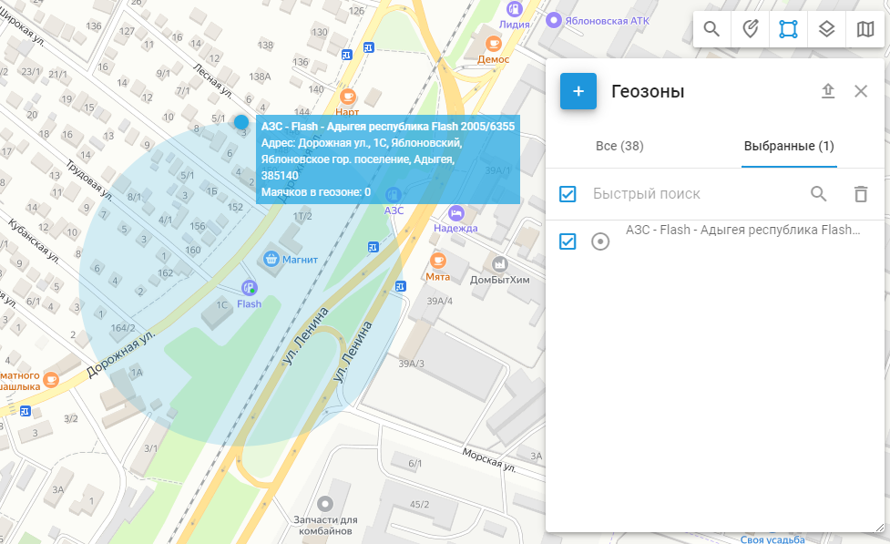
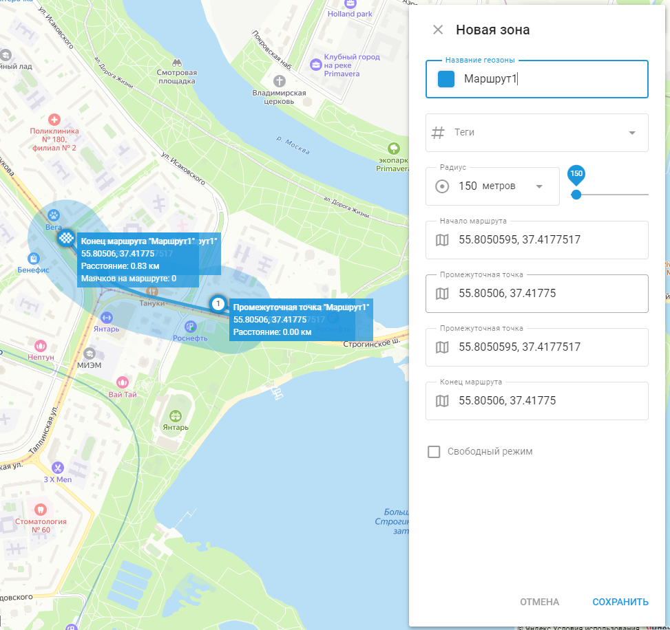

# Геозоны

## Обзор

Геозоны - это виртуальные периметры, которые позволяют системе отслеживать, пересек ли объект границу геозоны ("вошел" или "вышел"). Эти события регистрируются, что позволяет пользователям создавать отчеты о геозонах и [получать оповещения](../../../page-394f6245-7796-421d-8eb5-203b10fcffb1/page-e9083680-7721-4d24-b44b-ee95247f7b3e/page-eab06155-f95d-4dbb-acb6-2bf8537b4d4a/page-92cada2d-dc96-4d6b-b285-0b7287c5f244.md). Геозонам также можно присвоить определенные [правила](../../../page-711dca4a-202e-4bcf-89f2-791b184a2aa7/page-d2d3f92d-51d2-4ee3-b88a-8aebdf87b4b3.md) в определенных областях, например, получать предупреждения о превышении скорости только в пределах города или на маршруте.

### Просмотр сведений о геозоне

При нажатии на значок "i" (информация) рядом с геозоной отображается подробная информация о выбранной геозоне.

- **Теги**: Метки, связанные с геозоной, например "центральная", помогают классифицировать и упорядочить геозоны для удобства идентификации и управления.
- **Расположение**: Географическое местоположение геозоны. Например: Округ Куинс, Нью-Йорк, Соединенные Штаты Америки.

### Отслеживание объектов внутри геозоны

Щелкнув левой кнопкой мыши по геозоне на карте, пользователь может просмотреть количество отслеживаемых объектов в ее пределах. Чтобы получить доступ к инструменту "Геозоны", щелкните значок "Полигон" на панели инструментов карты. Здесь можно создавать, импортировать или редактировать геозоны, а также отображать нужные геозоны на карте, отмечая их флажками.

## Типы геозон

Существует три основных типа геозон:

### Круговая геозона

Круговая геозона - это географическая область с заданным центром и круглой формой с минимальным радиусом 20 метров. Пользователи могут определить радиус и центр круга.

### Полигональная геозона

Полигональная геозона - это область, определяемая произвольным многоугольником с множеством вершин (до 500), что позволяет создавать сложные фигуры. Этот тип геозон особенно полезен для точного определения территорий неправильной формы, таких как районы, парки или любые другие зоны, которые не вписываются в простую круговую границу.

### Геозона-маршрут

Геозона-маршрут (или, по-другому, маршрутная геозона) создает виртуальный периметр между двумя или более точками. Этот тип геозон особенно полезен для мониторинга [Контроля отклонения от маршрута](../../../page-a9d309f4-3984-4155-bfa4-e85b1adfde82/page-a1078f2c-d1f6-4ec7-94b0-fe1ce1ccefd1/page-a04d97a4-57bc-4d17-8db5-ab42b4dbf2f2/page-040334e1-0363-4568-b793-de5db0ff4a08.md) и не допущения отклонения транспортных средств от намеченного пути. Маршрутная геозона определяется серией точек, создающих непрерывный маршрут, с заданным радиусом, определяющим допустимое отклонение от маршрута.

## Как создать геозону

1. Найдите нужный район на карте с помощью инструмента "Поиск адреса".
2. Выберите инструмент "Геозоны", нажав на кнопку **Квадрат** значок в правом верхнем углу карты.
3. Нажмите на кнопку "Добавить геозону" и выберите тип геозоны.
4. Нанесите геозону на карту:
  - **Круг**: Переместите круг с помощью мыши, нажимая на центр. Измените размер, перетащив край.
  - **Полигон**: Начните с пятиугольника и настройте его, перетаскивая вершины или добавляя новые.
  - **Маршрут**: Выберите начальную и конечную точки. Система построит маршрут. Добавьте дополнительные точки, перетаскивая маршрут, и настройте размер окрестностей.
5. Укажите название геозоны и сохраните ее. Созданные геозоны можно редактировать или удалять.

Создание геозоны-маршрута

Выполните следующие шаги, чтобы создать геозону-маршрут:

1. **Откройте настройки геозоны** в приложении "Мониторинг" на веб-интерфейсе.
2. **Выберите опцию "Новая геозона",** чтобы начать создание новой геозоны-маршрута.
3. **Назовите геозону** и добавьте соответствующие теги для облегчения идентификации.
4. **Определите радиус** **маршрута**. Этот радиус определяет, на какое расстояние транспортное средство или объект может отклониться от маршрута, прежде чем будет обнаружено отклонение от маршрута.
5. **Установка точек маршрута**: Добавьте начальную точку, несколько промежуточных точек и конечную точку маршрута. Каждая точка определяется географическими координатами.
6. **Ручной режим**: При необходимости вы можете настроить точки вручную для точного контроля над маршрутом.

Создание полигональных геозон

Чтобы создать полигональную геозону:

1. Найдите нужную область на карте.
2. Выберите инструмент "Геозоны", нажав на значок квадрата в правом верхнем углу карты.
3. Нажмите на кнопку "Добавить геозону" и выберите "Полигон" в качестве типа геозоны.
4. Изначально геозона будет выглядеть как пятиугольник. Настройте форму, перетаскивая вершины или добавляя новые, чтобы вписать их в нужную область.
5. Назовите геозону и сохраните ее. При необходимости созданные геозоны можно редактировать или удалять.

## Редактирование сведений о геозоне

Чтобы найти функцию редактирования, нажмите на значок карандаша рядом с геозоной, которую вы хотите отредактировать, в инструменте "Геозоны". При редактировании геозоны можно настроить различные элементы для улучшения организации и мониторинга:

- **Название геозоны**: Назначьте или измените название геозоны для облегчения ее идентификации.
- **Теги**: Добавляйте или изменяйте теги, чтобы классифицировать и упорядочивать геозоны. Такие метки, как "центральная" и "западная", помогают сортировать и управлять несколькими геозонами.
- **Расположение**: В поле "Местоположение" отображается географический адрес геозоны, обеспечивающий точную точку отсчета для ее области.
- **Цвет**: Измените цвет геозоны для лучшей визуализации на карте. Это особенно полезно при управлении несколькими геозонами, так как разные цвета позволяют быстро различать разные зоны. Инструмент выбора цвета позволяет выбрать конкретный цвет и просмотреть его HEX-код.

## Импорт геозон

Если вам нужно добавить большое количество геозон, быстрее импортировать их из файла, чем создавать вручную. Геозоны можно импортировать из файлов Excel или KML.

### Импорт круговых геозон из Excel

1. Выберите инструмент "Геозоны".
2. Нажмите кнопку "Импорт круглых геозон".
3. Загрузите предоставленный файл-пример.
4. Добавьте в файл информацию о геозонах (название, адрес, долгота, широта, радиус).
5. Загрузите отредактированный файл в службу мониторинга.
6. Если ваш файл содержит заголовки, включите опцию "Использовать заголовки из файла".
7. Проверьте поля заголовка и нажмите кнопку Далее.
8. Проверьте записи и нажмите кнопку Приступить.
9. После завершения импорта новые геозоны появятся в списке.

### Импорт геозон-маршрутов из KML

1. Выберите инструмент "Геозоны".
2. Нажмите кнопку "Импорт геозон из KML".
3. Нажмите на кнопку "Обзор", чтобы выбрать нужный KML-файл на вашем компьютере.
4. При необходимости измените радиус по умолчанию.
5. Нажмите "Загрузить".
6. После завершения импорта новые геозоны появятся в списке. Обратите внимание, что радиус по умолчанию используется только для геозон маршрутов. Для других типов этот шаг можно пропустить.