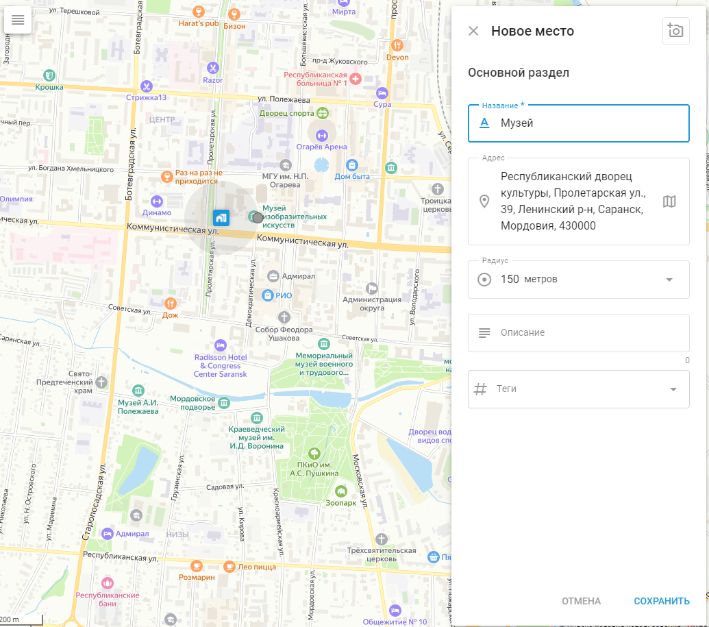

# Места (POI)

## Обзор

Места, также известные как точки интереса (POI), являются неотъемлемой частью управления автопарком и отслеживания активов с помощью GPS. Организации могут создавать подробный список мест, включая такие ключевые объекты, как офисы и склады, а также многочисленные объекты, имеющие важное значение для логистических операций. Места повышают эффективность работы за счет отслеживания посещений, оптимизации планирования маршрутов и оптимизации заданий для сотрудников на местах.

### Практическое использование мест

- **Поиск объектов:** Быстро находите объекты, вводя название места или метку.
- **Создание маршрутов и геозон:** Используйте Places для прокладки маршрутов и создания геозон.
- **Назначение заданий:** Упростите распределение заданий, используя имена мест вместо полных адресов.

## Создание и редактирование мест

Чтобы перейти к инструменту "Места", щелкните значок POI на панели инструментов в правой верхней части карты.

### Создавайте места

При создании или редактировании места вы можете указать следующие сведения:

- **Название:** Присвойте имя для удобства идентификации, например "Офис" или "Склад".
- **Иконка:** Выбирайте из библиотеки иконок или загружайте свои собственные.
- **Адрес:** Введите адрес вручную или выберите его на карте.
- **Радиус:** Определите радиус Места, чтобы определить зону его влияния.
- **Теги:** Добавьте теги для лучшей организации и облегчения поиска.
- **Описание:** Включите любую дополнительную информацию о Месте.

### Посмотреть детали места

Нажав на значок "i" рядом с местом, вы можете просмотреть подробную информацию, включая последние события, связанные с этим местом.

### Редактирование мест

Чтобы отредактировать место, нажмите на значок редактирования. Вы можете настроить следующие элементы:

- **Название:** Измените имя для идентификации.
- **Теги:** Измените теги для лучшей организации.
- **Расположение:** Обновите географический адрес.
- **Радиус:** Настройте радиус для круговых площадок.
- **Цвет:** Измените цвет для лучшей визуализации на карте.

## Импорт мест из файла Excel

Если вам нужно быстро добавить большое количество Места, воспользуйтесь импортом из файла Excel.

1. **Перейдите к инструменту "Места":** Выберите инструмент "Точки интереса".
2. **Импорт мест:** Нажмите на кнопку "Импорт мест".
3. **Загрузите файл примера:** Загрузите предоставленный пример файла Excel.
4. **Заполните данные:** Введите такие данные, как имя, адрес, широта, долгота и радиус.
5. **Загрузите файл:** Сохраните файл на компьютере, затем нажмите кнопку "Выбрать" в окне "Импорт места" и найдите свой файл.
6. **Проверьте данные:** После нажатия кнопки "Далее" проверьте названия столбцов и исправьте все несоответствия.
7. **Полный импорт:** Убедитесь, что все данные верны, и продолжайте. Ваши места появятся в списке.