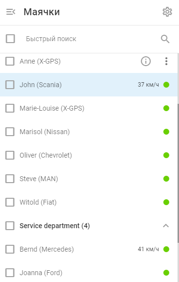

# Список маячков

Список маячков в [мониторинге](https://squaregps.atlassian.net/wiki/spaces/USERDOCS/pages/2735538275/GPS+tracking) обеспечивает обзор всех отслеживаемых активов, позволяя пользователям эффективно контролировать свой автопарк и движимое имущество.

## Особенности списка маячков

- **Группы и категории:** Объекты организованы в группы и категории для более удобного управления. Такая организация может представлять структуру вашей компании в виде региональных подразделений или групп специализированных автомобилей.
- **Быстрый поиск:** Используйте строку быстрого поиска, чтобы быстро найти конкретные объекты, введя их название или другую идентифицирующую информацию.
- **Видимость объекта:** Владельцы могут видеть все объекты в организации учетной записи. Пользователь из пункта [Пользователи и Роли](https://squaregps.atlassian.net/wiki/spaces/USERDOCS/pages/2733506578/Team+access) могут просматривать только те объекты, которые были созданы ими лично или назначены владельцем.

### **Для маячков в списке**

- **Название маячка:** Для удобства идентификации каждый предмет снабжен этикеткой, на которой указано его название и любая другая необходимая информация.
- **Индикаторы состояния:** Зеленые точки обозначают активные и функционирующие объекты. Желтые, красные, серые точки сигнализируют о том, что GPS-устройство может нуждаться во внимании.
- **Детали маячка:**
  - **Щелчок по маячку** фокусирует карту на объекте.
  - **Клик на значке информации ("i").** рядом с объектом в списке объектов Navixy отображает подробный вид выбранного объекта.
  - **Меню правой кнопки мыши ("⋮"):** Обеспечивает быстрый доступ к общему местоположению объекта, изменению его значка, открытию правил оповещения, доступу к настройкам устройства и просмотру отчетов, связанных с объектом.