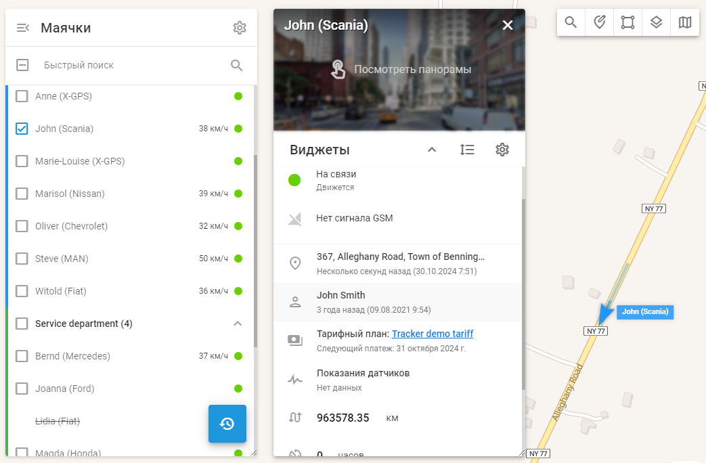
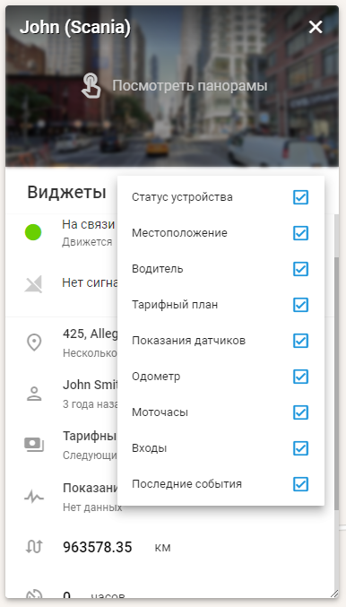

# Информационные виджеты маячка

На платформе Navixy, панель управления устройствами - это центр, предоставляющий подробную информацию и инструменты для управления объектами и связанными с ними GPS-устройствами и датчиками.

Чтобы получить доступ к этой панели, просто нажмите кнопку "Информации 

" или дважды щелкните устройство в [списке маячков](../page-8b3ad27f-05dc-46ae-8ef5-3c753326d3dc.md). После открытия панель управления отображает исчерпывающие данные о выбранном объекте и его IoT-устройствах, включая текущее состояние, GPS-положение и данные телеметрии. Кроме того, на ней представлены различные инструменты оперативного управления, удобно расположенные в одном месте.

## Настройка виджетов

Список виджетов в панели управления устройством можно настраивать в соответствии с вашими потребностями. Вы можете легко развернуть или свернуть все виджеты для более полного или компактного представления. Для этого используйте кнопку "Показать все", чтобы развернуть все виджеты, и кнопку "Скрыть все", чтобы свернуть их. Если вы предпочитаете другой порядок расположения виджетов, нажмите кнопку "Изменить порядок", чтобы перетащить и переставить их по своему усмотрению. Кроме того, вы можете настроить отображение виджетов, нажав на иконку шестерёнки и сняв флажки с тех виджетов, которые вы хотите скрыть.

Виджеты - подробный обзор (пример)

### Объяснение ключевых виджетов

- **Общая информация**: Отображает такие важные данные, как модель устройства, идентификатор, статус подключения, статус движения, уровень заряда батареи, уровень сигнала GSM и другие. Этот виджет также предоставляет информацию о том, находится ли устройство в режиме роуминга.
- **Расположение**: Предоставляет подробную информацию о текущем местоположении трекера, включая адрес, широту, долготу, скорость и направление.
- **OBD2 И CAN**: Если трекер подключен к CAN-шине автомобиля или разъему OBD2, этот виджет будет отображать такие данные, как уровень топлива, скорость двигателя, температура охлаждающей жидкости и диагностические коды неисправностей (DTC).
- **Показания датчиков**: Отображает данные с датчиков, настроенных в настройках устройства, например температуру или уровень топлива. Этот виджет также позволяет отмечать избранные датчики для быстрого доступа.
- **Одометр**: Отображает пробег устройства. Вы можете вручную настроить пробег, нажав кнопку "Изменить".
- **Моточасы**: Показывает общее время работы двигателя. Как и одометр, время работы двигателя можно отрегулировать, нажав кнопку "Редактировать".
- **Входы и выходы**: Отображает состояние подключенных датчиков и позволяет управлять выходами, например зажиганием, посылая команды непосредственно с виджета.
- **Водитель**: Предоставляет информацию о назначенном водителе и позволяет сменить водителя прямо из виджета.
- **Рабочие статусы**: Отображает и позволяет изменять назначенный статус устройства, например "В пути" или "Бездействует".
- **Последние события**: Показывает последние оповещения и позволяет скрыть определенные события от просмотра.
- **Электронный замок**: Для устройств с функцией интеллектуального замка этот виджет позволяет управлять состоянием блокировки, в том числе дистанционно блокировать или разблокировать устройство.

Используя эти виджеты, вы можете полностью настроить и контролировать взаимодействие с GPS-устройствами, гарантируя, что все необходимые данные и элементы управления будут у вас под рукой. Такой уровень настройки и доступности поможет вам более эффективно и точно управлять своим автопарком.