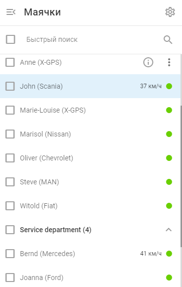
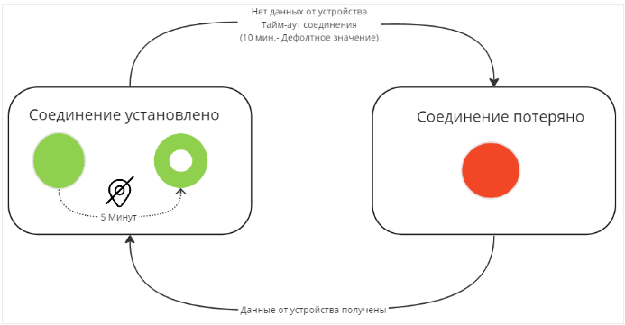

# Состояние подключения

Каждое GPS-устройство на платформе имеет статус, который указывает на текущее состояние его соединения с сервером. Эти статусы выделены цветом и видны в окне [список объектов](../page-bfccf336-051e-499b-8ff3-f2f3c9fbe48b.md).

Цветные индикаторы позволяют пользователям быстро и легко оценить состояние GPS-устройств с первого взгляда. Зеленый цвет указывает на то, что все работает правильно, а красный, желтый и серый сигнализируют о наличии проблем, требующих внимания.

В следующей таблице приведены возможные состояния GPS-устройств, дано описание каждого состояния и его признаков, касающихся подключения и активности устройства. Эта информация помогает пользователям понять состояние устройств в реальном времени, выявить проблемы и предпринять необходимые действия для обеспечения оптимальной производительности.

| Статус | Описание |
| --- | --- |
| Активированные устройства |     |
|  | **На связи, GPS координаты обновлены.**   GPS-устройство объекта подключено и сообщает координаты, как и ожидалось. |
|  | **Подключен, но GPS координаты устарели.**  GPS-устройство объекта подключено к серверу, но не передавало текущие координаты более 5 минут. Возможные причины включают:  - Последнее обновление GPS было более 5 минут назад - Данные, полученные из памяти устройства, имеют устаревшие временные метки - Потеря сигнала GPS (например, под крышей, в туннеле, на подземной парковке) - Устройство в энергосберегающем или спящем режиме, отправляет последние известные координаты или пакеты сердцебиения - Настройка часового пояса устройства отличается от UTC+0 |
|  | **Не подключен**  GPS-устройство объекта не отправляло данные в течение заданного пользователем времени (по умолчанию 10 минут). Возможные причины включают:  - Слабый сигнал GPRS - Устройство в режиме глубокого сна - Роуминг не включен на SIM-карте - Исчерпан лимит трафика GPRS или баланс SIM-карты - Устройство отключено от платформы |
|  | **Трекер заблокирован по тарифному плану**  В период приостановки платформа не принимает данные с устройства, и данные за этот период будут недоступны даже после снятия приостановки. Чтобы возобновить обслуживание, пополните баланс или обратитесь в службу поддержки. Устройство будет автоматически разблокировано в течение 15 минут после оплаты. |
| **Устройства добавлены, но еще не активированы** |     |
|  | **Трекер недавно зарегистрирован**  GPS-устройство было добавлено недавно. Этот статус будет отображаться до окончания активации, которая обычно занимает 2-3 минуты (исключение: для мобильного приложения X-GPS Tracker этот статус длится неограниченное время). |
|  | **Трекер зарегистрирован, но прошло уже довольно много времени**  Устройство GPS было добавлено, но связь с платформой пока не установлена. Могут потребоваться дополнительные действия, для устранения неполадок обратитесь к статьям о проблемах активации. |
|  | **Трекер зарегистрирован, но эта модель не поддерживает автоматическую активацию.**  Устройство GPS требует [ручной конфигурации](https://squaregps.atlassian.net/wiki/spaces/UDOCRU/pages/2922809628/GPS-#%D0%90%D0%BA%D1%82%D0%B8%D0%B2%D0%B0%D1%86%D0%B8%D1%8F-GPS-%D1%83%D1%81%D1%82%D1%80%D0%BE%D0%B9%D1%81%D1%82%D0%B2%D0%B0-%D0%B2%D1%80%D1%83%D1%87%D0%BD%D1%83%D1%8E) поскольку он не поддерживает [автоматической активации](https://squaregps.atlassian.net/wiki/spaces/UDOCRU/pages/2922809628/GPS-#%D0%90%D0%B2%D1%82%D0%BE%D0%BC%D0%B0%D1%82%D0%B8%D1%87%D0%B5%D1%81%D0%BA%D0%B0%D1%8F-%D0%B0%D0%BA%D1%82%D0%B8%D0%B2%D0%B0%D1%86%D0%B8%D1%8F-GPS-%D1%83%D1%81%D1%82%D1%80%D0%BE%D0%B9%D1%81%D1%82%D0%B2%D0%B0). Следуйте инструкциям по настройке устройства или обратитесь за помощью в службу поддержки вашего поставщика услуг.  Советы:  - Адрес и порт сервера указаны в подробной информации ("i"), а также представлены на сайте [Веб-сайт Navixy](https://navixy.ru/device) - Установите часовой пояс устройства на UTC+0 для корректной обработки временных меток данных. |
|  | **Трекер не передавал данные на платформу после регистрации или замены.**   Платформа не получила никаких данных от устройства GPS после его активации или после замены неисправного устройства. |

## Последовательность состояний подключения

На диаграмме ниже показана последовательность состояний соединения для успешно активированного GPS-устройства на платформе, демонстрирующая переходы между различными состояниями в зависимости от полученных данных и прошедшего времени.

Подробное объяснение:

- Первоначально статус устройства - **На связи** обозначен зеленым кружком, что означает, что он подключен к серверу и передает действительные GPS-координаты и временную метку. Если в течение 5 минут не поступает новых GPS-координат, статус изменяется на **GPS координаты устарели.** Изображается в виде зеленого круга с отверстием. Это может произойти, если устройство потеряло сигнал GPS, перешло в режим энергосбережения или отправило устаревшие данные из своей памяти.
- Если по истечении времени ожидания соединения (заданного пользователем или 10 минут по умолчанию) не будет получено никаких новых данных, статус изменится на **Оффлайн** в виде красного круга. Это может произойти, если устройство находится в зоне с плохим сигналом сотовой связи, в режиме глубокого сна или при наличии таких проблем, как проблемы с SIM-картой или исчерпание трафика GPRS.
- Когда устройство возобновит отправку действительных GPS-координат и временной метки, статус вернется в состояние **На связи** и цикл повторяется до тех пор, пока устройство работает, переходя между состояниями на основе полученных данных и истекшего времени.

Эта последовательность помогает пользователям в режиме реального времени отслеживать состояние подключения и передачи данных GPS-устройств, что обеспечивает своевременное принятие мер при возникновении каких-либо проблем.