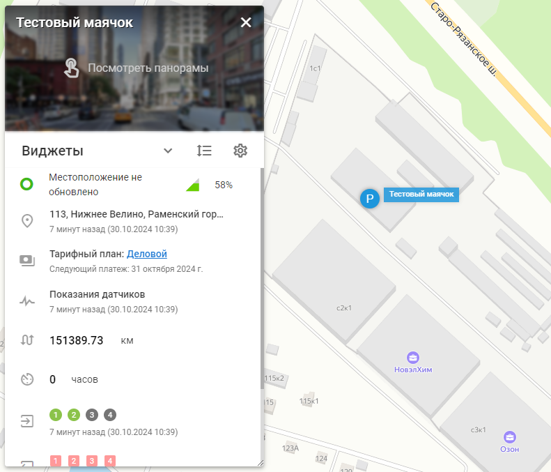

# Детали маячка

Детальное представление объекта позволяет получить подробное представление о ваших активах, обеспечивая лучший мониторинг и управление. Предлагая исчерпывающую информацию, такую как местоположение, состояние, данные диагностики и последние действия, эта функция позволяет принимать обоснованные решения и оперативно реагировать на любые проблемы.

Чтобы перейти к детальному просмотру конкретного объекта, дважды щелкните по нему в списке или нажмите на значок информации ("i") рядом с названием объекта.

Ниже приведено объяснение различных компонентов, доступных в детальном представлении объекта.

- **Заголовок:** Название объекта и изображение с улицы, если оно доступно.
- **Виджеты, отображающие данные GPS и автомобильной телематики** - Доступная информация зависит от функциональности и настроек GPS-устройства/датчика:
  - [Состояние подключения](../page-dbc17c0a-e1ef-437c-80a2-f09035e2c45d/page-adcb29ae-d63e-486f-b604-d3942346919b.md) : Указывает, подключен ли объект в данный момент.
  - Информация о местоположении: Показывает последнее известное местоположение с адресом (или GPS-координатами) и временной меткой
  - План: Отображает текущий план и дату следующего платежа
  - Данные OBD2 и CAN: Показывает последние данные, полученные от бортовой системы диагностики автомобиля и шины CAN
  - Показания датчиков: Отображает последние показания датчиков и их временные метки
  - Одометр: Позволяет пользователям просматривать и корректировать данные одометра
  - Моточасы: Включает отслеживание моточасов
  - Входы: Указывает на состояние зажигания и других датчиков (например, датчика двери автомобиля)
  - Выходы: Позволяет управлять устройствами, подключенными к GPS-трекеру (например, удаленным автомобильным иммобилайзером)
- **Виджеты, представляющие дополнительную информацию об объекте** - в зависимости от вашей установки:
  - Назначение водителя: Указывает, назначен ли драйвер для объекта
  - Последние события: Перечисляет все последние события, связанные с объектом