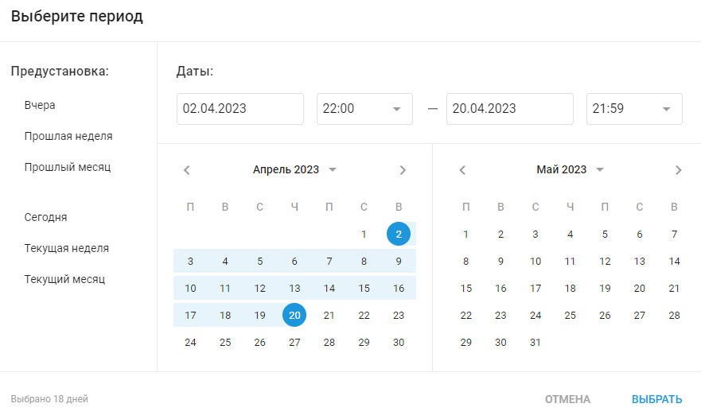
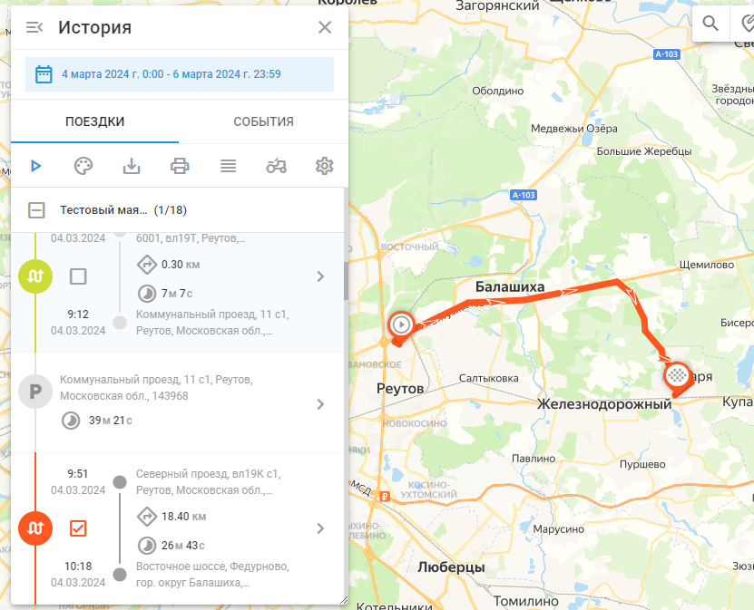

# История поездок

История поездок в Navixy позволяет просматривать прошлые действия и маршруты, пройденные автомобилями вашего автопарка. Эта функция предоставляет подробный журнал поездок, включая временные метки, местоположение, расстояние и продолжительность, помогая вам отслеживать активность транспортных средств и оптимизировать управление автопарком.

Чтобы просмотреть историю поездок в Navixy, выберите интересующие вас объекты, а затем нажмите кнопку истории (синяя круглая стрелка в правом нижнем углу списка объектов). Вам будет предложено выбрать диапазон времени и дат. Выберите нужный диапазон дат, чтобы продолжить.

## Краткая история поездки

После выбора диапазона дат в представлении "История" отображается сводка поездок и событий для выбранных объектов. Каждая запись о поездке содержит основные сведения:

- **Временная метка**: Показывает время начала и окончания поездки.
- **Расположение**: Указывает начальный и конечный адреса поездки.
- **Пройденное расстояние**: Указывает общее расстояние, пройденное во время поездки.
- **Продолжительность**: Отображает общее время, затраченное на поездку.

Используя краткую историю, вы можете быстро получить обзор активности и истории поездок вашего автопарка за выбранный период.

## Подробная история поездки

При нажатии на запись о поездке в кратком обзоре истории поездок вы увидите подробную информацию о поездке. Сюда входят:

- **Время начала и окончания**: Точное время начала и окончания поездки.
- **Пройденное расстояние**: Общее расстояние, пройденное во время поездки.
- **Продолжительность**: Общее время, затраченное на поездку.
- **Остановить**: Подробная информация о каждой остановке, включая местоположение и продолжительность остановки.

Каждый сегмент поездки указан с точными адресами и временными отметками, что позволяет тщательно проанализировать передвижения и остановки вашего автопарка за выбранный период. Такой подробный обзор помогает отслеживать активность транспортных средств, понимать поведение водителей и оптимизировать маршруты.

## Удобные функции

| Характеристика | Описание |
| --- | --- |
| **Методы цветового оформления** | Вы можете выбрать различные цветовые схемы для визуализации данных о поездках:  - Цвет вручную: Назначьте цвета вручную для различных поездок. - Цвет по поездкам: Автоматически выделяйте поездки цветом в зависимости от их маршрута. - Цвет по статусу: Различайте поездки по их статусу, например, движущиеся или остановленные. - Цвет по скорости: Визуализация поездок на основе изменения скорости. |
| **Изменение цвета сегмента поездки** | Настройте цвет определенных сегментов поездки, чтобы выделить конкретные участки для лучшего визуального анализа. |
| **Проиграть маршрут** | Используйте кнопку воспроизведения, чтобы анимировать поездки на карте, показывая перемещение объекта во времени. Настройте скорость воспроизведения с помощью таких опций, как x1, x3, x10, x30, x100 и x300. Эта функция полезна для понимания характера и продолжительности поездок. |
| **Выгрузить поездки в виде KML-файла** | Загружайте данные о поездках в виде файлов KML для использования в других ГИС-приложениях, что позволит проводить дальнейший анализ и обмениваться информацией. |
| **Печать выбранных поездок** | Распечатайте подробные отчеты о поездке прямо из интерфейса для документации или обмена информацией с членами команды. |
| **Переключение между свернутым и подробным видом** | Переключайтесь между свернутым сводным представлением и подробным развернутым представлением поездок, чтобы увидеть больше или меньше информации по мере необходимости. |
| **Установите ширину трека** | Настройте ширину треков, отображаемых на карте. Это полезно в таких приложениях, как сельское хозяйство, для более четкой визуализации покрытия полей гусеницами тракторов. |
| **Другие настройки вида** | Дополнительные настройки включают показ остановок, данные LBS, группировку точек данных для наглядности, использование интеллектуальных фильтров для уменьшения шума и разделение поездок по остановкам для детального анализа. |

## Типы треков

Существуют различные типы треков в зависимости от технологии, используемой для определения местоположения, и режима отслеживания, установленного в конфигурации устройства.

- **Непрерывные треки**: Это наиболее распространенные треки, обычно используемые в приложениях для отслеживания транспортных средств. Они представлены в виде полилиний с четкими начальной и конечной точками.
- **Интервальные треки**: Для автономных GPS-трекеров местоположение часто обновляется через относительно большие промежутки времени, например, раз в час или раз в день. Такие треки отображаются в виде пронумерованных ориентиров (1, 2... N). Для облегчения визуализации они соединены прозрачными серыми линиями, которые могут неточно отображать реальный путь.
- **Точки LBS**: Когда данные о местоположении определяются с помощью альтернативных технологий LBS, таких как сигналы GSM или Wi-Fi, им может не хватать точности. Такие местоположения визуализируются с помощью кругов, где радиус указывает на точность.
- **Кластеризованные точки**: Когда объект остается на одном месте в течение длительного времени, многочисленные интервальные или LBS-сообщения могут загромождать карту. Чтобы улучшить читаемость, сервер объединяет их в один кластерный ориентир, отображающий только одну точку на карте. Время начала/окончания и продолжительность будут добавлены в примечание для этого точки.