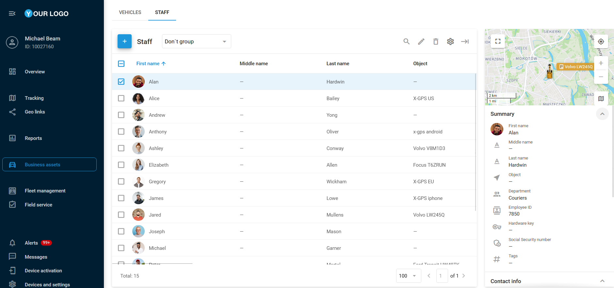

# (new)Сотрудники

Страница **Сотрудники** предназначена для управления персоналом. Она позволяет просматривать и редактировать подробную информацию о сотрудниках. Ведение полного учёта водителей помогает оптимизировать управление автопарком, повысить уровень ответственности персонала и улучшить общую эффективность работы.

## Список сотрудников

Список сотрудников — быстрый и удобный способ управления персоналом. Информация представлена в табличной форме и дополнена боковой панелью справа на экране. Здесь можно легко добавлять сотрудников, редактировать их данные, назначать в определённые отделы и связывать с активированными GPS-устройствами.

## Добавление сотрудника

Чтобы добавить нового сотрудника, выполните следующие шаги:

1. Нажмите 
.
2. Заполните обязательные поля:
  1. Привязанное GPS-устройство (**Маячок**).
3. При необходимости заполните дополнительные поля, например, отдел, табельный номер или электронный ключ.
4. При желании выберите иконку или загрузите фотографию для удобной идентификации.
5. Нажмите **Сохранить**.

## Импорт сотрудников

Если вам необходимо добавить сразу несколько сотрудников, вы можете загрузить их список с помощью файла Excel (XLS, XLSX, CSV).

### Импорт списка сотрудников

1. Откройте вкладку **Сотрудники** на странице **Бизнес-активы**, наведите курсор на кнопку 
 и нажмите 
.
2. В окне импорта вы найдёте пример XLS-файла, который можно использовать в качестве шаблона.
3. Убедитесь, что столбцы в вашем файле соответствуют нужным полям в системе мониторинга. Это можно сделать до начала импорта или в процессе загрузки.
4. В файле необходимо указать основную информацию, такую как имя, email, номер водительского удостоверения и т. д.
5. Сохраните заполненный файл на компьютере.

### Загрузка файла на платформу

1. Нажмите кнопку **Обзор**, выберите файл и нажмите **Продолжить**. Если файл содержит заголовки, убедитесь, что установлен флажок **Использовать заголовки файла**.
2. Вам будет предложено проверить соответствие заголовков полям системы. Если всё верно, нажмите **Продолжить** ещё раз.
3. Если какие-либо поля заполнены неверно, система предложит их исправить. Пустые обязательные поля не будут импортированы.
4. После проверки и корректировки данных импорт будет завершён, и новые сотрудники появятся в списке сотрудников.