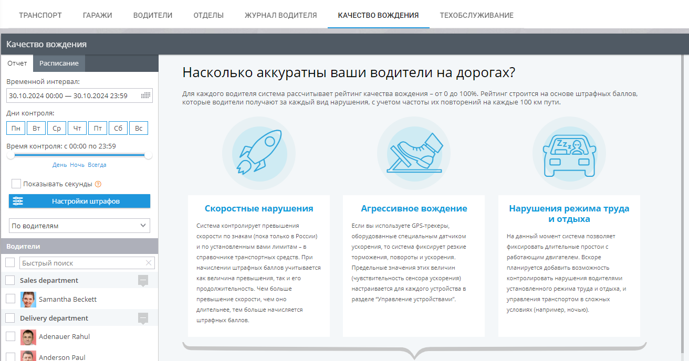
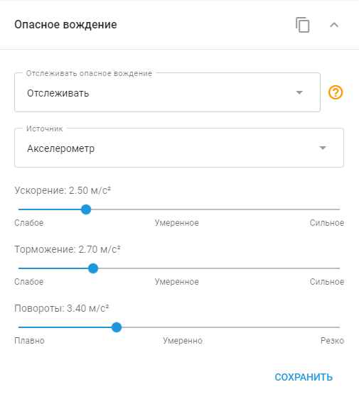

# Качество вождения

Вкладка **Качество вождения** в Navixy - это мощный инструмент, предназначенный для анализа и улучшения поведения водителей вашего автопарка. Присваивая каждому водителю оценку от 0 до 100, система обеспечивает четкую метрику эффективности вождения на основе штрафных баллов, накопленных за различные нарушения правил вождения. Эти нарушения оцениваются в зависимости от их частоты и тяжести на каждые 100 километров пробега, что обеспечивает всестороннюю оценку привычек каждого водителя.

Чтобы получить доступ к отчету Качество вождения, перейдите в раздел **Управление транспортом** и выберите вкладку **Качество вождения.**

## Понимание штрафных баллов

Штрафные баллы - ключевой компонент отчета **Качество вождения**, позволяющий оценить влияние различных типов нарушений на работу водителя. Система отслеживает три основные категории нарушений: превышение скорости, агрессивное вождение и чрезмерный холостой ход. Каждый тип нарушения вносит свой вклад в общий балл, причем более низкие баллы свидетельствуют о более частых или серьезных нарушениях.

## Настройка отчета

Отчет **Качество вождения** можно настроить в соответствии с вашими конкретными потребностями, что позволит вам установить собственные критерии того, что считать нарушением и насколько серьезным оно является. Вы можете присваивать различные штрафные баллы различным нарушениям, что позволит вам расставить приоритеты в отношении определенных аспектов поведения водителя в соответствии со стандартами вашей организации.

**Основные характеристики**

- **Нарушение скоростного режима:** Отслеживайте случаи превышения водителями установленного скоростного режима, при этом наказание будет зависеть от степени и продолжительности превышения скорости.
- **Агрессивное вождение:** Отслеживайте агрессивные маневры, такие как резкое торможение, ускорение или резкие повороты, с настраиваемыми пороговыми значениями на основе устройств вашего автопарка.
- **Чрезмерный холостой ход:** Выявляйте и наказывайте водителей за длительные периоды простоя, которые приводят к трате топлива и снижению эффективности автомобиля.

Расчеты в отчете Eco Driving

Отчет **Качество вождения** предназначен для оценки поведения сотрудников за рулем на основе ряда критериев. Оценка для каждого водителя варьируется от 0 до 100 и зависит от штрафных баллов, начисляемых за различные нарушения.

Ниже приведены подробные объяснения того, как рассчитываются эти штрафные баллы и как они влияют на общую оценку водителя. Эти подробные расчеты и отчеты позволяют руководителям автопарков всесторонне оценивать поведение водителей, способствуя более безопасному и эффективному вождению в своем автопарке.

### Нарушение скоростного режима

Нарушение скоростного режима наказывается в зависимости от того, насколько водитель превысил скорость и на какое время. Вы можете установить универсальное ограничение скорости или использовать ограничения скорости для конкретного транспортного средства.

**Расчет штрафов за превышение скорости:**

Штрафные баллы за превышение скорости рассчитываются по следующей формуле:

`Time Factor × Penalty Points = Total Penalty Points`

Например, если автомобиль превысил скорость на 21 км/ч в течение 1 минуты 37 секунд, система исключит первую минуту (она не штрафуется) и рассчитает штраф за оставшиеся 37 секунд. Если штраф за превышение скорости на 20-30 км/ч установлен в размере 10 баллов, формула будет выглядеть следующим образом:

`0.616 × 10 = 6.16 penalty points`

### Агрессивное вождение и нарушения правил вождения

Такие жесткие дорожные ситуации, как резкое ускорение, резкое торможение и резкие повороты, фиксируются GPS-трекерами, оснащенными датчиками ускорения. Степень тяжести каждого события, связанного с резким вождением, можно настроить, и штрафные баллы начисляются соответствующим образом.

**Расчет штрафов за жесткое вождение**

За каждое нарушение правил вождения автоматически начисляется определенное количество штрафных баллов. Эти баллы вычитаются из общей оценки водителя в зависимости от частоты таких событий.

### Нарушение режима работы на холостом ходу

Чрезмерный холостой ход отслеживается, когда автомобиль остается неподвижным с работающим двигателем в течение длительного времени. Штрафные баллы начисляются в зависимости от того, как долго автомобиль работает на холостом ходу сверх заданного порога.

**Расчет штрафов за работу на холостом ходу**

Например, если автомобиль простаивает 8 минут и 14 секунд, а порог установлен на 5 минут, при расчете штрафа будут исключены первые 5 минут и начислены штрафы только за оставшиеся 3 минуты и 14 секунд. Если штраф за холостой ход установлен на уровне 5 баллов за минуту, то расчет будет следующим:

`3.23 × 5 = 16.17 penalty points`

### Итого за период

В разделе представлен обзор всех штрафов и оценок для каждого водителя или транспортного средства за выбранный период. Он включает в себя графическое представление и подробные таблицы.

**График суммы штрафа**

На этом графике отображаются накопленные штрафные баллы, выделенные цветом по типу нарушения (красный - за превышение скорости, синий - за агрессивное вождение, зеленый - за работу на холостом ходу).

**График рейтинга**

На этом графике показаны баллы каждого водителя или устройства, рассчитанные на 100 пройденных километров. Баллы корректируются с учетом штрафов, что дает четкое представление о работе каждого водителя.

### Таблицы с подробной информацией

Каждый тип нарушения разбит на подробные таблицы, предлагающие информацию о конкретных событиях, таких как превышение скорости, резкое вождение и холостой ход.

#### Таблица скоростей

В этой таблице перечислены все случаи превышения скорости, а штрафные баллы начисляются в зависимости от наиболее серьезного превышения скорости во время события.

#### Таблица агрессивного вождения

События, зарегистрированные в течение 5-минутного окна, группируются, и для каждой группы рассчитываются штрафы.

#### Таблица интервалов простоя

В этой таблице приведена подробная информация о каждом случае холостого хода с работающим двигателем, включая продолжительность и соответствующие штрафные баллы.

## Анализ результатов

Отчет **Качество вождения** содержит как графические, так и табличные данные, что позволяет с первого взгляда понять, какие водители работают хорошо, а какие, возможно, нуждаются в дополнительном обучении. В графическом интерфейсе используется цветовое кодирование для различения разных типов нарушений, а в таблицах - подробная разбивка штрафов по водителям и устройствам.

### Настройки и персонализация

Вы можете точно настроить отчет **Качество вождения**, чтобы сосредоточиться на определенных периодах времени, днях недели или времени суток, которые наиболее важны для вашей работы. Кроме того, система позволяет выбирать, генерировать ли отчеты по отдельным водителям или по используемым ими автомобилям, что обеспечивает гибкость в зависимости от ваших предпочтений.

### Планирование отчета об экономичном вождении

Отчет **Качество вождения** в Navixy можно запланировать на автоматическое выполнение через заданные промежутки времени, что позволит вам регулярно контролировать и оценивать поведение водителей без ручного вмешательства. Эта функция обеспечивает постоянное и своевременное получение информации о работе вашего автопарка, помогая выявлять тенденции и проактивно решать проблемы.

Чтобы запланировать отчет, перейдите на вкладку **Расписание** в разделе **Качество вождения** и установите желаемую периодичность и укажите получателей. Система сформирует отчет в соответствии с вашими настройками и доставит его прямо в ваш почтовый ящик или сделает доступным для скачивания на платформе.

### Практическое применение

Отчет **Качество вождения** особенно полезен для компаний, которым необходимо тщательно следить за поведением водителей, например, в сфере пассажирских перевозок, транспортировки опасных материалов или аварийных служб. Анализируя этот отчет, организации могут продлить срок службы автомобилей, снизить вероятность аварий и обеспечить эффективное и ответственное использование транспортных средств.

В целом, отчет **Качество вождения** - незаменимая функция для любого руководителя автопарка, стремящегося поддерживать высокие стандарты безопасности, эффективности и соответствия нормативным требованиям.