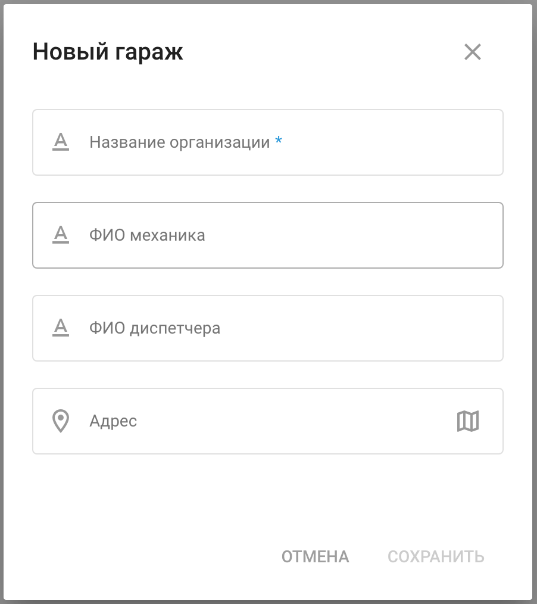

# Гаражи

Гаражи ("депо") в Navixy играют важную роль для организаций с большим автопарком, расположенным в нескольких местах. Они помогают организовать и управлять работой автопарка, например, диспетчеризировать операции, формировать отчеты и обеспечивать соответствие требованиям документации.

Профили гаражей содержат подробную информацию о каждом гараже, включая владельца парка, местоположение и ключевых сотрудников, таких как механики и диспетчеры.

Информация о владельцах автопарков доступна во вкладке **Гаражи.**

Нажмите 

 чтобы добавить новый гараж.

Профиль гаража содержит его название, адрес, имя механика и имя диспетчера. Эти данные можно использовать для более удобного и эффективного управления задачами.