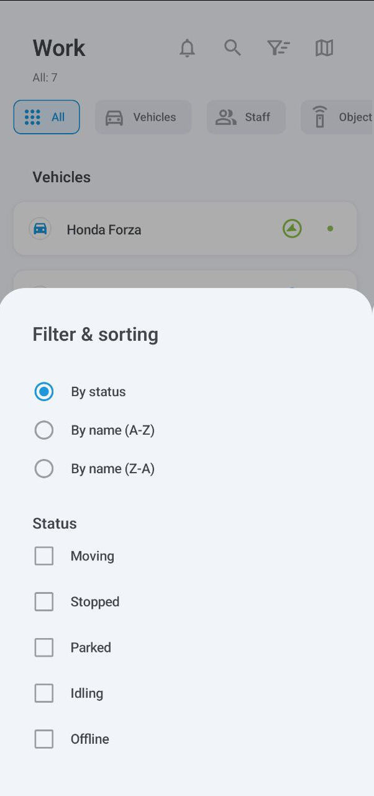

# Список активов

На этом экране отображаются все ваши активы: транспортные средства, персонал и маячки (неназначенные GPS-устройства). Чтобы просмотреть дополнительную информацию о любом из ваших активов, просто нажмите на его запись. Чтобы найти конкретный актив, нажмите 

 и введите его название.

Значок справа от каждого актива указывает на его статус движения, например, движется или припаркован.

### События

Нажмите 

 для просмотра событий.

На этом экране отображаются различные события, происходящие с вашими активами, такие как выход или вход в геозону, переход в режим холостого хода, превышение скорости, выполнение задач и многое другое. Для фильтрации по типу категории нажмите **Все**, **Транспорт**, **Персонал** или **Маячки**.

Второе меню показывает ваши текущие фильтры, все из которых можно настроить: временной период, конкретные транспортные средства или персонал, и типы событий. Фильтр **Непрочитанные** будет отображать только непрочитанные уведомления, а **Экстренные** сузит ваш поиск до срочных событий.

### Карта

Нажмите 

, чтобы открыть интерактивную карту, отображающую ваши активы.

Вы можете увеличивать и уменьшать масштаб, а также центрировать карту по вашим собственным GPS-координатам. Нажмите на значок транспортного средства, чтобы следить за его маршрутом и просматривать его текущий статус и местоположение. Нажмите 

 еще раз, чтобы открыть подробную информацию о транспортном средстве.

Нажмите 

, чтобы отобразить меню параметров карты:

Здесь вы можете выбрать места (например, местоположения клиентов для доставки), геозоны и тип карты. Обратите внимание, что выбор типа карты в настоящее время доступен только на устройствах Android.

### Сортировка и фильтрация

Список имеет два метода фильтрации: по категории и по статусу.

Для фильтрации по категории нажмите **Все**, **Транспорт**, **Персонал** или **Маячки**.

Для фильтрации по статусу (в движении, остановлен, припаркован, на холостом ходу и офлайн), нажмите 

, чтобы открыть меню **Фильтр и сортировка**. Помимо фильтрации, это меню также позволяет сортировать активы по названию.

