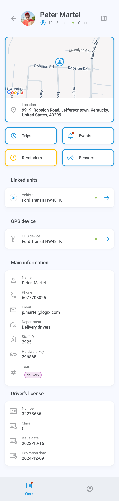
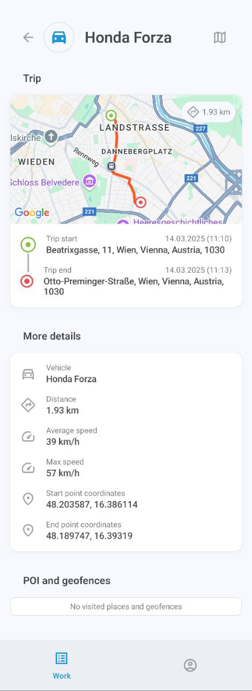
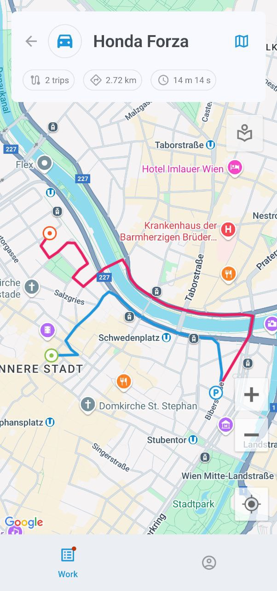
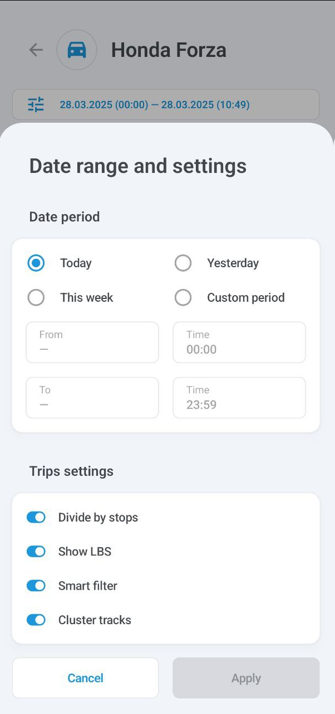
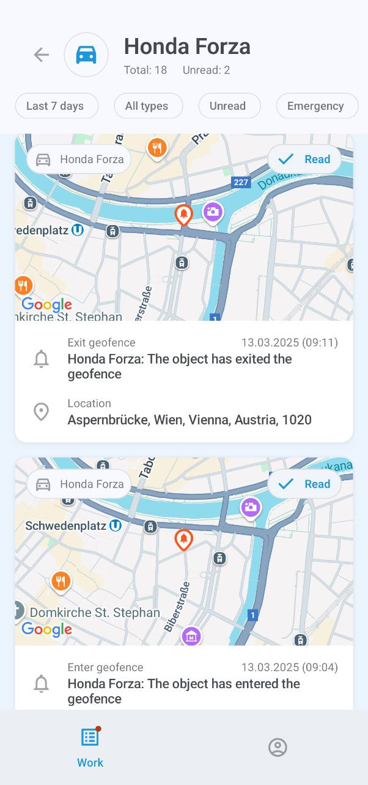
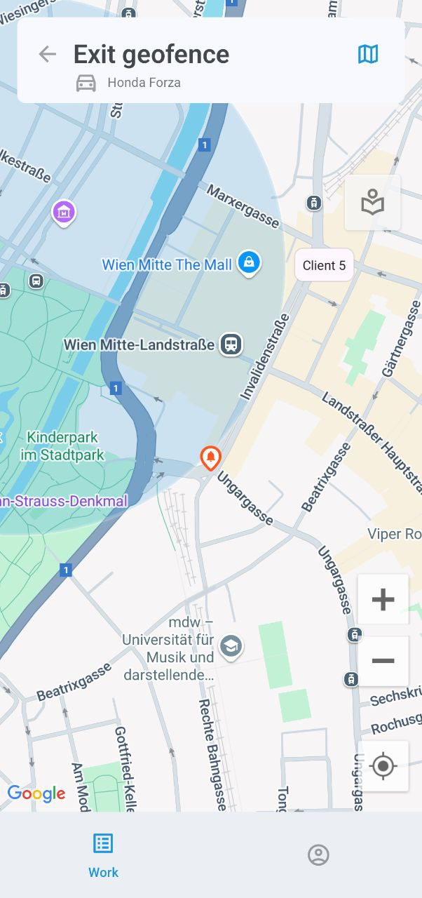
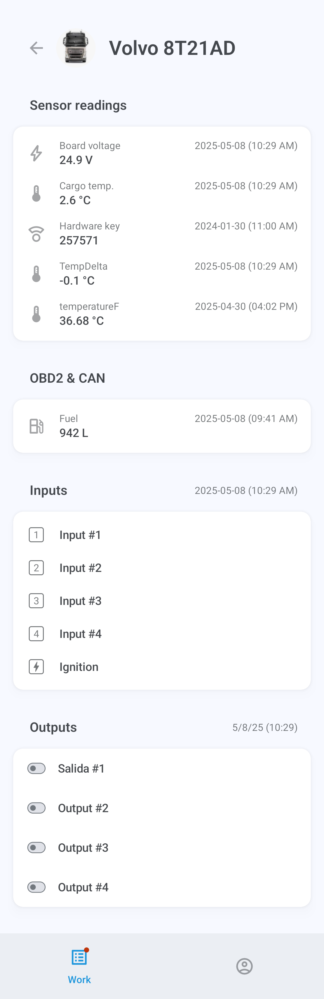
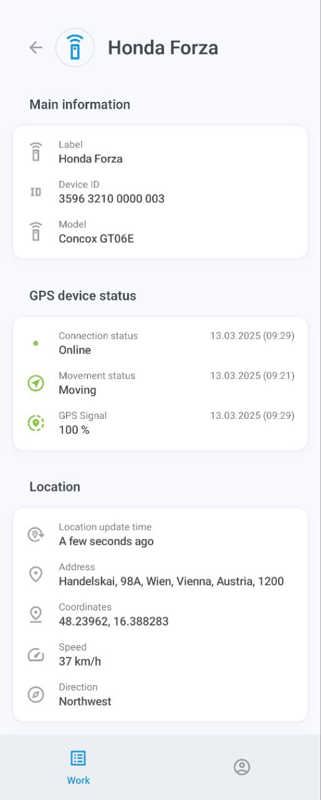

# Информация об активе

Экран информации об активе отображает подробные сведения об активе, включая его местоположение на карте, историю поездок и событий, напоминания, связанные устройства, назначенное GPS-устройство, теги и другие данные.

### Карта

По умолчанию карта отображается в верхней части экрана информации. Нажмите и удерживайте адрес, чтобы скопировать его, или нажмите на изображение, чтобы перейти в полноэкранный режим. Карта автоматически следует за маршрутом актива, если он движется. Вы также можете увеличивать и уменьшать масштаб и центрировать карту по вашим собственным GPS-координатам.

Нажмите 

 , чтобы отобразить меню параметров карты, где вы можете выбрать места, геозоны и тип карты. Обратите внимание, что выбор типа карты в настоящее время доступен только на устройствах Android.

### Поездки

Нажмите **Поездки**, чтобы отобразить список поездок, совершенных вашим активом. Нажмите на любую поездку, чтобы просмотреть ее детали, включая посещенные POI и геозоны. Вы также можете просмотреть историю одной или нескольких поездок на карте в полноэкранном режиме.

Чтобы отфильтровать отображение поездок, например, по временному периоду и другим параметрам, нажмите 

 и откройте **Диапазон дат и настройки**:

### События

Нажмите **События**, чтобы просмотреть историю событий актива, таких как выход из геозоны или вход в нее, простой, превышение скорости, выполнение задач, аварии, отклонение от маршрута, прибытие в контрольную точку и многое другое.

Меню под названием актива показывает ваши текущие фильтры, все из которых можно настроить: временной период, конкретные транспортные средства или сотрудники и типы событий. Фильтр **Непрочитанные** отобразит только непрочитанные уведомления, а **Экстренные** сузит ваш поиск до срочных событий.

Нажмите на событие, чтобы отобразить его детали. Вы также можете нажать на карту в верхней части экрана, чтобы просмотреть ее в полноэкранном режиме. Кнопка 

 позволяет переключаться между различными картами.

> [!WARNING]
> Выбор типа карты в настоящее время доступен только на устройствах Android.

### Напоминания

Кнопка **Напоминания** отображается только при наличии ожидающих решения проблем, таких как истекающие или истекшие водительские права или страховка транспортного средства. Нажмите на нее, чтобы узнать больше о проблеме.

### Датчики

Нажмите кнопку **Датчики**, чтобы увидеть показания, предоставляемые GPS-устройством или устройствами актива, включая моточасы, уровень топлива, температуру и пользовательские входы и выходы.

Выходы позволяют отправлять команды управления на устройства, например, для остановки двигателя. Чтобы отправить команду, нажмите 

 и выберите **Отправить** в окне подтверждения.

Датчики транспортных средств настраиваются через основную платформу Navixy. Чтобы узнать о них больше, прочитайте [Документацию пользователя Navixy](https://squaregps.atlassian.net/wiki/spaces/UDOCRU/pages/2922813861?atlOrigin=eyJpIjoiYWQxMzNkNmM2OTA5NGYwMThjMTAzZWE5MzI0OTUxMGUiLCJwIjoiYyJ9).

### Связанные устройства

Нажмите на имя или метку в записи **Связанные устройства**, чтобы получить доступ к экрану информации об устройстве, связанном с активом, например, о водителе или управляемом транспортном средстве.

### GPS-устройство

Нажмите на метку устройства в записи **GPS-данные**, чтобы отобразить его детали, включая ID, модель, статус подключения и движения, местоположение, скорость и другие технические данные.

