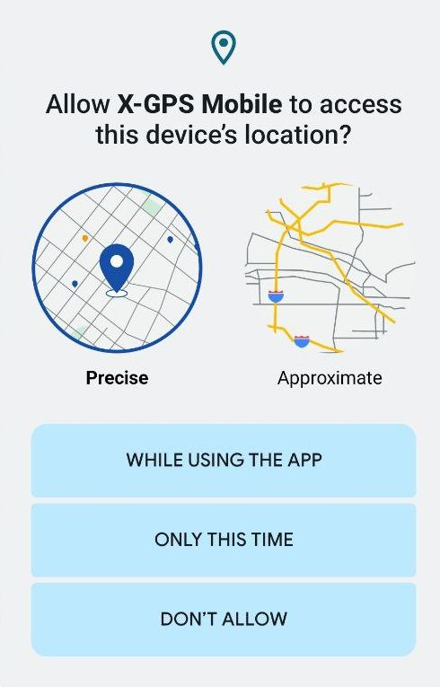
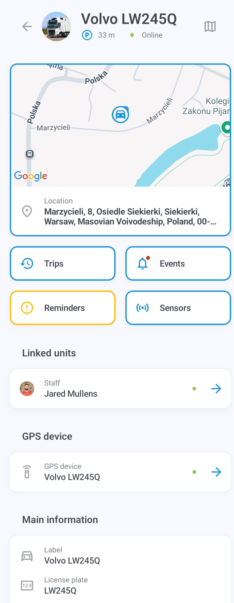

# Быстрый старт X-GPS Mobile

Следуйте этим шагам, чтобы научиться работать с X-GPS Mobile.

### Шаг 1. Скачайте приложение

1. Откройте Google Play или App Store и введите X-GPS Mobile в поле поиска.
2. Выберите его и нажмите **Установить**.

### Шаг 2. Войдите в систему

1. Откройте приложение.
2. Введите ваше имя пользователя и пароль, затем нажмите **Войти**.
3. При необходимости введите URL вашего сервера (по умолчанию используется сервер Navixy). Вы также можете использовать QR-код, чтобы пропустить ввод URL и автоматически настроить параметры.

> [!INFO]
> Если вы забыли пароль, нажмите соответствующую кнопку и введите ваш адрес электронной почты. Вы получите письмо со ссылкой для сброса пароля.

### Шаг 3. Установите разрешения

Разрешите приложению отправлять вам уведомления и получать доступ к местоположению устройства во время использования приложения. Обратите внимание, что вы будете получать push-уведомления для всех активов в вашем автопарке.

### Шаг 4. Откройте главный экран

На главном экране отображаются ваши активы: транспортные средства, персонал и маячки (GPS-устройства) с иконками, указывающими на их статус движения.

Вы можете фильтровать их по категории или статусу (в движении, на стоянке и т.д.) и сортировать их по имени или статусу.

Чтобы отсортировать или отфильтровать список активов и получить доступ к инструментам мониторинга, нажмите на иконки в правом верхнем углу: 

|     |     |
| --- | --- |
|  | Открывает [журнал событий](https://squaregps.atlassian.net/wiki/spaces/~7120201a6252f8d34242e3bdb7409b5d34d953/pages/3182821465/new+Assets+list#events-list) для всех устройств |
|  | Позволяет ввести поисковый запрос |
|  | Открывает меню [фильтрации и сортировки](https://squaregps.atlassian.net/wiki/spaces/~7120201a6252f8d34242e3bdb7409b5d34d953/pages/3182821465/new+Assets+list#sorting-and-filtering) |
|  | Открывает [экран карты](https://squaregps.atlassian.net/wiki/spaces/~7120201a6252f8d34242e3bdb7409b5d34d953/pages/3182821465/new+Assets+list#map-fullscreen) |

Используйте нижнюю панель для переключения между главным экраном и вашим профилем.

### Шаг 5. Начните работу

Нажмите на актив, чтобы просмотреть его местоположение, статус, историю поездок и событий, датчики, напоминания, GPS-устройство и другую информацию.

