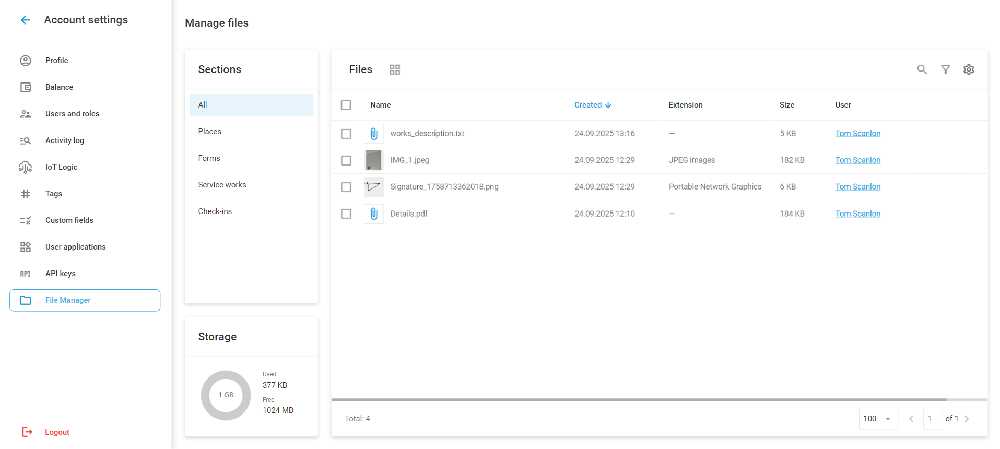
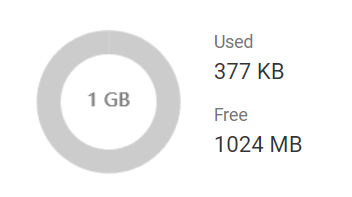
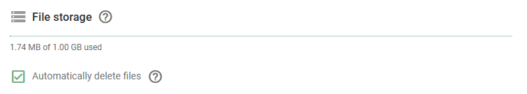

# File Manager

**File Manager** stores, displays, and manages files uploaded by users through the Navixy platform and X-GPS Tracker mobile app. This centralized system organizes all file attachments across different features, providing a single interface for working with files.

To access File Manager, navigate to **Account settings → File Manager**.

<figure><figcaption>
File Manager
</figcaption></figure>

### Sections

Files are automatically stored when users upload attachments through these features. File Manager organizes uploaded files into four sections based on their source:

**Places:** Files attached to [Places (POIs)](../tracking/map-tools/places-pois.md), including location photos and reference materials. To attach a file to a POI, you need to add a **File** or **Image** custom field while [creating or editing the POI](../tracking/map-tools/places-pois.md#creating-and-editing-places).

**Forms:** Attachments from [forms submitted through X-GPS Tracker](../x-gps-mobile-apps/x-gps-tracker/check-ins.md#forms-in-check-ins), such as signatures and inspection reports.

**Service works:** Files attached to [maintenance tasks](../fleet-management/maintenance.md), such as invoices, service documentation, and completion photos.

**Check-ins:** Photos uploaded during [Check-in submissions from X-GPS Tracker](../x-gps-mobile-apps/x-gps-tracker/check-ins.md).  When both a photo and a Form are attached during a Check-in, files directly attached to the Check-in appear in this section, while Form-related files are categorized under Forms.


Not all feature usage requires file uploads. For example, you can create a service work without attaching any files. In that case, no files will be added to File Manager.


### File management and operations

File Manager includes standard search and filtering capabilities, column sorting and customization options, and a grid/list view toggle for organizing your stored files. Advanced filtering allows search by name, date range, file format, size, and uploading user.

The list view automatically displays all file details, including creation date, size, file type, and the uploading user. In the grid view, this information is available upon clicking the ⓘ button. This mode also lets you select multiple files without additional clicks.

Pagination controls at the bottom of the interface show the total file count and allow you to customize the number of files displayed per page.

Files can be downloaded individually or selected for bulk download in a ZIP archive. When downloading files exceeding 1 GB, the system automatically creates multiple archives to accommodate all selected content.

Files can also be deleted individually or in bulk.


Deleted files cannot be recovered.


### Storage management

All new users automatically receive 1 GB of storage space, with additional storage available through subscription plans.


{% column width="66.66666666666666%" %}
A storage usage diagram in the lower-left corner of the screen displays current space usage. Files remain stored and accessible for 5 years after the end of the subscription or until deleted (automatically or manually), providing long-term access to important documentation and supporting materials across all platform operations.


{% column width="33.33333333333334%" valign="middle" %}
<figure><figcaption>
Storage diagram
</figcaption></figure>



**Automatic deletion:** Enable this option to automatically delete files when the storage limit is reached. This option deletes the oldest files first to maintain storage within limits while preserving the most recent uploads. Configure this setting in [Account settings → Profile](profile.md).

