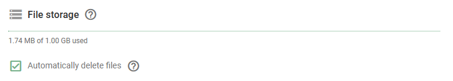

# File storage

Each user account is allocated 1 GB of file storage, which is designed to support essential functions within the Navixy platform. This is found within **Account Settings → Profile → General Settings**.

**Purpose:**

* **Photo and video files:** Store images and videos captured by camera-enabled vehicle telematics devices, helping you monitor and manage fleet operations effectively.
* **Task and form attachments:** Manage photos and attachments associated with tasks and forms within the X-GPS Tracker app, ensuring that all relevant documentation is easily accessible.

### File auto-deletion

For users who frequently handle large volumes of these files, the "Automatically delete files" feature is available to help manage your storage efficiently. This feature automatically replaces older files with new ones, ensuring that you stay within your storage limits without losing access to the most recent and relevant data.
