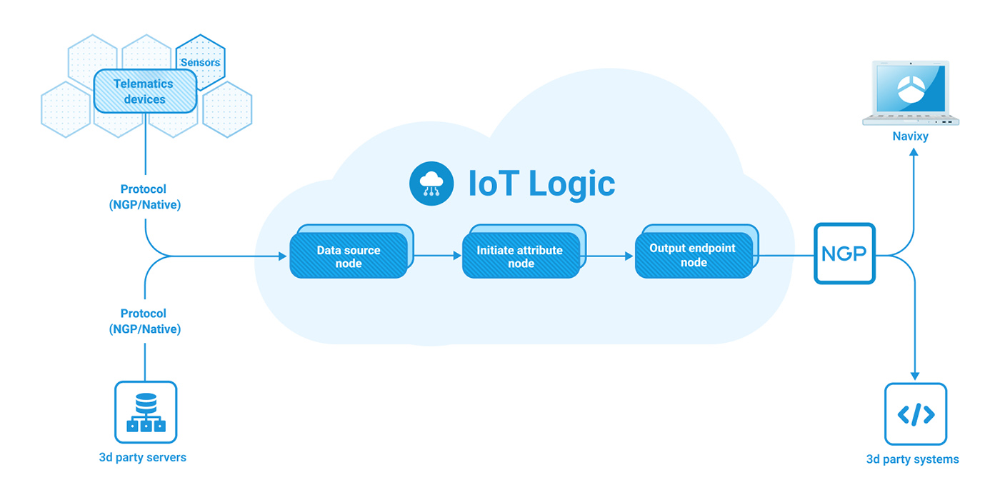

# IoT Logic

**IoT Logic** is a no-code/low-code data processing tool built into the Navixy platform. It gives telematics operators direct control over how device data is received, processed, and distributed, without involving a developer for every new requirement.

It can work with GPS trackers, dash cams, IoT sensors, or third-party telematics servers forwarding device data into Navixy. Incoming data is normalized into a consistent format regardless of its origin, and can then be enriched with calculated attributes and routed to the Navixy platform, external systems, or both.

Inside the flow, you can transform and route data based on real-time conditions, trigger automated actions on devices, and deliver results to the Navixy platform, third-party systems, or both. Continuous data streams, targeted event-driven notifications, and parallel outputs to multiple destinations are all supported within a single flow.


**Navigation**

IoT logic is accessible to account **Owners** in the **Account Settings** section. To find it:

1. Click the profile icon in the top-left corner of the screen to open your account settings
2. In the settings sidebar, select **IoT Logic**


## IoT Logic components

**IoT Logic** relies on its components to process, decode, enrich, and convert incoming data in real time, ensuring compatibility with various platforms and services. By optimizing data flow management, the solution enhances accuracy and customization of your data-related activities and offers more control over the data involved in your processes in general.

### Flow

**Flow** is the central functional element of IoT Logic, providing a structured framework for designing, customizing, and managing data processing. It introduces an intuitive drag-and-drop workspace that simplifies the creation of data pipelines through a sequence of data processing steps - **Nodes**.

The process is built around three key stages of data interaction: data reception, data enrichment, and data transmitting, each handled by specific nodes. Here are the most common ones:

* [Data Source node](nodes/data-source-node.md) manages data reception by connecting trackers to the Navixy platform for seamless input.
* [Initiate Attribute node](nodes/initiate-attribute-node/) enables data enrichment by renaming and customizing incoming parameters to meet various application requirements.
* [IF/THEN Logic node](nodes/logic-node/) enables conditional data routing by creating branching points that direct data flow based on logical expressions and real-time conditions.
* [Output Endpoint node](nodes/output-endpoint-node.md) handles data transmission by forwarding processed data to third-party servers and applications, ensuring efficient delivery.

You can build data flows covering your specific use cases or scenarios from scratch, start from a pre-configured template on the IoT Logic start page, or import an existing flow.


For a full list of available nodes with descriptions and guides, see the [Nodes](nodes/) reference page.


### Expression language

IoT Logic uses a built-in expression language based on JEXL (Java Expression Language) with telematics-specific extensions. It powers the data transformation and conditional routing logic inside flows, without requiring scripting or coding.

* **Calculation formulas:** compute new data attributes from existing ones using mathematical operations, unit conversions, and bit-level binary decoding. Used in **Initiate Attribute** nodes.
* **Condition formulas:** evaluate logical conditions to validate data or branch a flow based on real-time values. Used in **IF/THEN Logic** nodes.

For the full syntax reference and function catalog, see the [Navixy IoT Logic Expression Language](https://app.gitbook.com/s/tx3J5BxnWyPV0nP2xr0z/technologies/navixy-iot-logic-expression-language) documentation.

### Data Stream Analyzer

Data Stream Analyzer is a monitoring tool offering real-time troubleshooting capabilities for your data flow. The Analyzer provides a detailed view of incoming device data, making it the primary instrument to assess data integrity. On top of that, it has the potential to minimize operational risks, enhance decision-making, and improve service quality by allowing you to quickly identify data inconsistencies, optimize device performance, and maintain seamless operations.

For more details and usage instructions, see [Data Stream Analyzer](./#data-stream-analyzer).

### Navixy Generic Protocol

Navixy Generic Protocol (NGP) creates the foundation for IoT Logic data handling. It is a flexible communication mechanism designed to standardize data flows from diverse GPS devices and sensors connected to them, enabling seamless integration into a single system. Regardless of the original data format, NGP unifies device communications by converting all incoming data into a common standard, therefore reducing compatibility issues. The protocol ensures reliable, scalable, and secure data transmission, making it ideal for complex fleet management and asset tracking tasks.

For technical details and implementation guidance, see the focused [Navixy Generic Protocol documentation](https://app.gitbook.com/s/tx3J5BxnWyPV0nP2xr0z/technologies/navixy-generic-protocol).

## API access

IoT Logic functionality can also be accessed programmatically through the Navixy API. This allows developers to automate flow creation, management, and monitoring.


For security reasons, API access requires appropriate permissions. Contact your account administrator to ensure you have the necessary access rights.


For complete API documentation, parameters, request/response formats, and code examples, refer to the [IoT Logic API documentation](https://app.gitbook.com/o/YVLWhgAwCZPoU5vlRsCs/s/tx3J5BxnWyPV0nP2xr0z/).

## Section content

* [Quick start guide](quick-start-guide/)
  * [Templates](quick-start-guide/templates.md)
* [Flow management](flow-management/)
  * [Default data processing](flow-management/default-flow.md)
  * [Flow configuration example](flow-management/flow-configuration-example.md)
* [Nodes](nodes/)
  * [Data Source node](nodes/data-source-node.md)
  * [Initiate Attribute node](nodes/initiate-attribute-node/)
  * [IF/THEN Logic](nodes/logic-node/)
  * [Device action](nodes/action-node.md)
  * [Webhook](nodes/webhook-node.md)
  * [Output Endpoint node](nodes/output-endpoint-node.md)
* [Data Stream Analyzer](data-stream-analyzer.md)
