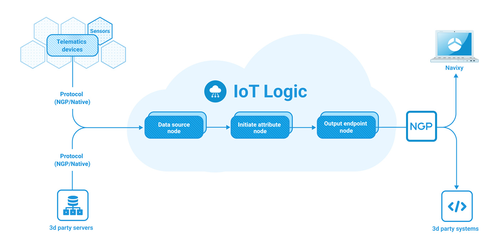

# IoT Logic

## Your complete data management solution

**IoT Logic** is a no-code/low-code tool integrated into Navixy platform, designed to simplify telematics data management. It combines a visual flow system with a JEXL-based expression language, enabling efficient data transformation without requiring coding expertise. Acting as a data traffic manager, it processes raw input from GPS devices, dash cams, and IoT sensors, converting it into actionable insights through custom data pipelines.


**Navigation**

IoT logic is accessible to account **Owners** in the **Account Settings** section. To find it:

* Click the profile icon in the top-left corner of the screen to open your account settings
* In the settings sidebar, select **IoT Logic**


## IoT Logic components

**IoT Logic** leverages its components to process, decode, enrich, and convert incoming data in real time, ensuring compatibility with various platforms and services. By optimizing data flow management, the solution enhances accuracy and customization of your data-related activities and offers more control over the data involved in your processes in general.

### Flow

Flow is the central functional element of IoT Logic, providing a structured framework for designing, customizing, and managing data processing. It introduces an intuitive drag-and-drop workspace that simplifies the creation of data pipelines. The process is built around three key stages of data interaction, each handled by specific nodes:

* **Data reception**\
  [Data Source node](flow-management/data-source-node.md) manages data reception by connecting trackers to the Navixy platform for seamless input.
* **Data enrichment**\
  [Initiate Attribute node](flow-management/initiate-attribute-node/) enables data enrichment by renaming and customizing incoming parameters to meet various application requirements.\
  [Logic node](https://squaregps.atlassian.net/wiki/spaces/USERDOCSOLD/pages/3361832995/Logic+node?atlOrigin=eyJpIjoiNDIwN2QzMmRiMDAzNDI4MmJkMGVlODVmODcxYWIzMjAiLCJwIjoiYyJ9) enables conditional data routing by creating branching points that direct data flow based on logical expressions and real-time conditions.
* **Data transmitting**\
  [Output Endpoint node](flow-management/output-endpoint-node.md) handles data transmission by forwarding processed data to third-party servers and applications, ensuring efficient delivery.


These nodes can be interacted with directly from Navixy’s interface. For a detailed breakdown of each node and usage instructions within the UI, redirect to the dedicated descriptions in [Flow management ](flow-management/)section.


### Data Stream Analyzer

Data Stream Analyzer is a monitoring tool offering real-time troubleshooting capabilities for your data flow. The Analyzer provides a detailed view of incoming device data, making it the primary instrument to assess data integrity. On top of that, it has the potential to minimize operational risks, enhance decision-making, and improve service quality by allowing you to quickly identify data inconsistencies, optimize device performance, and maintain seamless operations.

For more details and usage instructions, see [Data Stream Analyzer](./#data-stream-analyzer).

### Navixy Generic Protocol

Navixy Generic Protocol (NGP) creates the foundation for IoT Logic data handling. It is a flexible communication mechanism designed to standardize data flows from diverse GPS devices and sensors connected to them, enabling seamless integration into a single system. Regardless of the original data format, NGP unifies device communications by converting all incoming data into a common standard, therefore reducing compatibility issues. The protocol ensures reliable, scalable, and secure data transmission, making it ideal for complex fleet management and asset tracking tasks.

For technical details and implementation guidance, see the focused [Navixy Generic Protocol documentation](https://app.gitbook.com/s/tx3J5BxnWyPV0nP2xr0z/technologies/navixy-generic-protocol).

## API access

IoT Logic functionality can also be accessed programmatically through the Navixy API. This allows developers to automate flow creation, management, and monitoring.


For security reasons, API access requires appropriate permissions. Contact your account administrator to ensure you have the necessary access rights.


For complete API documentation, parameters, request/response formats, and code examples, refer to the [IoT Logic API documentation](https://app.gitbook.com/o/YVLWhgAwCZPoU5vlRsCs/s/tx3J5BxnWyPV0nP2xr0z/).

## Section content

* [Workspace and default flow](workspace-and-default-flow.md)
* [Quick start guide](quick-start-guide.md)
* [Flow management](flow-management/)
  * [Data Source node](flow-management/data-source-node.md)
  * [Initiate Attribute node](flow-management/initiate-attribute-node/)
    * [Managing attributes](flow-management/initiate-attribute-node/managing-attributes.md)
    * [Calculation examples](flow-management/initiate-attribute-node/calculation-examples.md)
    * [Displaying new calculated attributes on the Navixy platform](flow-management/initiate-attribute-node/displaying-new-calculated-attributes-on-the-navixy-platform.md)
  * [Logic node](flow-management/logic-node/)
    * [Logic node expressions and syntax](flow-management/logic-node/logic-node-expressions-and-syntax.md)
  * [Output Endpoint node](flow-management/output-endpoint-node.md)
  * [Flow configuration example](flow-management/flow-configuration-example.md)
* [Data Stream Analyzer](data-stream-analyzer.md)
