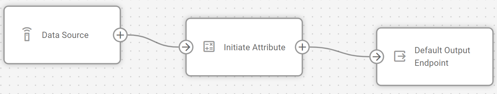
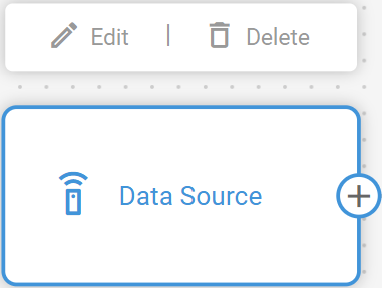
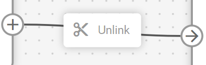

# Flow management

IoT Logic provides a flexible canvas environment where you can build custom data flows to process, transform, and route device telemetry. Each flow consists of interconnected nodes that perform specific functions within your data processing pipeline, from receiving raw device data to forwarding enriched information to external systems.

## Creating a new flow

You create flows from the IoT Logic start page using the **Create Flow** button.

1. Open IoT Logic. The start page opens with the **Created flows** table.
2. Click **Create Flow**.
3. Enter a name and description for the flow and set its initial enabled state.
4. Click **Confirm**. The canvas opens and the new flow is ready to edit.

<figure><figcaption></figcaption></figure>


Disabled flows don't send any data! The readings from the devices involved in a disabled flow do not reach any destination, including the Navixy platform. This means that disabling a flow can interrupt your monitoring capabilities and data collection for the affected devices. Only disable flows when you deliberately want to stop data transmission completely.


## Configuring flow components

IoT Logic flows are built from interconnected nodes that define how data moves through your system. Data enters through **Data Source** nodes, can be transformed by processing nodes like **Initiate Attribute**, and exits through **Output Endpoint** nodes. Additional specialized nodes, like **Action** and **Webhook** provide specific functions for automation and integration.

This modular architecture supports both simple data forwarding and complex multi-stage transformations. Every functional flow requires at least one input node and one output node, with optional processing nodes in between to enrich your data according to specific business requirements.

For complete node reference and configuration instructions, see [Nodes](../nodes/).


Your flow should include a **Default Output Endpoint** to send data to the platform. Maintaining this connection ensures your device data remains available for visualization and management in the Navixy interface.


## Building your flow

To assemble your data processing sequence:

1. Drag nodes from the left menu and drop them onto the workspace.
2. Click on each node to open its configuration panel and set up the required parameters.
3. Connect nodes by clicking on a node's output connector and dragging it to the input connector of the destination node.

<figure><figcaption></figcaption></figure>

Your flow must begin with at least one **Data Source** node and end with one or more **Output Endpoint** nodes. Between these, you can add transformation nodes to manipulate the data according to your requirements.

Nodes can be connected in various configurations:

* A single **Data source node** can feed multiple nodes for parallel processing
* Multiple **Data source nodes** can connect to a single **Output endpoint node** to consolidate data streams
* **Initiate attribute nodes** can be chained sequentially for multi-stage calculations

## Editing existing flows

After creating a flow, you can modify its configuration as your requirements evolve.

### Modifying flow details

You can edit a flow's name, description, and enabled state from the IoT Logic start page.

1. Open IoT Logic. Locate the flow in the **Created flows** table.
2. Click the **"..."** menu for that flow and select **Edit**.
3. Update the name, description, or enabled state in the dialog.
4. Click **Save** to confirm the changes.

### Removing elements



When you need to restructure your flow, you can remove nodes or connections:

**Deleting a node:**

1. Hover your cursor over the node you want to remove
2. Click the delete icon that appears in the top right corner of the node



<figure><figcaption></figcaption></figure>




When you delete a node, all of its connections will also be removed.




**Deleting a connection:**

* Click on the connection line you want to remove
* Click **Unlink** or press the backspace key on your keyboard



<figure><figcaption></figcaption></figure>



### Managing multiple flows

All flows are listed in the **Created flows** table on the IoT Logic start page. The table shows each flow's name, last modified date, number of connected devices, and current status.

Each row provides a status toggle to enable or disable the flow without opening it, a download icon to export the flow as a file, and a **"..."** menu with the options **Edit**, **Download**, and **Delete**.

To open a flow on the canvas, click its name in the table or select **Edit** from its **"..."** menu.

## Importing and exporting flows

IoT Logic allows you to export flow configurations for backup purposes or to share them with other accounts. You can also import previously exported configurations to quickly set up new flows.

Here's an example of an exported/ready-to-import flow JSON file:



### Exporting a flow

To export your flow configuration:

1. Locate the flow in the **Created flows** table.
2. Click the **"..."** menu for that flow and select **Download**.
3. The flow configuration downloads as a JSON file


You can also export a flow from canvas. To do it, open the "..." menu near the flow name and select **Download**.


#### What gets exported

The following table shows what is included and excluded from flow exports:

| Component                                |       Exported       |
| ---------------------------------------- | :------------------: |
| Node structure and connections           | :white\_check\_mark: |
| Attribute calculations and expressions   | :white\_check\_mark: |
| Node names and descriptions              | :white\_check\_mark: |
| Flow metadata                            | :white\_check\_mark: |
| Device selections (Data Source nodes)    |           ❌          |
| Authentication headers (Webhook nodes)   |           ❌          |
| MQTT credentials (Output Endpoint nodes) |           ❌          |


Device selections and authentication data are excluded from exports. Device selections are excluded to avoid conflicts when importing into a different account. Authentication data is excluded to protect sensitive information.

After importing a flow, you need to manually add the excluded data before you can save the flow.


### Importing a flow

To import a flow configuration:

1. On the IoT Logic start page, click **Upload Flow**
2. Select the JSON file containing the exported flow configuration
3. Review the imported flow structure
4. Configure the excluded elements:
   * Assign devices to Data Source nodes
   * Add authentication headers to Webhook nodes (if applicable)
   * Enter MQTT credentials for Output Endpoint nodes (if applicable)
5. Save the flow

The import process creates a new flow with the structure and calculations from the exported configuration, allowing you to quickly replicate complex data processing pipelines across different environments.

## Saving and activating flows

After configuring your flow:

1. Click the **Save flow** button to store your flow configuration
2. Ensure the flow is enabled for it to begin processing data

Once activated, your flow will:

* Receive real-time data from the configured devices
* Apply any defined transformations through Initiate attribute nodes
* Forward the processed data to your specified endpoints in the [Navixy Generic Protocol](https://app.gitbook.com/s/tx3J5BxnWyPV0nP2xr0z/technologies/navixy-generic-protocol) format

If you need to temporarily disable data processing, you can toggle the flow's enabled status without losing your configuration.

## Example configurations

You can find detailed step-by-step descriptions of an example flow creation in [Flow configuration example](flow-configuration-example.md). The example also contains explanations on some common data enrichment options. Feel free to use this example as a template for your custom flows.


For reference documentation on individual node types, including capabilities and configuration options, see the [Nodes](../nodes/) reference page.

