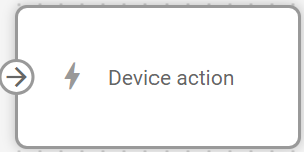
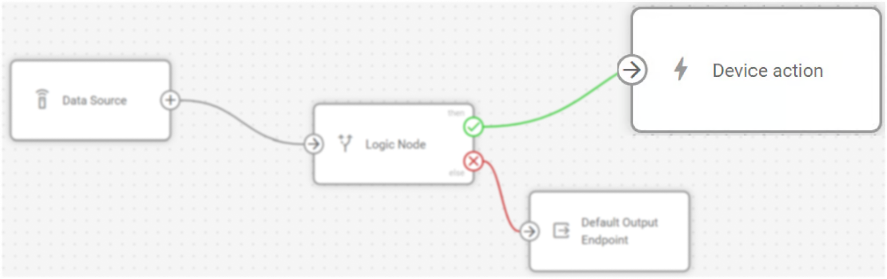
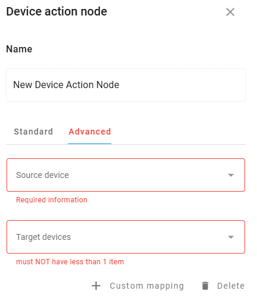

# Device action

## Technical overview and capabilities


{% column width="58.333333333333336%" %}
**Device action** nodes in IoT Logic enable automated device control by executing specific commands when triggered by incoming data flows. These nodes transform passive fleet monitoring into active automation systems, performing critical operations like output switching and GPRS command transmission.


{% column width="50%" %}
<figure><figcaption></figcaption></figure>



While Device action nodes can receive data from any node type, they are most commonly connected to [IF/THEN Logic](logic-node/) nodes that evaluate conditions and trigger actions only when specific criteria are met, such as temperature thresholds, unauthorized movement, or harsh driving incidents.


The **Device action** nodes are configured separately for each flow in the Navixy platform UI. Each node can contain multiple actions that execute sequentially when triggered by incoming data.


<figure><figcaption></figcaption></figure>

### How Device action nodes work

When data reaches a **Device action** node, the system identifies which devices provided the incoming data and executes the configured actions for those devices only. For full details on execution sequence and targeting, see [Action execution and targeting](action-node.md#action-execution-and-targeting) below.


**Device connectivity requirement**: Actions are sent only to devices that are confirmed online (those providing recent data), ensuring reliable command delivery.


### Flow architecture integration

**Device action** nodes function as terminal nodes within the flow architecture, receiving triggers from upstream nodes without passing data forward. The automation capabilities integrate with Navixy's broader device management system through:

* **Conditional automation**: Integration with [IF/THEN Logic](logic-node/) nodes enables sophisticated IF-THEN workflows where actions execute only when specific conditions are validated
* **Real-time device control**: Commands are transmitted within seconds of receiving triggers, ensuring immediate response to critical conditions
* **Fleet-wide coordination**: When connected to multiple device sources, actions can coordinate responses across entire vehicle groups simultaneously
* **Device capability respect**: Individual device limitations are honored, with unsupported commands being received but not executed

## Configuration options



Configuring a **Device action** node determines what commands execute and, optionally, which additional devices receive those same commands.

The configuration dialog is organized into two tabs:

* **Standard**: defines what commands to execute. Works independently, with no dependency on the Advanced tab.
* **Advanced**: defines which additional devices receive the same commands when the node is triggered. Optional.



<figure><figcaption></figcaption></figure>



Let's see what elements this node uses and what you can configure when working with it:

### Configuration steps



**Specify node Name**

Enter a descriptive name that identifies the automated actions this node will perform

1. Use names like "Emergency Cooling Response" or "Security Alert Actions" for clarity
2. This name appears in the flow diagram for easy identification



**Select Action type**

In the **Standard** tab, choose the type of automated response from the dropdown menu

1. **Switch Output**: Control device outputs by switching them on or off
2. **Send GPRS Command**: Transmit custom commands directly to devices



**Configure action parameters**

Set up the specific details based on your selected action type:

Switch Output configuration

<figure><figcaption></figcaption></figure>

When configuring Switch Output actions:

* **Output number**: Select which device output to control from the dropdown menu
  * Available output numbers depend on your specific device capabilities
  * Refer to your device documentation to understand output functions
* **On/Off toggle**: Set whether the action switches the output ON or OFF
  * Use the toggle switch to select the desired state

Send GPRS Command configuration

<figure><figcaption></figcaption></figure>

When configuring GPRS Command actions:

* **Command string**: Enter the exact command text to send to devices
  * Commands must match your device's supported command syntax
  * Consult device documentation for available commands and proper formatting
  * There are no character restrictions in the input field




**Add additional actions (optional)**

Click **Add action** to create multiple actions within the same node.


* Action commands are sent upon receiving a data package from the device according to the flow configuration
* Commands execute sequentially in the order they appear in the configuration
* Each action can be a different type (Switch Output or GPRS Command)
* Use the bin icon to remove unnecessary actions




**Configure recipient mappings (optional)**

Open the **Advanced** tab to define which additional devices receive the same commands when the node is triggered.

<figure><figcaption></figcaption></figure>

1. Use the **Source device** dropdown to select the device whose incoming data triggers the node. This must be a device present in the flow's **Data Source node**.
2. Use the **Target devices** dropdown to select one or more devices that will receive the same commands.
3. Click **+ Custom mapping** to add additional source-to-target pairs if different source devices should propagate commands to different sets of target devices.


The Advanced tab is optional. Without it, the node behaves exactly as before — commands execute only for the triggering device.




**Save configuration**

Click **Apply changes** to save your node configuration




**Device compatibility note:** Action execution depends on individual device capabilities. Ensure your devices support the specific outputs or commands you're configuring. Please look for supported commands in manufacturer resources like device documentation. List of supported devices is available at [Navixy integrated devices](https://www.navixy.com/devices/).


## Action execution and targeting

The **Device action** node provides precise control over when and where commands are executed, ensuring efficient and targeted automation responses.

### Execution sequence

When triggered, the **Device action** node follows this execution pattern:

1. **Device targeting**: Actions are sent only to devices that provided data in the current trigger event
   1. This ensures commands reach only the specific devices involved in the condition
   2. Prevents unnecessary commands to unaffected devices in the fleet
2. **Sequential processing**: Multiple actions within a node execute in the configured order from top to bottom
   1. Each action completes transmission before the next action begins
   2. Total execution time is typically within seconds of receiving the trigger
3. **Device validation**: Individual devices process received commands according to their capabilities
   1. Supported commands execute immediately upon receipt
   2. Unsupported commands are received but ignored by the device
   3. Device safety mechanisms may prevent inappropriate commands (e.g., engine shutdown while moving)

### Connection behavior

**IF/THEN Logic node integration**: When connected to [IF/THEN Logic](logic-node/) nodes, actions execute only for devices where the logical condition evaluated to `true`. This provides precise conditional automation.

**Direct connections**: When connected directly to other node types (Data Source, Initiate Attribute), actions execute for all devices in the data stream each time data is received.

## Frequently asked questions

#### How do I know if my actions were executed successfully?

Currently, action execution feedback is limited. Commands are sent to devices that are confirmed online (those providing recent data) without execution time gap, which eliminates the possibility of the device going offline between trigger and execution. You can monitor device behavior during test stage, or use separate test flows to verify action results in a controllable environment.

#### Can I connect multiple nodes to the same Device action node?

Yes. Device action nodes can receive triggers from multiple upstream nodes, but be aware that actions will execute for any device that triggers any connected node. When designing complex flows, consider the cumulative effect of multiple trigger sources to ensure actions execute only for intended scenarios.

#### What happens if I connect a Device action node directly to a Data Source?

The Device action node will execute its configured actions every time any device in the Data Source sends data. This creates continuous action execution rather than conditional responses. For most use cases, connecting Device action nodes to [IF/THEN Logic](logic-node/) nodes provides better control over when actions should execute.
