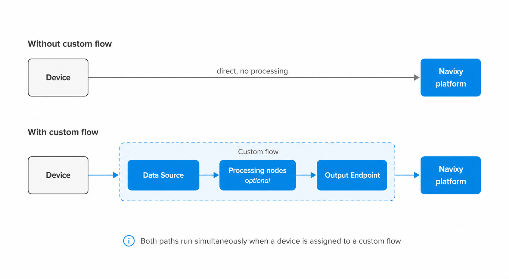

# Default data processing

Navixy automatically ensures that every device in your account transmits data to the platform, regardless of whether the device is assigned to a custom flow. This guarantee operates at the system level and requires no configuration.

When a device is not included in any custom flow, the system still processes its data and delivers it to the Navixy platform directly, without any transformations. This means no device data is ever lost due to routing configuration. Custom flows are how you go beyond this baseline. They let you enrich data with calculated attributes, apply conditional routing, and forward results to external systems. If your devices only need to reach the Navixy platform without any processing, no custom flow is required.

## How data flows

Without a custom flow, device data travels directly to the Navixy platform without any processing or transformation. The system receives the raw device data and delivers it as-is, ensuring the device is visible and monitored in the platform.

With a custom flow, data enters through a **Data Source** node, passes through any processing nodes you have configured, and exits through a **Default Output Endpoint** node to reach the platform. This path lets you enrich, filter, and route data before it arrives. When a device is assigned to a custom flow, both paths run simultaneously: the custom flow handles processing, while the system independently ensures the raw data reaches the platform regardless.

<figure><figcaption></figcaption></figure>


Disabling a custom flow stops all data transmission for the devices assigned to it. The automatic system coverage does not substitute for a disabled flow. Re-enable the flow to restore data transmission for the affected devices.


## Default Output Endpoint



The **Default Output Endpoint** node provides a pre-configured destination for sending device data to the Navixy platform. This node is pre-configured with optimal settings for direct transmission to Navixy's servers.




<figure><figcaption></figcaption></figure>




The endpoint ensures that data processed by a custom flow is properly formatted and transmitted to the Navixy platform, enabling full visibility of your devices in the main Navixy interface.


The **Default Output Endpoint** node is available for use in custom flows. Each custom flow should maintain a connection to this output node to ensure device data is sent to the platform, enabling monitoring capabilities using Navixy tools. If the Navixy output is removed from a custom flow, data from the devices involved in that flow will no longer reach the platform.


## Flow and device relationships

The following principles govern how device data coverage works across flows:

* **Every device in your account has a guaranteed path to transmit data.** The system ensures that all devices connected to your account always have a defined route for their data, maintaining complete visibility of your device fleet.
* **A device can belong to multiple flows at the same time.** All flows that include the device process its data simultaneously, and results are merged to avoid data loss. There are no constraints on how many flows a device can belong to.
* **Automatic system coverage always runs in parallel with custom flows.** Regardless of how many custom flows a device belongs to, the system always processes its data independently. Assigning a device to a custom flow does not replace or affect this behavior.

This approach ensures complete data coverage while allowing for customized data processing where needed.


[Data Stream Analyzer](../data-stream-analyzer.md) is scoped to custom flows. Devices that are not assigned to any custom flow cannot currently be monitored through it.

